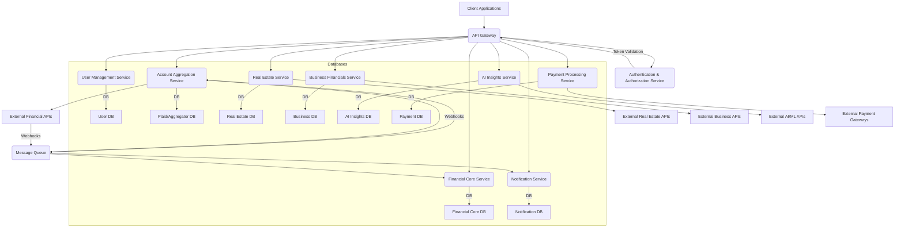

# Backend Architecture Design Plan: Java Microservices for Wealth Management

> **📐 This is the original design plan (aspirational), not the as-built reference.** Some elements
> here (e.g. a message-queue bus, a separate User Management service) were not built as drawn. For the
> **current, code-accurate architecture** see:
> [docs/architecture/system-architecture.md](docs/architecture/system-architecture.md),
> [docs/architecture/api-reference.md](docs/architecture/api-reference.md), and the leveled
> [docs/workflows/](docs/workflows/README.md) set. As built, there are **11 services** behind the
> gateway (auth, account-aggregation, financial-core, real-estate, business-financials, ai-insights,
> payment, notification, platform-config, audit) — with User Management folded into auth-service and
> inter-service calls done synchronously (Feign via the gateway), not via a message queue.

## 1. Introduction & Goals

This document outlines a detailed backend architecture design for the "My Wealth Management" application. The architecture is based on a Java-driven microservices approach, emphasizing modularity, scalability, security, and ease of maintenance and reuse. The primary goal is to create a robust and extensible backend capable of integrating with various external financial services and providing secure, real-time financial insights.

**Key Architectural Goals:**
*   **Modularity:** Services are independent, loosely coupled, and focused on specific business capabilities.
*   **Scalability:** Each service can scale independently based on demand.
*   **Security:** Comprehensive measures for data protection (especially PII/NPI) and service integrity.
*   **Maintainability:** Clear responsibilities, well-defined APIs, and independent deployment cycles.
*   **Reusability:** Common components and libraries are shared across services.
*   **Resilience:** Designed to handle failures gracefully.
*   **Observability:** Robust logging, monitoring, and tracing capabilities.

## 2. High-Level Architecture Overview

The backend will adopt a microservices pattern, where distinct business capabilities are encapsulated within separate, independently deployable services. An API Gateway will serve as the single entry point for all client requests, handling routing, authentication enforcement, and cross-cutting concerns. Asynchronous communication via message queues will be utilized for inter-service communication where immediate responses are not required, enhancing resilience and scalability.

## 3. Service Breakdown & Responsibilities

Each service will be developed using **Java (Spring Boot)**, containerized with Docker, and deployed independently.

1.  **API Gateway Service**
    *   **Responsibilities:**
        *   Single entry point for all client requests (web, mobile).
        *   Request routing to appropriate microservices.
        *   Authentication enforcement (validating JWTs from Auth Service).
        *   Rate limiting, traffic management.
        *   Cross-Origin Resource Sharing (CORS) handling.
        *   Request/response transformation (if needed).
    *   **Key Technologies:** Spring Cloud Gateway, Netflix Zuul (older), NGINX.

2.  **Authentication & Authorization Service (Auth Service)**
    *   **Responsibilities:**
        *   User registration and login (issuing JWTs).
        *   JWT validation and token refresh.
        *   Role-Based Access Control (RBAC) and permission management.
        *   Secure storage of hashed passwords.
        *   Integration with OAuth2/OpenID Connect providers (e.g., Keycloak, Auth0) for external identity management.
    *   **Key Technologies:** Spring Security, Spring Boot, JWT, PostgreSQL.

3.  **User Management Service**
    *   **Responsibilities:**
        *   Managing user profiles (name, contact info, preferences).
        *   User account lifecycle (creation, update, deletion).
        *   Storing non-sensitive user data.
        *   Communicating with Auth Service for authentication-related tasks.
    *   **Key Technologies:** Spring Boot, PostgreSQL.

4.  **Account Aggregation Service**
    *   **Responsibilities:**
        *   Integration with external financial data aggregators (e.g., Plaid).
        *   Handling Plaid Link token creation and public token exchange.
        *   Fetching raw account balances, transaction history, and investment holdings from aggregators.
        *   Storing `access_token`s and raw aggregated data (encrypted).
        *   Processing and responding to webhooks from aggregators (e.g., `TRANSACTIONS_UPDATES`).
        *   Mapping external data models to internal canonical models.
    *   **Key Technologies:** Spring Boot, Plaid Java SDK, PostgreSQL, Message Queue (for webhooks).

5.  **Financial Core Service**
    *   **Responsibilities:**
        *   Central hub for financial calculations and data processing.
        *   Calculating net worth, asset allocation, debt-to-income ratios.
        *   Transaction categorization (manual and AI-assisted).
        *   Budget management (tracking spending vs. budget).
        *   Debt payoff scenario analysis (Avalanche, Snowball, Hybrid).
        *   Consolidating data from Account Aggregation, Real Estate, and Business Financials services.
    *   **Key Technologies:** Spring Boot, PostgreSQL.

6.  **Real Estate Service**
    *   **Responsibilities:**
        *   Integration with external real estate APIs (e.g., Zillow).
        *   Managing user-owned properties (address, purchase details).
        *   Fetching and updating property valuations.
        *   Storing property-specific data (encrypted).
    *   **Key Technologies:** Spring Boot, Zillow API client, PostgreSQL.

7.  **Business Financials Service**
    *   **Responsibilities:**
        *   Integration with external business accounting platforms (e.g., QuickBooks Online).
        *   Handling OAuth 2.0 flows for business account linking.
        *   Fetching business financial statements (P&L, balance sheet), loans, revenue, expenses.
        *   Storing business-specific data (encrypted).
    *   **Key Technologies:** Spring Boot, QuickBooks Java SDK, PostgreSQL.

8.  **AI Insights Service**
    *   **Responsibilities:**
        *   Integration with external AI/ML providers (e.g., OpenAI API).
        *   Processing aggregated user financial data (from Financial Core) to generate personalized insights and recommendations.
        *   Generating debt strategies, investment plans, risk management suggestions.
        *   Storing AI prompts and responses for auditing and improvement.
    *   **Key Technologies:** Spring Boot, OpenAI Java client, MongoDB (for flexible prompt/response storage).

9.  **Payment Processing Service**
    *   **Responsibilities:**
        *   Integration with external payment gateways (e.g., Stripe).
        *   Creating and managing bill payment intents.
        *   Initiating payments (e.g., ACH transfers, credit card payments).
        *   Handling payment status updates and webhooks from payment gateways.
        *   Ensuring idempotency for payment requests.
    *   **Key Technologies:** Spring Boot, Stripe Java SDK, PostgreSQL.

10. **Notification Service**
    *   **Responsibilities:**
        *   Sending emails (e.g., account alerts, bill reminders).
        *   Sending push notifications to mobile devices.
        *   Managing notification preferences.
        *   Receiving events from other services via Message Queue.
    *   **Key Technologies:** Spring Boot, AWS SES/SNS, Firebase Cloud Messaging (FCM), PostgreSQL, Redis (In-memory data store for temporary notification queues, rate limiting).

## 4. End-to-End Data Flow Example: Linking a Bank Account

1.  **Client Request:** User clicks "Link Bank Account" in the mobile/web app.
2.  **API Gateway:** Client sends `POST /v1/aggregation/create-link-token` request to API Gateway. Gateway authenticates the user via Auth Service.
3.  **Account Aggregation Service:** Gateway routes request to Account Aggregation Service. This service calls Plaid API to create a `link_token` for the user.
4.  **Client UI:** Account Aggregation Service returns `link_token` to the client. Client uses `react-plaid-link` (or web equivalent) to open Plaid Link UI.
5.  **User Interaction:** User interacts with Plaid Link, selects their bank, and provides credentials.
6.  **Plaid Callback:** Plaid Link returns a `public_token` to the client.
7.  **Client Request:** Client sends `POST /v1/aggregation/exchange-public-token` with `public_token` to API Gateway.
8.  **Account Aggregation Service:** Gateway routes request. Account Aggregation Service calls Plaid API to exchange `public_token` for `access_token` and `item_id`.
9.  **Data Persistence:** Account Aggregation Service stores the `access_token`, `item_id`, and `institution_id` in its `PlaidItem` database, linked to the user.
10. **Initial Data Fetch:** Account Aggregation Service immediately calls Plaid API (using `access_token`) to fetch initial account balances and transaction history.
11. **Data Storage:** Account Aggregation Service stores/updates `Account` and `Transaction` records in its database.
12. **Asynchronous Update (Optional but Recommended):** Account Aggregation Service publishes an event (e.g., `ACCOUNT_LINKED_SUCCESS`) to the Message Queue.
13. **Financial Core Service:** Financial Core Service consumes `ACCOUNT_LINKED_SUCCESS` event, triggers net worth recalculation, and updates relevant financial summaries.
14. **Client Update:** Client polls Financial Core Service or receives a push notification for updated dashboard data.

## 5. Database Solutions (Polyglot Persistence)

Each microservice will manage its own database, allowing for technology choices best suited to its data characteristics.

*   **User Management Service:** **PostgreSQL** (Relational, ACID compliance, strong consistency for user profiles, roles).
*   **Authentication & Authorization Service:** **PostgreSQL** (User credentials, JWT blacklists, OAuth client details).
*   **Account Aggregation Service:** **PostgreSQL** (Structured storage for `PlaidItem`s, `Account`s, `Transaction`s, with foreign key relationships).
*   **Financial Core Service:** **PostgreSQL** (Complex financial calculations, budgeting rules, historical snapshots, strong relational integrity).
*   **Real Estate Service:** **PostgreSQL** (Structured property data, valuations, ownership details).
*   **Business Financials Service:** **PostgreSQL** (Structured business entities, financial reports, OAuth tokens for QuickBooks).
*   **AI Insights Service:** **MongoDB** (NoSQL, flexible schema for storing AI prompts, responses, and potentially unstructured insights data).
*   **Payment Processing Service:** **PostgreSQL** (Strict ACID requirements for payment transactions, idempotency keys, audit trails).
*   **Notification Service:** **PostgreSQL** (Notification history, user preferences), **Redis** (In-memory data store for temporary notification queues, rate limiting).

## 6. Security Strategy

Security is paramount for a financial application. A multi-layered approach will be implemented.

### 6.1. Data Encryption (PII & NPI)

*   **Encryption at Rest:**
    *   **Database Encryption:** All databases will utilize native cloud provider encryption (e.g., AWS RDS encryption with KMS). This encrypts underlying storage volumes.
    *   **Application-Level Encryption:** For highly sensitive PII/NPI fields (e.g., Plaid `access_token`s, bank account numbers, SSN, specific business financial identifiers), data will be encrypted *before* being stored in the database.
        *   **Method:** Use strong symmetric encryption algorithms (e.g., AES-256 GCM) with unique encryption keys per data field or record.
        *   **Key Management:** Encryption keys will be managed by a dedicated Secrets Management solution (e.g., AWS Secrets Manager, HashiCorp Vault) and rotated regularly. Java Cryptography Architecture (JCA) or libraries like Jasypt can be used for implementation.
*   **Encryption in Transit:**
    *   **TLS/SSL Everywhere:** All communication, both external (client-to-API Gateway) and internal (inter-service communication, service-to-database), will be enforced over TLS/SSL (HTTPS).
    *   **Mutual TLS (mTLS):** For critical inter-service communication, mTLS can be implemented to ensure both client and server authenticate each other.

### 6.2. Advanced Security Practices

*   **Authentication & Authorization:**
    *   **OAuth 2.0 & OpenID Connect:** Use industry-standard protocols for user authentication and authorization.
    *   **JWTs:** JSON Web Tokens for stateless authentication between API Gateway and microservices.
    *   **Identity Provider:** Utilize a dedicated Identity Provider (e.g., Keycloak, Auth0, AWS Cognito) to centralize user identities and access management.
    *   **Least Privilege:** Services and users will only be granted the minimum necessary permissions to perform their functions.
*   **Network Security:**
    *   **VPC & Subnet Segmentation:** Isolate services into private subnets within a Virtual Private Cloud (VPC).
    *   **Security Groups & Network ACLs:** Strict firewall rules to control inbound/outbound traffic for each service and database.
    *   **Private Endpoints:** Use private endpoints (e.g., AWS PrivateLink) for secure access to cloud services.
*   **API Security:**
    *   **Input Validation:** Strict validation of all API inputs to prevent injection attacks (SQL, XSS).
    *   **Rate Limiting:** Protect against brute-force attacks and denial-of-service (DoS).
    *   **API Gateway Policies:** Implement security policies at the API Gateway level.
*   **Secrets Management:**
    *   **Dedicated Solution:** Use a robust secrets management service (e.g., AWS Secrets Manager, HashiCorp Vault) to store API keys, database credentials, and encryption keys. Avoid hardcoding secrets.
    *   **Rotation:** Implement automated secret rotation.
*   **Logging, Monitoring & Alerting:**
    *   **Centralized Logging:** Aggregate logs from all services into a central system (e.g., ELK Stack, AWS CloudWatch Logs).
    *   **Security Information and Event Management (SIEM):** Integrate logs with a SIEM solution for real-time threat detection and analysis.
    *   **Anomaly Detection:** Monitor for unusual activity patterns.
*   **Vulnerability Management:**
    *   **SAST/DAST:** Integrate Static Application Security Testing (SAST) and Dynamic Application Security Testing (DAST) into the CI/CD pipeline.
    *   **Dependency Scanning:** Regularly scan for vulnerabilities in third-party libraries.
    *   **Penetration Testing:** Conduct regular penetration tests and security audits.
*   **Immutable Infrastructure:** Deploy services as immutable containers. Any changes require deploying a new container version.
*   **Secure Coding Practices:** Adhere to OWASP Top 10 guidelines and secure coding standards.

## 7. Cloud Deployment Strategy (AWS as an Example)

The backend will be deployed on a cloud platform, with AWS being a strong candidate due to its comprehensive suite of services for microservices and security.

*   **Compute:**
    *   **Amazon EKS (Elastic Kubernetes Service):** For orchestrating Docker containers, providing high availability, scalability, and self-healing capabilities for microservices.
    *   **AWS Fargate:** Serverless compute for containers, simplifying infrastructure management for less complex services or batch jobs.
    *   **AWS Lambda:** For event-driven, serverless functions (e.g., processing specific webhook events that don't require a full service).
*   **API Gateway:** **Amazon API Gateway** for managing all API endpoints, routing, authentication, and rate limiting.
*   **Databases:**
    *   **Amazon RDS (PostgreSQL):** For relational databases requiring strong consistency and transactional integrity.
    *   **Amazon DynamoDB:** For NoSQL use cases (e.g., AI Insights service for flexible schema, caching).
    *   **Amazon ElastiCache (Redis):** For high-performance caching and message queues (e.g., Notification Service).
*   **Message Queue:** **Amazon SQS (Simple Queue Service)** for reliable asynchronous inter-service communication and webhook processing. **Amazon SNS (Simple Notification Service)** for fan-out messaging.
*   **Identity Provider:** **AWS Cognito** for user authentication and authorization, or integrate a self-managed Keycloak instance on EKS.
*   **Secrets Management:** **AWS Secrets Manager** for securely storing and rotating API keys, database credentials, and encryption keys.
*   **Logging & Monitoring:**
    *   **AWS CloudWatch:** For centralized logging, metrics, and alarms.
    *   **Prometheus & Grafana:** Deployed on EKS for advanced metrics collection and visualization.
    *   **AWS X-Ray:** For distributed tracing across microservices.
*   **CI/CD:** **AWS CodePipeline, CodeBuild, CodeDeploy** for automated build, test, and deployment pipelines.
*   **Network:** **AWS VPC** with private and public subnets, **Security Groups**, **Network ACLs**, and **Route 53** for DNS management.
*   **Content Delivery:** **Amazon CloudFront** for CDN and WAF integration.
*   **Web Application Firewall (WAF):** **AWS WAF** integrated with API Gateway and CloudFront to protect against common web exploits.

## 8. High-Level Backend Workflow (Illustrative)

1.  **Client Request:** User initiates an action (e.g., "View Dashboard").
2.  **API Gateway:** Receives request, validates JWT via Auth Service, routes to Financial Core Service.
3.  **Financial Core Service:**
    *   Authenticates request internally with Auth Service (if needed).
    *   Fetches consolidated financial data from its database.
    *   May call Account Aggregation Service, Real Estate Service, Business Financials Service to get latest data (synchronously or asynchronously via Message Queue for freshness).
    *   May call AI Insights Service for personalized recommendations.
4.  **Data Processing:** Financial Core Service performs calculations (e.g., net worth).
5.  **Response:** Financial Core Service returns processed data to API Gateway, which then sends it to the client.
6.  **Asynchronous Updates (Example: Plaid Webhook):**
    *   Plaid sends a `TRANSACTIONS_UPDATES` webhook to the API Gateway.
    *   API Gateway validates the webhook, routes it to a dedicated endpoint in Account Aggregation Service.
    *   Account Aggregation Service verifies the webhook signature, then publishes a `PlaidTransactionsUpdatedEvent` to the Message Queue.
    *   Financial Core Service consumes this event, fetches new transactions from Account Aggregation Service, updates its database, and recalculates relevant metrics.
    *   Notification Service consumes the event, sends an alert to the user ("New transactions available").

## 9. Modularity, Scalability, Maintenance, and Reuse

*   **Modularity:** Each service is a self-contained unit with a clear, bounded context. Changes in one service have minimal impact on others, enabling independent development and deployment.
*   **Scalability:**
    *   **Horizontal Scaling:** Services are stateless (where possible) and can be scaled horizontally by adding more instances behind a load balancer.
    *   **Database Scaling:** Use managed database services (AWS RDS) with read replicas and sharding capabilities.
    *   **Asynchronous Communication:** Message queues decouple services, allowing producers and consumers to operate at different paces and scale independently.
*   **Maintenance:**
    *   **Clear Contracts:** Services communicate via well-defined APIs (RESTful, gRPC) and message formats.
    *   **Independent Deployments:** Each service can be deployed and updated without affecting the entire application (CI/CD pipelines per service).
    *   **Observability:** Centralized logging, metrics, and tracing provide deep insights into service health and performance, simplifying troubleshooting.
*   **Reuse:**
    *   **Shared Libraries:** Common utilities, DTOs (Data Transfer Objects), and API clients can be packaged as internal libraries and reused across services.
    *   **Standardized Frameworks:** Using Spring Boot across all services promotes consistency in development patterns.
    *   **API Gateway:** Provides a unified and consistent interface for all client applications.

## 10. Technology Stack (Java Focus)

*   **Language:** Java 17+
*   **Framework:** Spring Boot 3+ (for rapid microservice development, dependency injection, and embedded servers).
*   **Build Tool:** Maven / Gradle.
*   **Containerization:** Docker.
*   **Orchestration:** Kubernetes (managed service like AWS EKS).
*   **Messaging:** Apache Kafka / AWS SQS/SNS (for inter-service communication, event streaming, webhooks).
*   **API Client Generation:** OpenAPI Generator (for generating client SDKs from OpenAPI specifications).
*   **Monitoring & Alerting:** Prometheus, Grafana, AWS CloudWatch.
*   **Distributed Tracing:** Jaeger / AWS X-Ray.
*   **Logging:** SLF4J with Logback, centralized via ELK Stack (Elasticsearch, Logstash, Kibana) or AWS CloudWatch Logs.
*   **Security Libraries:** Spring Security, Jasypt (for application-level encryption).

---