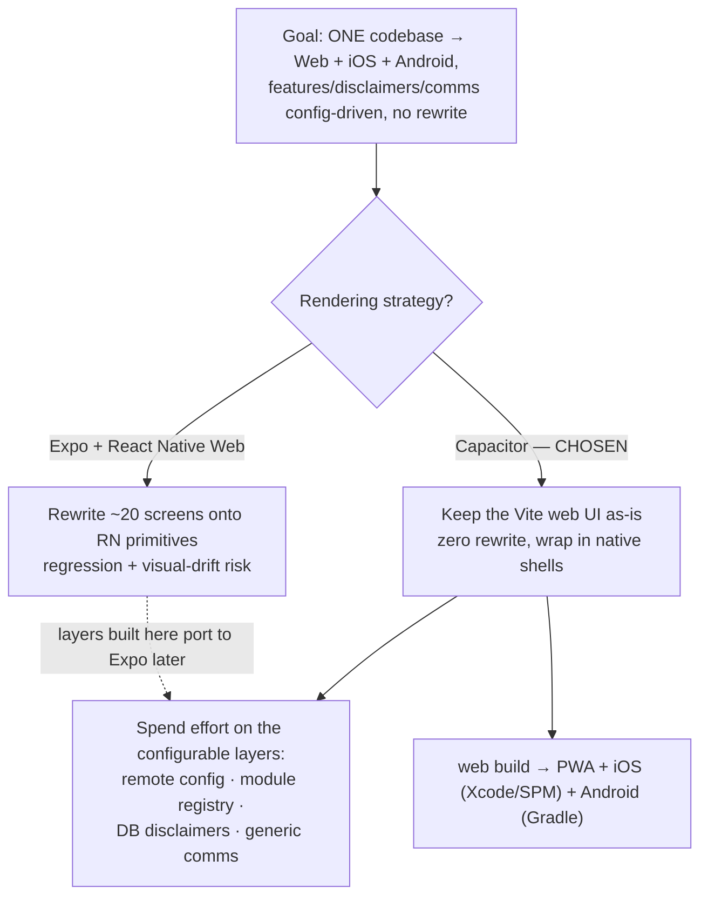

# ADR-001 — Cross-platform strategy & configurable architecture

Status: Accepted (2026-06-07) · Decider: senior architect (autonomous build while owner away)

## Context
TerraVest is a working React 18 + Vite web app backed by a Spring Boot microservice suite.
The goal: one codebase running on **Web + iOS + Android**, with **features, disclaimers, copy,
themes, and communication providers configurable from config/DB — no code changes**.

The brief offered two paths:
1. **Expo + React Native Web** monorepo (rewrite all ~20 screens onto RN primitives).
2. **Capacitor** — keep the existing Vite web UI as the single codebase, wrap it in native
   iOS/Android shells, and add the config/module/disclaimer/comms layers.

## Decision flow

## Decision: Capacitor (path 2)
**Why** (optimizing for: don't break the working app, ship robustly, owner is away):
- **Zero-rewrite, zero-regression.** The proven web UI *is* the mobile UI. No porting 20 screens
  to RN, no visual drift — the brief says "preserve the visual identity exactly."
- **The real work is the configurable layers**, not the rendering tech. Capacitor lets ~100% of
  effort go to: remote config + feature registry + DB-driven disclaimers + a generic comms layer —
  the actual acceptance criteria.
- **One codebase, three targets today.** `apps/web` builds to the browser and is wrapped by
  Capacitor into Xcode/Android Studio projects. OTA web/content updates work via any static host
  or Capacitor live-update plugins.
- **Lower operational risk** for a solo/away owner: fewer moving parts than a full Expo monorepo.

**Trade-offs accepted:** native feel is web-in-a-webview (mitigated by Capacitor native plugins for
push, secure storage, biometrics); not "true native" widgets. If pixel-native UX becomes a
priority later, the feature-registry + tokens + remote-config layers built here port directly onto
an Expo RN Web monorepo — this decision does **not** lock that door.

## What this build delivers (verifiable now)
1. **platform-config-service** (Spring Boot, :8089) — DB-driven:
   - `GET /api/v1/config/app?platform=web|ios|android` → theme, sections, enabledModules (ordered),
     dashboardLayout.
   - `GET /api/v1/config/flags` → feature flags.
   - `GET /api/v1/content/disclaimers?keys=&locale=` → versioned disclaimer content (markdown).
   - `POST /api/v1/content/disclaimers/accept` (JWT) → consent tracking.
2. **Web becomes config-driven**: a typed **RemoteConfig** client (cache + offline fallback) + a
   **module registry** (manifests). Nav, routes, and dashboard are composed from config — toggling
   a module in the DB adds/removes/reorders it with **no code change**. Robust fallback: if config
   is unreachable, the full default module set renders (app never breaks).
3. **`<Disclaimer id="…"/>`** renders versioned content from the API (markdown), with skeleton +
   fallback. **No disclaimer text in code.**
4. **Generic communications** in notification-service: a Channel provider interface (SMS/Email/
   Push/InApp) with swappable adapters + **DB templates** + an orchestrator (idempotency, prefs,
   quiet hours). Swapping a provider or editing a template = config/DB change, not code.
5. **Cross-platform shell + ops**: Capacitor config for `apps/web`, `packages/tokens` extraction,
   GitHub Actions CI, `.env` placeholders, `DEPLOYMENT.md`, `MIGRATION.md`.

## Placeholders the owner fills later (documented in DEPLOYMENT.md / .env.example)
- Real provider keys: Twilio/SNS (SMS), SendGrid/SES (email), FCM/APNs/Expo (push), Plaid, Stripe.
- App Store / Google Play signing + EAS or Capacitor cloud credentials.
- Optional managed flags (LaunchDarkly/Unleash) or CMS (Strapi/Sanity) — interfaces are ready.

Everything ships with **mock adapters + seed data** so the whole system runs end-to-end locally
with **no keys**.
