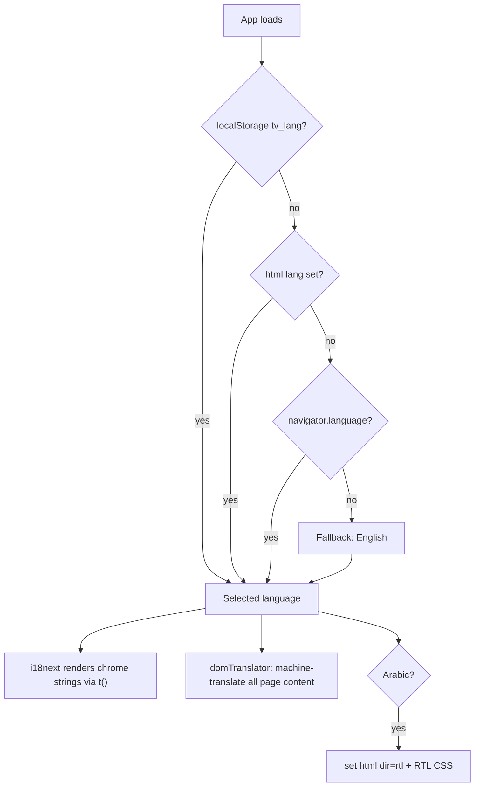

# Internationalization (i18n) & Auto-Translation

TerraVest auto-detects the user's language and renders the UI in it. No manual
selection is required; a language picker in the top bar lets users override.

## How it works

| Piece | Library / file | Role |
|-------|----------------|------|
| Engine | `i18next` | Translation lookup + interpolation |
| React binding | `react-i18next` (`useTranslation`) | `t()` in components, re-render on change |
| **Auto-select** | `i18next-browser-languagedetector` | Detects language from saved choice → `<html lang>` → `navigator.language` |
| Config | `apps/web/src/i18n/index.js` | Wires the above; sets `<html dir>` for RTL |
| Translations | `apps/web/src/i18n/locales/*.json` | One file per language, identical key trees |
| Picker | `apps/web/src/components/LanguageSwitcher.jsx` | Top-bar override; persists to `localStorage[tv_lang]` |
| **Whole-page MT** | `apps/web/src/i18n/domTranslator.js` | Translates ALL page-content text automatically on language switch |
| MT provider | `apps/web/src/i18n/autoTranslate.js` | The translation backend (MyMemory by default, LibreTranslate if configured) |

### Detection order
1. `localStorage["tv_lang"]` — a previous explicit choice.
2. `<html lang>` attribute.
3. `navigator.language(s)` — the browser/OS language.
4. Fallback: **English**.

`en-US`, `es-419`, etc. collapse to the base language (`load: "languageOnly"`).



## Bundled languages
`en, es, fr, de, pt, zh, hi, ja, ar` — full chrome translations (nav, top bar,
sections, common actions, disclaimers). **Arabic** renders right-to-left
(`<html dir="rtl">`, RTL CSS at the end of `terravest-theme.css`).

All locale files share the **exact same key structure** (CI-checkable: each has
the same flattened key set as `en.json`).

## Adding a language
1. Copy `locales/en.json` → `locales/<code>.json`, translate the values (keep
   keys and `{{placeholders}}` untouched).
2. Register it in `i18n/index.js`: import the JSON, add to `resources`, and add
   an entry to `SUPPORTED_LANGUAGES` (set `dir: "rtl"` for RTL scripts).
3. Add its autonym under the `language` block in **every** locale file.

## Translating new UI strings
Use `t("some.key")` with the key added to `en.json` (and other locales). For a
quick inline default while iterating: `t("some.key", "English default")`.

## Whole-page auto-translation (ON by default)
The bundled locale files only cover the chrome. To make the **entire app** switch
language without hand-keying every string, `domTranslator.js` walks all visible
text (and `placeholder`/`title`/`aria-label`/`alt` attributes) inside
`.page-content`, machine-translates each unique phrase, and swaps it in. A
`MutationObserver` keeps route changes and async-loaded data translated. Switching
back to English instantly restores the original text (no reload).

It runs from `<AutoTranslate>` in `AppLayout`, re-firing on every language/route
change. Translated phrases are cached per `(text, language)` in `localStorage`,
so each phrase is translated at most once and is instant thereafter.

### Translation provider (auto-selected)
1. **Default, zero-config:** [MyMemory](https://mymemory.translated.net) — free,
   no API key, CORS-enabled, so it works out of the box. Anonymous quota is
   limited; set `VITE_TRANSLATE_EMAIL` to raise it.
2. **Recommended for scale / production:** self-host LibreTranslate (free, no
   quota) and point at it:
   ```
   VITE_TRANSLATE_ENDPOINT=https://libretranslate.example.com/translate
   VITE_TRANSLATE_API_KEY=...   # only if the endpoint requires one
   ```
   For Google / DeepL / Azure, adapt `translateViaLibre()` in `autoTranslate.js`.

### Opting elements out
Add `data-no-translate` to any element whose text must NOT be translated (brand
names, code, user-entered data). `<script>/<style>/<code>/<pre>/<textarea>` and
pure numbers/symbols are skipped automatically.

### Guarantees
- **Never blocks or breaks the UI** — on any failure the English source stays.
- Idempotent: only writes when a value actually changes, so it can't loop.
- Quality note: bundled chrome strings are human-translated; page-body strings
  are machine-translated. For polished copy on a specific screen, add explicit
  `t()` keys to the locale files — those always win over machine translation.

## DB-driven content (disclaimers)
`<Disclaimer>` automatically requests the active language from the content API
(`/api/v1/content/disclaimers?...&locale=<lang>`). Seed localized rows in the
`disclaimer` table (one row per `key + version + locale`); missing locales fall
back to the bundled English text in the component.

## Mobile (Capacitor)
The same web bundle powers iOS/Android, so language detection (via the device
WebView's `navigator.language`) and all translations work there unchanged.
