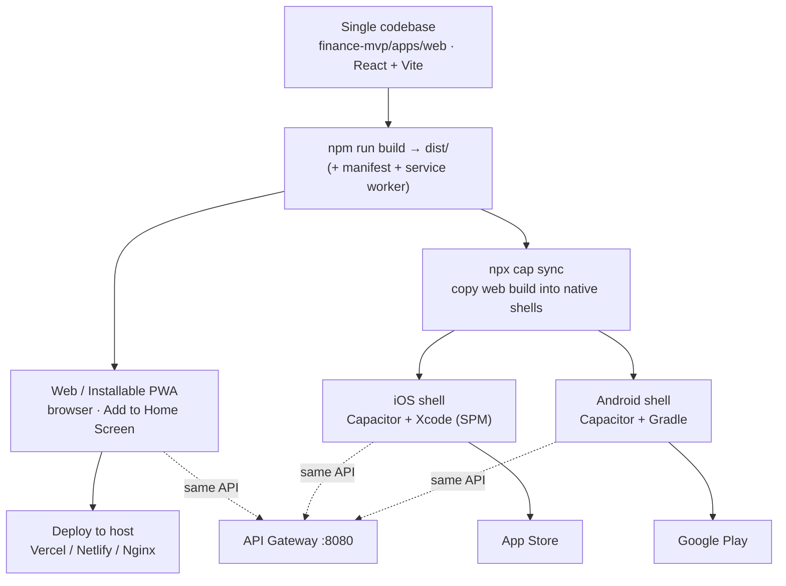
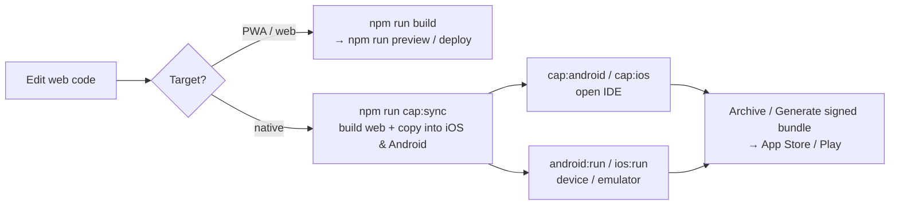
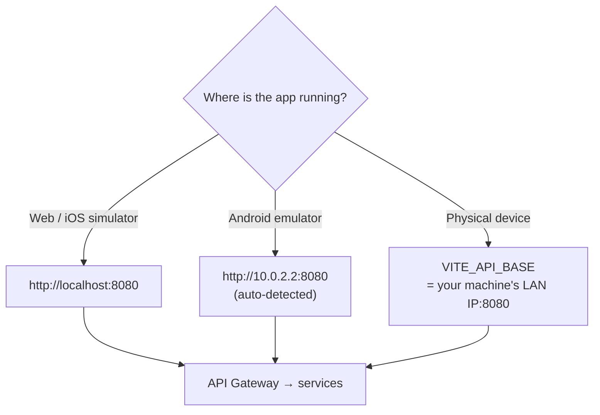

# Running TerraVest on Web, iOS & Android

One codebase (`finance-mvp/apps/web`, React + Vite) ships to all three platforms:

- **Web / PWA** — runs in any browser and is **installable** as an app (iOS Safari
  “Add to Home Screen”, Android Chrome “Install app”). Works today, no toolchain.
- **iOS (native)** — Capacitor wraps the web build in an Xcode project.
- **Android (native)** — Capacitor wraps the web build in a Gradle/Android Studio project.

All commands below are run from `finance-mvp/apps/web`.

## Platform topology — one codebase → three platforms



---

## 1. Web + installable PWA (no native toolchain needed)

```bash
npm run dev        # http://localhost:5173  (service worker OFF in dev)
npm run build      # production build -> dist/ (generates manifest + service worker)
npm run preview    # serve the production build locally to test install/offline
```

The build emits `dist/manifest.webmanifest`, `dist/sw.js`, and the icon set. In a
production build the app is installable and offline-capable:
- App shell is precached.
- API calls (`/api/**`) use **NetworkFirst** (fresh when online, last-known when offline).
- Fonts/icon CDN use **CacheFirst**.

> The service worker is intentionally **disabled in `dev`** so it never interferes
> with HMR. Test PWA behavior via `npm run preview` or a deployed build.

---

## 2. Native iOS & Android (Capacitor)

The native projects are already generated (`apps/web/ios`, `apps/web/android`).
Capacitor 8 uses **Swift Package Manager** for iOS, so **CocoaPods is not required**.

### Build & ship pipeline



### Build + open in the IDE
```bash
npm run cap:android   # build web -> sync -> open Android Studio
npm run cap:ios       # build web -> sync -> open Xcode
```
Then press Run in the IDE to launch on an emulator/simulator or device.

### Or run directly (with a connected device/emulator)
```bash
npm run android:run
npm run ios:run
```

### After ANY web change
```bash
npm run cap:sync      # rebuild web + copy into both native projects
```

### Toolchain prerequisites (on the build machine)
- **iOS:** macOS + **full Xcode** (from the Mac App Store — needs your Apple ID).
  Command Line Tools alone are NOT enough (no Simulator). No CocoaPods needed
  (Capacitor 8 uses Swift Package Manager). After installing Xcode:
  `sudo xcodebuild -license accept` then `npm run cap:ios`.
- **Android:** the SDK + **JDK 21** (Capacitor 8 / AGP compiles at source release 21
  — JDK 17 fails with `invalid source release: 21`).

### What was installed & verified on THIS machine (Android, end-to-end)
Installed via Homebrew: `openjdk@21` (Gradle), `openjdk@17`, `cocoapods`,
`android-commandlinetools`. Then via `sdkmanager`: `platform-tools`,
`platforms;android-36`, `build-tools;36.0.0`, `emulator`,
`system-images;android-36;google_apis;arm64-v8a`. Created an AVD named
`terravest`, built `app-debug.apk`, installed it on the emulator, logged in as
`demo@terravest.com` / `Demo1234!`, and confirmed the dashboard loads live data.

Env used for Android builds/commands (this machine):
```bash
export JAVA_HOME=/opt/homebrew/opt/openjdk@21          # Gradle needs 21
export ANDROID_HOME=/opt/homebrew/share/android-commandlinetools
export PATH="$JAVA_HOME/bin:$ANDROID_HOME/platform-tools:$ANDROID_HOME/emulator:$PATH"
```
The SDK location is also pinned for Gradle in `android/local.properties`
(`sdk.dir=...`, gitignored). Boot the emulator headless with:
```bash
$ANDROID_HOME/emulator/emulator -avd terravest -no-window -gpu swiftshader_indirect
```

### Android dev networking (already configured in the project)
For an http:// dev backend, the Android WebView (served over https://localhost)
needs two things, both already set:
- `capacitor.config.ts` → `android.allowMixedContent: true` (WebView mixed content)
- `android/app/src/main/res/xml/network_security_config.xml` permits cleartext to
  `10.0.2.2`, `localhost`, `127.0.0.1` (OS-level cleartext policy)

In production (HTTPS gateway) neither is needed — set `allowMixedContent:false`.

> This repo’s current environment has neither Xcode nor the Android SDK, so the
> native projects were **generated and synced but not compiled here**. On a machine
> with the toolchains, the commands above build and run them as-is.

---

## 3. Pointing the app at your backend (important for devices)

The API gateway base URL is resolved in `src/config/apiBase.js`:



| Runtime | Base used |
|---|---|
| Web / iOS simulator | `http://localhost:8080` |
| Android emulator | `http://10.0.2.2:8080` (auto-detected) |
| Physical device | **set `VITE_API_BASE`** to your machine’s LAN IP |

For a physical phone, create `apps/web/.env`:
```
VITE_API_BASE=http://192.168.1.50:8080   # your machine's LAN IP running the gateway
```
then `npm run cap:sync` (or rebuild for PWA). Start the backend first
(`npm run start:backend` from the repo, or run the services).

---

## 4. Icons / branding

All icons derive from one source SVG: `src/assets/app-icon.svg`.
Regenerate every size (PWA + Apple touch + favicon) with:
```bash
npm run icons
```

---

## 5. Optional native enhancements (install, then `cap:sync`)

| Feature | Plugin |
|---|---|
| Push notifications | `@capacitor/push-notifications` |
| Secure token storage | `@capacitor/preferences` (or a secure-storage plugin) |
| Biometric unlock | e.g. `capacitor-native-biometric` |
| Native status bar / splash | `@capacitor/status-bar`, `@capacitor/splash-screen` |

The app already works in the WebView without these — they’re polish.

---

## 6. Live reload on device (optional, for fast iteration)
Uncomment the `server` block in `capacitor.config.ts`, set `url` to your LAN
IP + `:5173`, run `npm run dev`, then `npm run cap:sync` and launch from the IDE.
Re-comment and rebuild before a release build.
