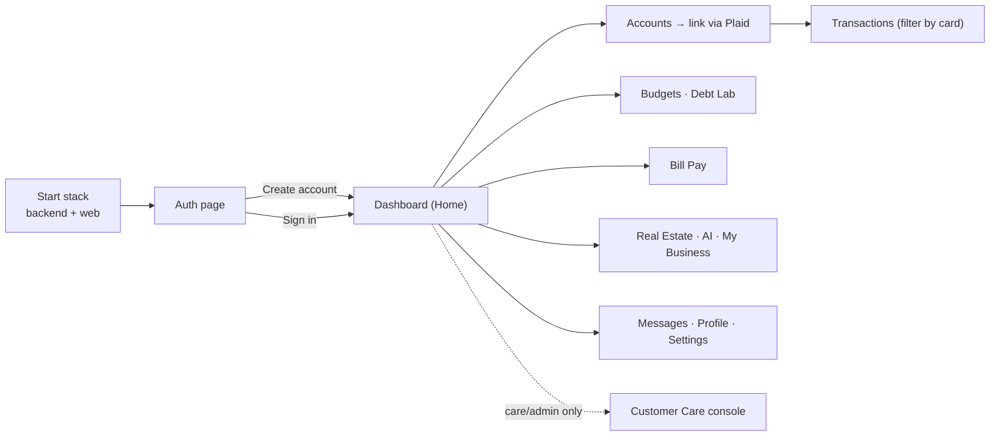

# End-to-End Walkthrough — Start to Finish

A step-by-step run of the whole application: from starting the stack, creating a profile, to
using every screen. Use this to test locally.

## 0. Start everything
```bash
cd finance-mvp
npm install                 # first time only (web + node deps)
npm run build:backend       # builds 9 Java services + prisma generate
npm run start:backend       # api-gateway :8080 + 8 services + node :4000
npm run dev -w apps/web      # web on :5173  (new terminal)
```
Open **http://localhost:5173**.

### The whole journey at a glance



Ports: gateway 8080 · auth 8081 · aggregation 8082 · financial-core 8083 · real-estate 8084 ·
business 8085 · ai 8086 · payments 8087 · notifications 8088 · node 4000 · web 5173.

## 1. Create a profile (Sign up)
1. The app opens on the **split-screen auth page** (brand panel left, form right).
2. Click **Create account**. Enter **Full name**, **Email**, **Password** (≥ 8 chars). Use the
   eye icon to show/hide the password.
3. Submit → the web calls `POST /api/v1/auth/register` → `auth-service` creates the user
   (`users` table incl. `name`), returns a **JWT** + your name/email. You land on the dashboard.

   _Flow:_ AuthPage → `api.register` → gateway → auth-service. JWT stored in `localStorage`
   (`terravet_token`), name in `terravet_name`.

## 2. Sign in (returning)
- Sign out from the sidebar (logout icon by your avatar). Click **Sign in**, enter email +
  password → `POST /api/v1/auth/login` → token + name returned → dashboard. A stale/expired
  token auto-clears and returns you here.

## 3. Home (dashboard)
- KPI cards (Net Worth, Cash, Investments, Real Estate, Debt) from `GET /api/v1/me/snapshot`.
- Net-worth chart, credit utilization, upcoming bills, recent transactions, AI insights widget.
- Greeting shows your **name**. (A brand-new user shows zeros until accounts are linked.)

## 4. Link a bank (Accounts → Plaid)
1. Go to **Accounts** → **Link Account**.
2. Plaid sandbox: pick any bank → username `user_good` / password `pass_good`
   (phone `415-555-0011`, OTP `123456` if asked).
3. `createLinkToken` → Plaid Link → `exchangePublicToken` → accounts + transactions persist →
   the page refreshes and shows your accounts grouped (Cash, Investments, Credit, Loans) with a
   KPI summary. Click the **chevron** on an account → Transactions.

## 5. Transactions
- `GET /api/v1/aggregation/transactions`. Filter by search, category dropdown, and the
  Income/Spending segmented control; KPIs (Money In/Out/Net) update with the filter.

## 6. Budgets & Debt Lab

### Budgets — the 50/30/20 method (industry standard)
The recommended way to budget, built into the page:
1. Enter your **monthly take-home income** in the "50/30/20 Method" card.
2. Click **Apply template** → it creates standard categories allocated to the targets:
   **50% Needs** (Housing, Groceries, Utilities, Transportation, Insurance),
   **30% Wants** (Dining, Entertainment, Shopping, Subscriptions, Travel, Personal Care),
   **20% Savings** (Emergency Fund, Investments, Retirement).
3. The three method tiles show your **allocation vs. target** per group (green/amber/over).
4. Tune any category's amount inline, **Add category** (custom or from the standard list),
   or delete one. Click **Save budget** → `PUT /api/v1/planning/budgets/{month}`.
5. Use the **‹ ›** arrows to budget per month; the donut + "Projected end" track spend pace
   (spent comes from your real transactions). **Export CSV** downloads the month.
6. Filter by **All / Needs / Wants / Savings**.

> Tip: aim to keep each group at/under its target bar. If "Projected end" exceeds your budget,
> you're on pace to overspend — trim a Wants category.

### Debt Lab
- **Add debt** (name, balance, APR, min payment) → `POST /api/v1/planning/debt-scenarios/add`.
- Set an **extra monthly payment**, click **Compare strategies** (Avalanche / Snowball / Hybrid)
  → `/api/v1/planning/debt-scenarios`; **Set as plan** picks your strategy.

## 7. Properties (Real Estate)
- `GET /api/v1/real-estate` — property cards with equity. Add / revalue a property
  (`POST /api/v1/real-estate`, `POST /{id}/revalue`). _(Mock valuation provider.)_

## 8. My Business
- Connect (mock QuickBooks) → dashboard KPIs, invoices & expenses tables
  (`/api/v1/business/*`). **Sync** refreshes.

## 9. AI Assistant
- Insight cards from `GET /api/v1/ai/insights`; **Refresh** regenerates. Use the **chat** box —
  `POST /api/v1/ai/chat` returns a grounded reply. _(Mock LLM provider.)_

## 10. Bill Pay
- Stepper: choose card → funding account → amount → submit →
  `POST /api/v1/payments/bill-pay-intents` (mock Stripe, settles immediately). History lists intents.

## 11. Fractional LLC
- Tabs: **My Holdings** (owned fractional shares with returns) and **Marketplace** (offerings with
  % funded + Invest). _(Presentational.)_

## 12. Notifications & Messages
- The **bell** in the topbar shows a live dropdown (`GET /api/v1/notifications`) with unread dot.
- **Messages** page = full inbox; filter All/Unread/Read, search, click to read (marks read).

## 13. Settings, Security, Profile
- **Settings**: notification toggles persist (`PUT /api/v1/notifications/preferences`); appearance,
  regional, data & privacy controls.
- **Security**: 2FA toggle, change-password form (validated), active sessions (revoke), login history.
- **Profile**: avatar/initials + name + email, plan tier, preference toggles, sign out.

## 14. Sign out
- Sidebar logout → token cleared → back to the auth page.

---
**What's mock vs real:** account linking (Plaid) is a real sandbox integration. Real estate
valuation, business financials, AI, payments, and notification delivery use **mock providers**
(no external keys) — fully functional locally; swap to the real vendor per `docs/phases/`.
