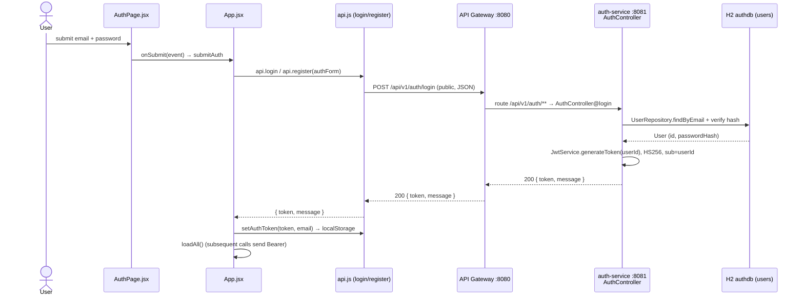

# Authentication Flow (register / login → JWT)

How a user registers or signs in, how `auth-service` issues an HS256 JWT
(`sub = userId`), how the web client stores and attaches it, and how every
downstream service validates it with an identical `JwtAuthFilter` + shared secret.

## Sequence



## Request trace

1. **`pages/AuthPage.jsx`** — `<form onSubmit={onSubmit}>` collects `authForm.email`
   / `authForm.password`; the toggle button flips `authMode` between `login`/`register`.
2. **`App.jsx` → `submitAuth(event)`** — calls `api.login(authForm)` when `authMode === "login"`,
   otherwise `api.register(authForm)`.
3. **`api.js` → `api.login` / `api.register`** — `request("/api/v1/auth/login", { method: "POST", body: JSON.stringify(payload) })`.
   `request()` does **not** attach a Bearer header here (no token yet); these routes are public.
4. **API Gateway `:8080`** — Spring Cloud Gateway routes path prefix `/api/v1/auth/**`
   to `auth-service :8081`. Gateway is the single CORS authority (`GatewayCorsConfig`).
5. **`auth-service` → `AuthController` (`@RequestMapping("/api/v1/auth")`)**
   - `POST /register` → `register(@Valid RegisterRequest)` → `AuthService.registerUser(...)`
     (409 `CONFLICT` if the email already exists), then immediately `AuthService.loginUser(...)`
     to mint a token → `200 AuthResponse(token, "User registered successfully")`.
   - `POST /login` → `login(@Valid LoginRequest)` → `AuthService.loginUser(...)`;
     on bad credentials returns `401 AuthResponse(null, "Invalid credentials")`.
6. **`AuthService.loginUser`** — authenticates via `AuthenticationManager`, loads the `User`,
   and calls `jwtService.generateToken(String.valueOf(user.getId()))`.
7. **`auth-service` → `JwtService.generateToken`** — builds a JWT with `setSubject(userId)`,
   `issuedAt`/`expiration` from `jwt.expiration`, signed `HS256` with `Keys.hmacShaKeyFor(jwt.secret)`.
8. **Back in `App.jsx`** — on `response.token`, calls `setAuthToken(token, email)`
   (stores under `terravet_token` + `terravet_email` in `localStorage`) then `loadAll()`.
9. **Every later request** — `api.js request()` adds `Authorization: Bearer <token>`.
   Each service's `JwtAuthFilter.doFilterInternal` reads the header, `JwtService.extractUsername`
   pulls `sub`, validates the signature/expiry against the **same `jwt.secret`**, and sets the
   `SecurityContext` principal to the `userId`.

## Data

Login request:
```json
{ "email": "user@example.com", "password": "Demo@1234" }
```
Register request (`RegisterRequest`):
```json
{ "email": "user@example.com", "password": "Demo@1234", "name": "Alex" }
```
Response (`AuthResponse`, both endpoints):
```json
{ "token": "<jwt>", "message": "Login successful" }
```

## Storage

- `users` table in H2 `authdb` (key columns: `id`, `email`, `password` hash, roles).
- Token is **not** persisted server-side; the web client stores it in `localStorage`
  (`terravet_token`). JWT validation everywhere else is stateless (signature + expiry).

## Notes

- **Auth requirement:** `/api/v1/auth/register` and `/login` are the only **public** routes.
  All other routes require `Authorization: Bearer <jwt>`.
- **Shared secret:** Token is HS256 with `sub = userId`. Each service (`auth`, `aggregation`,
  `financial-core`, …) has an identical `JwtAuthFilter` + `JwtService` using the same `jwt.secret`,
  so a token minted by `auth-service` validates everywhere. Services read the user id via
  `Long.valueOf(SecurityContextHolder.getContext().getAuthentication().getName())`.
- **401/403 handling:** `api.js request()` clears the token (`setAuthToken(null)`) and dispatches
  a `window` `auth:unauthorized` event; `App.jsx` listens and drops the user back to `AuthPage`
  with "Your session expired."
- **Gotcha:** the token is keyed `terravet_token` (a legacy `finance_token` is read once then
  cleared by `setAuthToken`). `register` returns 409 on duplicate email but `200` with a token
  on success (it auto-logs-in).
