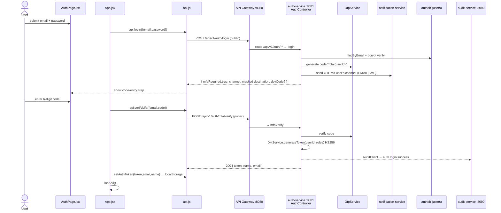
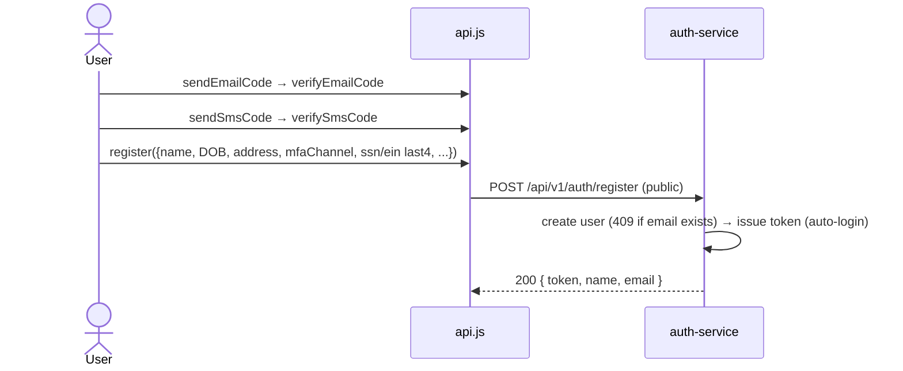

# Authentication Flow (register / MFA login → JWT with roles)

How a user registers (with verified email + phone) or signs in with **two-step MFA**, how
`auth-service` issues an HS256 JWT (`sub = userId`, `roles` claim), how the web client stores and
attaches it, and how every downstream service validates it with an identical `JwtAuthFilter` + shared
secret.

> _Refreshed 2026-06-07: login is now two-step (password → one-time code). MFA is on by default
> (`mfaEnabled`); when disabled, `/login` returns a token directly._

## Sequence — login (MFA)

## Sequence — register (verify-then-create, auto-login)

## Request trace (login)

1. **`pages/AuthPage.jsx`** — collects email/password (login) or the full signup form. The MFA code
   step replaces the password card until verified or "Back".
2. **`App.jsx` → `submitAuth`** — calls `api.login` then, on `mfaRequired`, `api.verifyMfa`.
3. **`api.js`** — `request("/api/v1/auth/login", …)`; these auth routes are public (no Bearer yet).
4. **API Gateway `:8080`** — routes `/api/v1/auth/**` to `auth-service :8081`; single CORS authority;
   the audit filter records the call (anonymous, status, latency, IP).
5. **`auth-service` → `AuthController`**
   - `POST /login` → verify password; if `mfaEnabled`, generate an OTP, send via
     `NotificationClient`, and return `{mfaRequired:true, channel, destination, devCode?}` (no token).
   - `POST /mfa/verify` → `{email,code}`; on success mint the JWT and emit `auth.login.success`.
   - `POST /register` → create user (409 on duplicate), auto-login.
   - `GET/PUT/DELETE /me` → profile view/edit/delete (SSN/EIN masked).
6. **`JwtService.generateToken`** — JWT with `setSubject(userId)`, a **`roles` claim**,
   `issuedAt`/`expiration`, signed HS256 with `Keys.hmacShaKeyFor(jwt.secret)`.
7. **Every later request** — `api.js` adds `Authorization: Bearer <token>`. Each service's
   `JwtAuthFilter` reads the header, validates against the **same `jwt.secret`**, sets the principal
   to `userId`, and maps `roles` → `ROLE_*` authorities (gating `/support/**`, `/audit/stats`, …).

## Data

Login step 1 → `{ "mfaRequired": true, "channel": "EMAIL", "destination": "d•••@gmail.com", "devCode": "123456" }`
Login step 2 (`/mfa/verify`) → `{ "token": "<jwt>", "name": "Alex", "email": "user@example.com" }`

## Storage

- `users` table (key columns: `id`, `email`, `password` hash, `mfa_channel`, verification flags,
  `ssn_last4`/`ein_last4`); `user_roles` (USER/CARE/ADMIN).
- Token is **not** persisted server-side; the web client stores it in `localStorage` (`terravet_token`).
  JWT validation everywhere else is stateless (signature + expiry + roles).

## Notes

- **Public routes:** `/auth/register`, `/auth/login`, `/auth/mfa/verify`, `/auth/{email,sms}/{send,verify}`.
  Everything else requires a Bearer token.
- **Dev codes:** OTPs are echoed as `devCode` only when `exposeDevCode` is set (never in prod).
- **401/403 handling:** `api.js` clears the token and dispatches `auth:unauthorized`; `App.jsx` drops
  the user back to `AuthPage`.
- **Roles:** the `roles` claim drives client-side nav gating for Customer Care / Admin; the backend
  enforces the real check on every gated endpoint.
