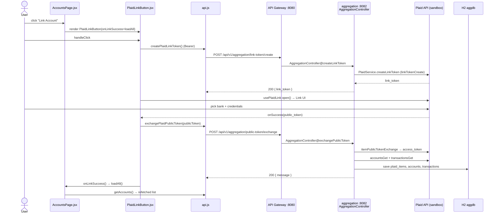

# Account Linking Flow (Plaid)

How a user links a financial institution: AccountsPage → PlaidLinkButton →
create link token → Plaid Link UI → exchange public token → `account-aggregation-service`
exchanges with Plaid, fetches accounts + transactions, persists them, then the page refetches.

## Sequence



## Request trace

1. **`pages/AccountsPage.jsx`** — renders `<PlaidLinkButton onLinkSuccess={loadAll}>Link Account</PlaidLinkButton>`
   (also in the empty-state "Link your first account" CTA).
2. **`components/PlaidLinkButton.jsx` → `handleClick`** — if no token yet, calls `fetchLinkToken()`,
   which guards on `api.getToken()` then calls `api.createPlaidLinkToken()`. Sets `linkToken` +
   `openWhenReady`; an effect calls `open()` once `react-plaid-link`'s `usePlaidLink` is `ready`.
3. **`api.js` → `createPlaidLinkToken`** — `POST /api/v1/aggregation/link-token/create` (Bearer, no body).
4. **API Gateway `:8080`** — routes `/api/v1/aggregation/**` → `account-aggregation-service :8082`.
5. **`AggregationController@createLinkToken`** (`@PostMapping("/link-token/create")`) — derives the
   user id via `getUserId()` (`Long.valueOf(authentication.getName())`), builds a `LinkTokenRequest`,
   calls `PlaidService.createLinkToken`, returns `{ "link_token": ... }`.
6. **`PlaidService.createLinkToken`** — `LinkTokenCreateRequest` with `clientUserId = userId`,
   `countryCodes=[US]`, `products=[AUTH, TRANSACTIONS]` (+ webhook if configured) →
   `plaidApi.linkTokenCreate(...).execute()`.
7. **Plaid Link UI** — `usePlaidLink({ token: linkToken })`; on completion fires `onSuccess(public_token)`.
8. **`PlaidLinkButton.onSuccess`** — `await api.exchangePlaidPublicToken(publicToken)`, then clears
   `linkToken`/`openWhenReady` and calls `onLinkSuccess?.()`.
9. **`api.js` → `exchangePlaidPublicToken`** — `POST /api/v1/aggregation/public-token/exchange`
   with body `{ publicToken }` (Bearer).
10. **`AggregationController@exchangePublicToken`** — sets `userId` from context, calls
    `PlaidService.exchangePublicToken`, returns **JSON** `{ "message": "Public token exchanged successfully" }`.
11. **`PlaidService.exchangePublicToken`** — `itemPublicTokenExchange(publicToken)` → `access_token` +
    `item_id`; persists a `PlaidItem`; then `fetchAccounts(...)` (`accountsGet`) and
    `fetchTransactions(...)` (`transactionsGet`, last 30 days), upserting by `plaidAccountId` /
    `plaidTransactionId`.
12. **`onLinkSuccess()` → `App.loadAll()`** — refetches via `api.getAccounts()` (and snapshot, tx,
    etc.); `AccountsPage` re-renders the grouped account list.

## Data

Link-token create: no body → `{ "link_token": "link-sandbox-..." }`.
Public-token exchange request → response:
```json
{ "publicToken": "public-sandbox-..." }
```
```json
{ "message": "Public token exchanged successfully" }
```
`GET /accounts` returns `[AccountDto]`:
```json
[{ "id": 1, "plaidAccountId": "...", "name": "Checking", "officialName": "...",
   "subtype": "checking", "type": "depository",
   "currentBalance": 8450.00, "availableBalance": 8450.00, "currency": "USD" }]
```

## Storage

H2 `aggdb`:
- `plaid_items` — `user_id`, `item_id`, `access_token` (key: linked institution).
- `accounts` — `user_id`, `plaid_account_id` (unique upsert key), `type`, `subtype`,
  `current_balance`, `available_balance`, `currency`.
- `transactions` — `user_id`, `account_id`, `plaid_transaction_id` (upsert key), `name`,
  `amount`, `date`, `category`.

## Notes

- **Auth requirement:** both endpoints require `Bearer <jwt>`; the user id comes only from the
  validated token, never from the request body (`getUserId()` overwrites any `userId` field).
- **plaid-java 35.0.0:** the service pins `plaid-java` `35.0.0` (SDK 35). Deserialization of newer
  Plaid response enums (e.g. `identity_match`) is handled by this version — older SDKs threw on
  unknown enum values. `PlaidConfig.resolvePlaidAdapter` maps env `production`/`prod` to
  `ApiClient.Production` and everything else (incl. the retired Development env) to Sandbox.
- **Exchange returns JSON, not a bare string** — `AggregationController` returns
  `Collections.singletonMap("message", ...)` so the web client's `response.json()` parses cleanly.
- **Error/edge:** `PlaidLinkButton` surfaces a hint if the gateway is unreachable
  (`Cannot reach API Gateway (http://localhost:8080)…`); `onExit` shows Plaid's `display_message`.
  401/403 anywhere clears the token (see auth flow).
- **Gotcha:** transactions only pull the last 30 days at link time; `mapTransaction` requires the
  account to already exist (accounts are fetched first), else it throws `IllegalStateException`.
