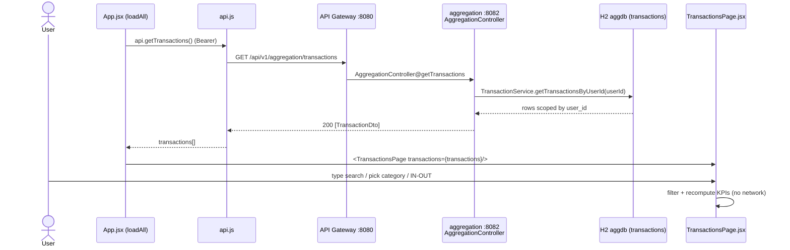

# Transactions Flow

How linked transactions reach the Transactions page. `App.jsx` loads them once via
`api.getTransactions()` into shared state; `TransactionsPage.jsx` renders that array and does
all searching, filtering, and KPI math **client-side**.

## Sequence



## Request trace

1. **`App.jsx` → `loadAll()`** — part of a `Promise.allSettled([...])` batch that includes
   `api.getTransactions()`. On `fulfilled` it does `setTransactions(txRes.value ?? [])`.
2. **`api.js` → `getTransactions`** — `request("/api/v1/aggregation/transactions")` (GET, Bearer
   header attached by `request()`).
3. **API Gateway `:8080`** — routes `/api/v1/aggregation/**` → `account-aggregation-service :8082`.
4. **`AggregationController@getTransactions`** (`@GetMapping("/transactions")`) — calls
   `getUserId()` then `transactionService.getTransactionsByUserId(userId)`; returns `200 [TransactionDto]`.
5. **`TransactionService.getTransactionsByUserId`** — queries `TransactionRepository` filtered by
   `user_id` (data isolation), maps entities → `TransactionDto`.
6. **`App.jsx`** passes the array to **`<TransactionsPage transactions={transactions} />`** (via
   `AppLayout`). No transactions-specific fetch happens inside the page.
7. **`pages/TransactionsPage.jsx`** — local `useState` for `search`, `category`, `direction`
   (`ALL|IN|OUT`):
   - `categories` = unique `t.category` values + `ALL`.
   - `filtered` = `useMemo` matching `name||description` + category against the search query,
     the selected category, and the IN/OUT sign of `amount`.
   - `totals` = `useMemo` summing `moneyIn` (amount ≥ 0), `moneyOut` (amount < 0), `net`.
   These KPIs and the table render from the in-memory array — **no API round-trips on filter**.

## Data

`GET /api/v1/aggregation/transactions` → `[TransactionDto]`:
```json
[{
  "id": 12, "accountId": 3, "plaidTransactionId": "...", "plaidAccountId": "...",
  "name": "Acme Grocery", "amount": -120.50, "isoCurrencyCode": "USD",
  "date": "2026-05-20", "category": "Groceries"
}]
```
The page reads `t.name` (falls back to `t.description`), `t.category`, `t.date`, `t.amount`.

## Storage

- Read-only against `transactions` in H2 `aggdb` (key columns: `user_id`, `account_id`, `date`,
  `amount`, `category`). No writes in this flow.

## Notes

- **Auth requirement:** Bearer JWT required; rows are scoped to `user_id` from the token.
- **Client-side everything:** searching, category filter, IN/OUT segmentation, and the Money
  In / Money Out / Net KPIs are computed in `TransactionsPage` from the already-loaded array —
  there are no query-param filters on the endpoint.
- **Shape gotcha:** transactions use `name` (Plaid), but `HomePage`'s "recent" widget and some mocks
  use `description`; the page defensively reads `t.name || t.description`. Income is `amount >= 0`,
  spending is `amount < 0`.
- **Error/edge:** because it's in the `allSettled` batch, a transactions failure does not block the
  rest of the dashboard; only an all-failed batch throws. 401/403 clears the token (auth flow).
- The Export button is a stub (no handler wired yet).
