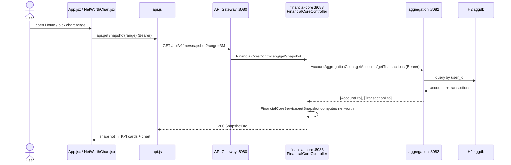

# Net Worth Snapshot Flow

How the dashboard's net-worth picture is produced. `HomePage` / `NetWorthChart` request a
snapshot from `financial-core-service`, which fans out to `account-aggregation-service` for the
user's accounts + transactions and computes net worth, cash, investments, and debt.

## Sequence



## Request trace

1. **`App.jsx` → `loadAll()`** — calls `api.getSnapshot()` (default range `"All"`) in the
   `Promise.allSettled` batch; stores via `setSnapshot(snapshotRes.value)`.
2. **`components/NetWorthChart.jsx`** — also calls `api.getSnapshot(range)` on its own when the user
   clicks a range chip (`1M / 3M / 1Y / All`); updates `displaySeries` from `snap.series`.
3. **`api.js` → `getSnapshot`** — `request(\`/api/v1/me/snapshot?range=${encodeURIComponent(range)}\`)`
   (GET, Bearer).
4. **API Gateway `:8080`** — routes `/api/v1/me/**` → `financial-core-service :8083`.
5. **`FinancialCoreController@getSnapshot`** (`@GetMapping("/snapshot")`, `@RequestParam(defaultValue="All") range`)
   → `financialCoreService.getSnapshot(range)`.
6. **`FinancialCoreService.getSnapshot`** —
   - `getUserId()` from the JWT principal; `getAuthorizationHeader()` re-builds the `Bearer` header
     from the security context credentials.
   - Calls `AccountAggregationClient.getAccounts(authHeader)` and `.getTransactions(authHeader)`
     (Feign → gateway/service-to-service), so the same JWT is forwarded downstream.
   - Sums balances: `type == "depository"` → `cash`; `type == "credit"` → `creditCardsDebt`.
     `investments`, `loans`, real-estate values are placeholders (zero) for now.
   - `netTotal = cash + investments + realEstateEquity − creditCardsDebt − loans`.
   - Builds `NetWorthDto`, `ComponentsDto` (with mock 30-day deltas), and a `series` list
     (`generateTimeSeriesPoints` currently returns empty), returns a `SnapshotDto`.
7. **`account-aggregation-service`** serves the Feign calls from `AggregationController`
   `getAccounts`/`getTransactions` (same endpoints as the accounts/transactions flows), scoped by
   `user_id`.
8. **Render** — `HomePage` reads `snapshot.net_worth.total`, `.change_30d`, and
   `snapshot.components.{cash,investments,credit_cards}` for KPI cards; `NetWorthChart` plots
   `snapshot.series` (falls back to a default polyline when the series is empty).

## Data

`GET /api/v1/me/snapshot?range=3M` → `SnapshotDto`:
```json
{
  "userId": 1,
  "computedAt": "2026-06-06T10:00:00",
  "netWorth": { "total": 128430.00, "change30d": 15732 },
  "components": {
    "cash": 10450, "cashChange30d": 2320,
    "investments": 0, "investmentsChange30d": 10450,
    "creditCards": 22020, "creditCardsChange30d": 1038,
    "loans": 0,
    "realEstateValue": 0, "realEstateValueChange30d": 8500,
    "realEstateEquity": 0, "realEstateEquityChange30d": 1800
  },
  "series": []
}
```

## Storage

- **Stateless / computed** in `financial-core-service` — it persists nothing for the snapshot.
- Source data is read (via Feign) from `accounts` + `transactions` in H2 `aggdb`, scoped by `user_id`.

## Notes

- **Auth requirement:** Bearer JWT required; the same token is forwarded to
  `account-aggregation-service`, so the principal stays consistent across services.
- **Mocked fields:** 30-day change deltas are hard-coded constants, and `investments`, `loans`,
  and real-estate components are placeholders (zero) until those sources are wired in. `series` is
  currently empty (`generateTimeSeriesPoints` returns `Collections.emptyList()`), so the chart uses
  its built-in default polyline.
- **Field naming gotcha:** the Java `SnapshotDto` uses camelCase (`netWorth`, `change30d`); the
  React layer reads snake_case (`net_worth`, `change_30d`, `components.credit_cards`). Confirm the
  Jackson naming strategy / serialization matches what `HomePage` expects, or values render as 0.
- **Error/edge:** snapshot is in the `allSettled` batch, so a failure won't blank the rest of the
  dashboard; `NetWorthChart` keeps its previous series on a range-fetch error. 401/403 clears the
  token (auth flow).
