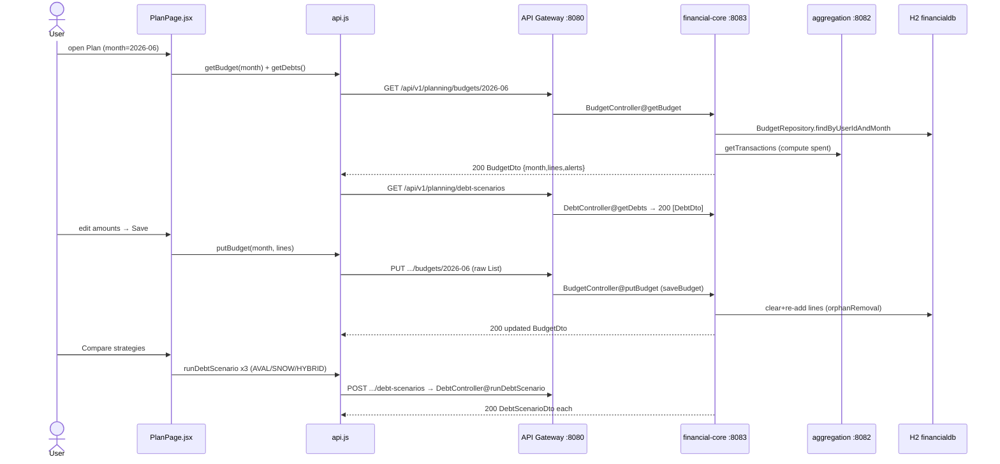

# Budget & Debt Flow

How the Plan page loads/saves a monthly budget and runs debt-payoff scenarios.
`PlanPage` talks to `financial-core-service` for both budgets
(`/api/v1/planning/budgets/{month}`) and debts (`/api/v1/planning/debt-scenarios`).

## Sequence



## Request trace

1. **`pages/PlanPage.jsx` → `loadBudgetAndDebts()`** (effect on `currentMonth`, e.g. `"2026-06"`):
   - `api.getBudget(currentMonth)` → sets `budgetLines = res.lines`, `alerts = res.alerts`.
   - `api.getDebts()` → sets `debts`.
2. **`api.js` → `getBudget`** — `GET /api/v1/planning/budgets/{month}` (Bearer).
3. **API Gateway `:8080`** — routes `/api/v1/planning/**` → `financial-core-service :8083`.
4. **`BudgetController@getBudget`** (`@GetMapping("/{month}")`) → `BudgetService.getBudgetForMonth(month)`:
   - `BudgetRepository.findByUserIdAndMonth(userId, month)`; if absent, an in-memory `new Budget(userId, month)`.
   - Fetches transactions via `AccountAggregationClient.getTransactions(authHeader)` and computes
     `spent` per category (`calculateSpentByCategory`, expenses only, within the month).
   - Returns `BudgetDto(month, lines[{category,amount,spent}], alerts=[])`.
5. **Save** — `PlanPage.saveBudget()` maps rows to `{ category, amount }` and calls
   `api.putBudget(currentMonth, lines)`.
6. **`api.js` → `putBudget`** — `PUT /api/v1/planning/budgets/{month}` with body
   `JSON.stringify(lines)` — a **raw `List<BudgetLineDto>`**, not an object wrapper.
7. **`BudgetController@putBudget`** (`@PutMapping("/{month}")`, `@RequestBody List<BudgetLineDto> lines`)
   → `BudgetService.saveBudget(month, lines)`:
   - loads/creates the `Budget`; if `lines == null` initializes the list; **mutates in place**
     (`getLines().clear()` then adds new `BudgetLine`s) — required because the collection is
     `orphanRemoval = true` and must not be reassigned.
   - `budgetRepository.save(budget)` (cascade ALL) persists new lines and deletes orphans; then
     re-runs `getBudgetForMonth` to return the budget with fresh `spent` values.
8. **Debts list** — `api.getDebts()` → `GET /api/v1/planning/debt-scenarios` →
   `DebtController@getDebts` (`@GetMapping`) → `DebtService.getDebtsByUserId()` → `[DebtDto]`.
9. **Run scenarios** — `App.runAllDebtScenarios()` (wired as `onRunAllScenarios`) calls
   `api.runDebtScenario({ strategy, extra_payment_monthly })` for `AVALANCHE`, `SNOWBALL`, `HYBRID`
   in parallel.
10. **`api.js` → `runDebtScenario`** — `POST /api/v1/planning/debt-scenarios` →
    `DebtController@runDebtScenario` (`@PostMapping`, `@RequestBody DebtScenarioRequest`) →
    `DebtService.runDebtScenario` → `DebtScenarioDto`.
11. **Add debt** — `api.addDebt(payload)` → `POST /api/v1/planning/debt-scenarios/add` →
    `DebtController@addDebt` (`@PostMapping("/add")`, `@RequestBody DebtDto`) → `DebtService.addDebt`.

## Data

`GET budgets/{month}` and `PUT` response — `BudgetDto`:
```json
{ "month": "2026-06",
  "lines": [{ "category": "Groceries", "amount": 600, "spent": 412.50 }],
  "alerts": [] }
```
`PUT budgets/{month}` **request body** is a raw list:
```json
[{ "category": "Groceries", "amount": 600 }, { "category": "Rent", "amount": 1600 }]
```
Debt scenario request / response:
```json
{ "strategy": "AVALANCHE", "extraPaymentMonthly": 300 }
```
```json
{ "strategy": "AVALANCHE", "monthsToDebtFree": 24,
  "totalInterestPaid": 4200, "debtFreeDate": "2028-06-01", "liquidity": "Medium" }
```
`GET debt-scenarios` → `[DebtDto]` `{ id, name, balance, apr, minPayment }`.

## Storage

H2 `financialdb`:
- `budgets` — `user_id`, **`month`** (`YYYY-MM`, backtick-quoted column — see notes), timestamps.
- `budget_lines` — FK `budget` (`@OneToMany ... orphanRemoval = true`), `category`, `amount`.
- `debts` — `user_id`, `name`, `balance`, `apr`, `min_payment`.
- `debt_scenarios` — persisted scenario runs.
Transactions for `spent` are read (Feign) from `aggdb`; not written here.

## Notes

- **Auth requirement:** all planning endpoints require Bearer JWT; budgets/debts are scoped to the
  token's `user_id`.
- **`month` reserved-word quoting:** `MONTH` is a reserved word in H2, so the `Budget` entity maps
  the column as `@Column(name = "\`month\`")` (backtick-quoted). Forgetting the quotes breaks DDL/queries.
- **orphanRemoval gotcha:** the `Budget.lines` collection is `orphanRemoval = true`; `saveBudget`
  must **mutate the managed collection in place** (`clear()` + `add()`), never reassign it, or
  Hibernate throws "A collection with orphanRemoval was no longer referenced".
- **PUT body shape:** `putBudget` sends a **bare JSON array** (`List<BudgetLineDto>`), and the
  controller binds `@RequestBody List<BudgetLineDto>` — do not wrap it in `{ lines: [...] }`.
  The request only needs `category` + `amount`; `spent` is recomputed server-side on the response.
- **camelCase vs snake_case:** the web sends `extra_payment_monthly` while `DebtScenarioRequest`
  is `extraPaymentMonthly`; rely on the configured Jackson naming strategy to bridge these (same
  caveat applies to reading `debt_free_date` / `total_interest_paid` in `PlanPage`).
- **Error/edge:** `loadBudgetAndDebts` swallows errors with a console log (page stays usable);
  401/403 anywhere clears the token and returns to login (auth flow).
