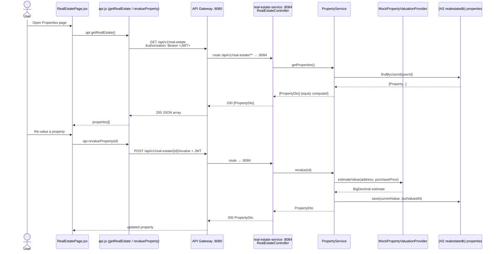

# Real Estate Flow

How the web app lists, adds, edits, deletes, and re-values properties. Equity is
computed server-side (`currentValue − mortgageBalance`) by `real-estate-service` (:8084)
and the property list renders the portfolio KPIs.

## Sequence



## Request trace

1. `apps/web/src/pages/RealEstatePage.jsx` renders `properties` (passed in as a prop from
   `App.jsx`, loaded via `api.getRealEstate`) and computes portfolio totals
   (`totalValue`, `totalEquity`, `totalMortgage`) from each `currentValue`/`equity`/`loanBalance`.
2. `apps/web/src/api.js` → `api.getRealEstate()` = `request("/api/v1/real-estate")`. The
   `request` helper adds `Authorization: Bearer <token>` from `localStorage` (`terravet_token`).
3. **API Gateway :8080** routes prefix `/api/v1/real-estate/**` to `real-estate-service :8084`
   (single CORS authority; downstream emits no CORS headers).
4. `RealEstateController@GET /api/v1/real-estate` → `PropertyService.getProperties()` →
   `PropertyRepository.findByUserId(userId)`, mapped via `convertToDto` (equity computed).
5. Other endpoints on the same controller: `POST /api/v1/real-estate` →
   `createProperty(dto)`; `GET /{id}` → `getProperty(id)`; `PUT /{id}` → `updateProperty(id, dto)`;
   `DELETE /{id}` → `deleteProperty(id)` (returns `204 No Content`);
   `POST /{id}/revalue` → `revalue(id)`, which calls `valuationProvider.estimateValue(...)`,
   sets `currentValue` + `lastValuedAt`, and persists.
6. `userId` is read from the JWT principal:
   `Long.valueOf(SecurityContextHolder.getContext().getAuthentication().getName())`.
   `findOwnedOrThrow` returns `404 Not Found` if the row's `userId` does not match.

## Data

Request body — `POST`/`PUT` (`PropertyDto`):
```json
{
  "address": "1842 Elmwood Drive, Austin TX",
  "propertyType": "PRIMARY_RESIDENCE",
  "purchasePrice": 250000.0000,
  "purchaseDate": "2018-06-15",
  "currentValue": 350000.0000,
  "mortgageBalance": 200000.0000,
  "lastValuedAt": "2026-06-06T10:00:00"
}
```

Response — `GET /api/v1/real-estate` returns a JSON **array** of `PropertyDto`, with
`equity` computed (`currentValue − mortgageBalance`):
```json
[
  {
    "id": 1,
    "address": "1842 Elmwood Drive, Austin TX",
    "propertyType": "PRIMARY_RESIDENCE",
    "purchasePrice": 250000.0000,
    "purchaseDate": "2018-06-15",
    "currentValue": 350000.0000,
    "mortgageBalance": 200000.0000,
    "equity": 150000.0000,
    "lastValuedAt": "2026-06-06T10:00:00"
  }
]
```
`POST`/`PUT`/`revalue` return a single `PropertyDto`; `DELETE` returns `204`.

## Storage

- DB: H2 `realestatedb` (dev) / PostgreSQL (prod).
- Table `properties` (entity `Property`). Key columns: `id`, `user_id`, `address`,
  `property_type` (`PRIMARY_RESIDENCE | RENTAL_PROPERTY | LAND`), `purchase_price`,
  `purchase_date`, `current_value`, `mortgage_balance`, `last_valued_at`.
- `equity` is **not** stored; it is computed in `PropertyService.convertToDto`.

## Provider (mock → real)

- Interface: `PropertyValuationProvider` (`estimateValue(address, purchasePrice)`).
- Mock: `MockPropertyValuationProvider` — deterministic, offline; hashes the address into a
  factor of ~1.05–1.30 × `purchasePrice` so the UI shows stable numbers (no network).
- To go live (see `docs/phases/PHASE_3_REAL_ESTATE.md`): add a real implementation calling
  **RentCast / ATTOM** (or Zillow), authenticated via the configured
  `realestate.provider.api-key` property, and remove/replace the mock `@Service` so Spring
  injects the real one.

## Notes

- **Auth required:** all `/api/v1/real-estate/**` endpoints need a valid Bearer JWT;
  `401/403` triggers the web client to clear the token and redirect to login.
- **Seed data:** `PropertyDataSeeder` (`CommandLineRunner`) seeds two properties for
  `userId=1` on first startup (Austin TX primary residence + Round Rock TX rental) if none
  exist.
- **Error handling:** non-existent or non-owned IDs return `404 Not Found` via
  `ResponseStatusException` (`findOwnedOrThrow`); ownership is always re-checked against the
  JWT `userId`.
