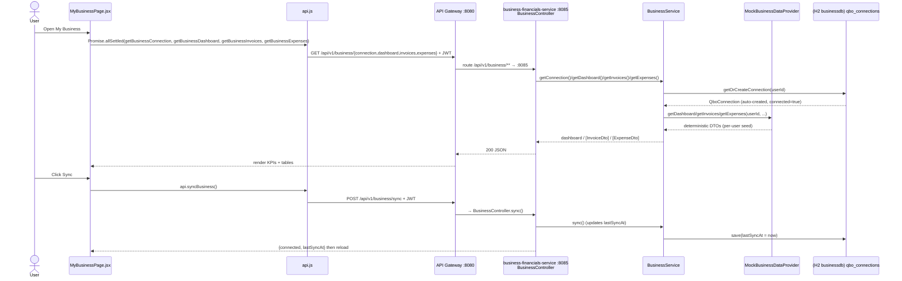

# Business Financials Flow

How the My Business page loads a QuickBooks-style dashboard, invoices, and expenses, and how
Connect / Sync work. `business-financials-service` (:8085) auto-creates a connected mock QBO
connection per user and serves deterministic, per-user financial data.

## Sequence



## Request trace

1. `apps/web/src/pages/MyBusinessPage.jsx` → `loadAll()` fires four calls via
   `Promise.allSettled`; an error surfaces only if **all four** fail. `handleSync` →
   `api.syncBusiness()`; `handleConnect` → `api.connectBusiness()`; both re-run `loadAll()`.
2. `apps/web/src/api.js`: `getBusinessConnection`, `getBusinessDashboard`,
   `getBusinessPnl(period)`, `getBusinessInvoices`, `getBusinessExpenses`, `connectBusiness`
   (`POST /connect`), `syncBusiness` (`POST /sync`). All carry the Bearer JWT.
3. **API Gateway :8080** routes `/api/v1/business/**` → `business-financials-service :8085`.
4. `BusinessController` endpoints → `BusinessService`:
   - `GET /connection` → `getConnection()` → returns map `{connected, companyName, lastSyncAt}`.
   - `GET /dashboard` → `getDashboard()` → `dataProvider.getDashboard(userId, companyName, connected)`.
   - `GET /pnl?period=` → `getPnl(period)` → `dataProvider.getPnl(userId, period)` (default `MTD`).
   - `GET /invoices` / `GET /expenses` → `getInvoices()` / `getExpenses()`.
   - `POST /sync` → `sync()` (sets `lastSyncAt = now`); `POST /connect` → `connect()` (sets `connected=true`).
5. `BusinessService.getOrCreateConnection(userId)` auto-creates a **connected** mock
   `QboConnection` (company `"Summit Ventures LLC"`, `realmId = "mock-realm-<userId>"`) on first
   access, so the demo works out of the box. `userId` comes from the JWT principal name.
6. `MockBusinessDataProvider` derives all figures from a deterministic per-user `Random` seed,
   keeping `netProfit = revenue − expenses` and `outstandingInvoices` = sum of non-`PAID`
   invoices.

## Data

`GET /connection` response:
```json
{ "connected": true, "companyName": "Summit Ventures LLC", "lastSyncAt": "2026-06-06T10:00:00" }
```

`GET /dashboard` response (`BusinessDashboardDto`):
```json
{
  "companyName": "Summit Ventures LLC",
  "connected": true,
  "revenueMtd": 72000.00,
  "expensesMtd": 50400.00,
  "netProfitMtd": 21600.00,
  "cashBalance": 88000.00,
  "outstandingInvoices": 34250.00,
  "revenueChangePct": 12.4
}
```

`GET /invoices` → array of `InvoiceDto`; `GET /expenses` → array of `ExpenseDto`:
```json
[{ "id": "INV-1000", "customer": "Acme Corp", "amount": 8200.00, "status": "OPEN", "dueDate": "2026-06-30" }]
[{ "id": "EXP-2000", "vendor": "AWS", "category": "Payroll", "amount": 3400.00, "date": "2026-05-29" }]
```

`GET /pnl?period=MTD` (`PnlDto`): `{ period, revenue:[{category,amount}], expenses:[{category,amount}], totalRevenue, totalExpenses, netProfit }`.

## Storage

- DB: H2 `businessdb` (dev) / PostgreSQL (prod).
- Table `qbo_connections` (entity `QboConnection`). Key columns: `id`, `user_id` (unique),
  `connected`, `realm_id`, `company_name`, `last_sync_at`, `created_at`, `updated_at`.
- Invoices/expenses/dashboard/P&L are **not persisted** — they are generated on demand by the
  mock provider from a per-user seed.

## Provider (mock → real)

- Interface: `BusinessDataProvider` (`getDashboard`, `getPnl`, `getInvoices`, `getExpenses`).
- Mock: `MockBusinessDataProvider` — deterministic per-user data, no network.
- To go live (see `docs/phases/PHASE_4_BUSINESS_FINANCIALS.md`): implement a **QuickBooks
  Online OAuth2** client and store the real `realm_id` / tokens on `QboConnection`. Config keys:
  `qbo.client-id`, `qbo.client-secret`, `qbo.redirect-uri`. `connect()` would start the OAuth2
  authorization flow instead of flipping `connected=true`.

## Notes

- **Auth required:** every `/api/v1/business/**` endpoint needs a valid Bearer JWT; `401/403`
  clears the client token and redirects to login.
- **Seed/demo behavior:** there is no seeder — instead, `getOrCreateConnection` lazily creates
  a connected mock connection per authenticated user on first request.
- **Error handling:** the page tolerates partial failures (`Promise.allSettled`), only showing
  an error card if all four loads fail; transient sync failures set a non-blocking error and a
  Retry button is offered.
