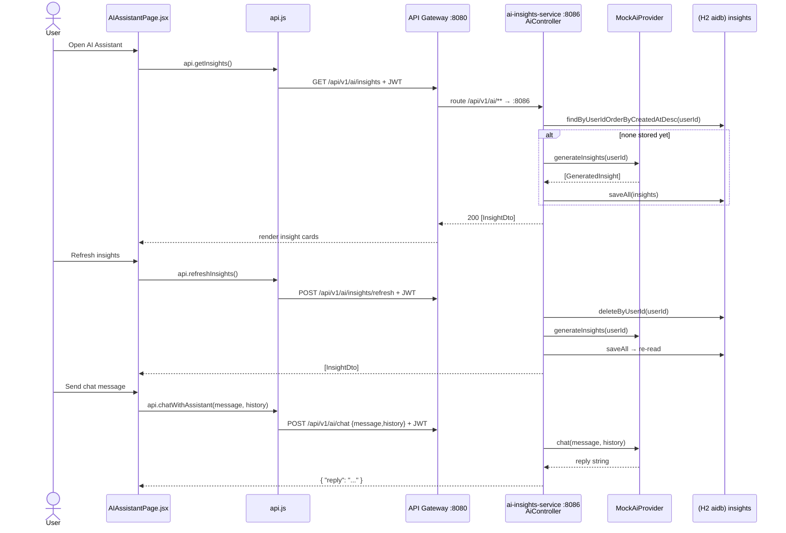

# AI Insights Flow

How the AI Assistant page loads personalized insights, refreshes them, and chats.
`ai-insights-service` (:8086) persists generated insights per user and serves templated
mock chat replies behind a swappable `AiProvider`.

## Sequence



## Request trace

1. `apps/web/src/pages/AIAssistantPage.jsx`: on mount loads insights via `api.getInsights()`;
   `handleRefresh` → `api.refreshInsights()`; `handleSend` → `api.chatWithAssistant(text, history)`
   where `history` is a flat array of prior message strings (`historyRef`). It reads
   `ins.suggestedAction || ins.suggested_action` and normalizes `severity` to
   `ACTIONABLE | WARNING | INFO`.
2. `apps/web/src/api.js`: `getInsights()` = `GET /api/v1/ai/insights`;
   `refreshInsights()` = `POST /api/v1/ai/insights/refresh`;
   `chatWithAssistant(message, history)` = `POST /api/v1/ai/chat` with body `{message, history}`.
   All carry the Bearer JWT.
3. **API Gateway :8080** routes `/api/v1/ai/**` → `ai-insights-service :8086`.
4. `AiController`:
   - `GET /insights` → `InsightRepository.findByUserIdOrderByCreatedAtDesc(userId)`; if empty,
     `generateAndPersist(userId)` calls `aiProvider.generateInsights(userId)` and `saveAll`.
   - `POST /insights/refresh` (`@Transactional`) → `insightRepository.deleteByUserId(userId)`
     then `generateAndPersist(userId)`.
   - `POST /chat` (`@Valid ChatRequest`) → `aiProvider.chat(message, history)` → `ChatResponse`.
5. `userId` is read from the JWT principal name (`SecurityContextHolder...getName()`).

## Data

`POST /api/v1/ai/chat` request (`ChatRequest`, `message` is `@NotBlank`):
```json
{ "message": "How do I lower my credit utilization?", "history": ["earlier user msg", "earlier reply"] }
```

`POST /api/v1/ai/chat` response (`ChatResponse`):
```json
{ "reply": "Thanks for your question. You asked: \"...\". Here is some general guidance..." }
```

`GET /api/v1/ai/insights` → array of `InsightDto` (note camelCase `suggestedAction`):
```json
[
  {
    "id": 1,
    "title": "High credit card utilization",
    "reason": "Your revolving credit utilization appears elevated relative to your total available limit...",
    "severity": "ACTIONABLE",
    "suggestedAction": "Aim to bring utilization below 30% by paying down the highest-balance card first...",
    "createdAt": "2026-06-06T10:00:00"
  }
]
```
`severity` ∈ `INFO | WARNING | ACTIONABLE`. The web client also tolerates a wrapped
`{ "insights": [...] }` shape and a snake_case `suggested_action`.

## Storage

- DB: H2 `aidb` (dev) / PostgreSQL (prod).
- Table `insights` (entity `Insight`). Key columns: `id`, `user_id`, `title`, `reason`
  (len 2000), `severity` (len 20), `suggested_action` (len 2000), `created_at`.
- Insights are persisted per user; refresh deletes then regenerates. Chat replies are **not**
  persisted (conversation history is held client-side in `historyRef`).

## Provider (mock → real)

- Interface: `AiProvider` (`generateInsights(userId)`, `chat(message, history)`); insight payload
  carrier `GeneratedInsight`.
- Mock: `MockAiProvider` — five curated personal-finance insights and a templated chat reply,
  no network call.
- To go live (see `docs/phases/PHASE_5_AI_INSIGHTS.md`): implement an LLM-backed provider that
  assembles the user's financial summary and calls **Claude (Anthropic)** or **OpenAI**. Config
  keys: `ai.provider`, `ai.model`, and an API key — `ANTHROPIC_API_KEY` for Claude or
  `OPENAI_API_KEY` for OpenAI. (`userId` is already available in `chat` for personalization.)

## Notes

- **Auth required:** all `/api/v1/ai/**` endpoints need a valid Bearer JWT; `401/403` clears the
  token and returns to login.
- **Seed data:** none — insights are generated lazily on first `GET /insights` per user.
- **Error handling:** blank chat `message` fails `@NotBlank` validation (`400`); the UI shows a
  per-section error (`insightsError` / `chatError`) and a standing disclaimer that the assistant
  provides general information, not financial advice.
