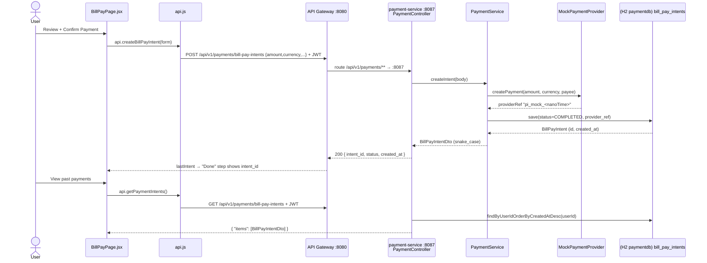

# Payments / Bill Pay Flow

How the Bill Pay wizard creates a payment and lists intents. `payment-service` (:8087) settles
each intent immediately through a mock `PaymentProvider` (Stripe stand-in) and stores it as
`COMPLETED`. Response JSON uses **snake_case** (`intent_id`, `created_at`).

## Sequence



## Request trace

1. `apps/web/src/pages/BillPayPage.jsx` is a stepper (Select card → Amount → Funding → Review →
   Done). On the Review step (`step === 3`) "Confirm Payment" calls the `onSubmit` handler
   (wired in `App.jsx`) which posts the `billPayForm`; the Done step (`step === 4`) shows
   `lastIntent.intent_id`.
2. `apps/web/src/api.js`: `getPaymentIntents()` = `GET /api/v1/payments/bill-pay-intents`;
   `createBillPayIntent(payload)` = `POST /api/v1/payments/bill-pay-intents` with the form body.
   Both carry the Bearer JWT.
3. **API Gateway :8080** routes `/api/v1/payments/**` → `payment-service :8087`.
4. `PaymentController`:
   - `GET /bill-pay-intents` → `PaymentService.getIntents()` → returns `Map.of("items", items)`
     (wrapped to match the client).
   - `POST /bill-pay-intents` (tolerant `Map<String,Object>` body) → `createIntent(payload)`.
   - `GET /bill-pay-intents/{id}` → `getIntent(id)` (owner-scoped, `404` otherwise).
   - `POST /webhook` _(public/permitAll)_ → returns `{received:true}` (mock Stripe webhook).
5. `PaymentService.createIntent` parses `amount` (defaults `0`; invalid → `400`), `currency`
   (defaults `USD`), `payee`, and the funding account from any of `fromAccountId`,
   `funding_account_id`, or `card_account_id`. It calls `paymentProvider.createPayment(...)`,
   then persists the intent as **`COMPLETED`** (the mock settles immediately) with the returned
   `providerRef`. `userId` comes from the JWT principal name.

## Data

`POST /api/v1/payments/bill-pay-intents` request body (tolerant; funding key may vary):
```json
{ "amount": 1250, "currency": "USD", "payee": "Acme Mortgage", "funding_account_id": "acc_1", "card_account_id": "card_2" }
```

`POST` response (single `BillPayIntentDto`, snake_case via `@JsonProperty`):
```json
{
  "intent_id": "42",
  "amount": 1250,
  "currency": "USD",
  "status": "COMPLETED",
  "payee": "Acme Mortgage",
  "created_at": "2026-06-06T10:00:00"
}
```
`intent_id` is the entity `id` as a string (falls back to `providerRef`).

`GET /api/v1/payments/bill-pay-intents` response (wrapped in `items`):
```json
{ "items": [ { "intent_id": "42", "amount": 1250, "currency": "USD", "status": "COMPLETED", "payee": "Acme Mortgage", "created_at": "2026-06-06T10:00:00" } ] }
```

## Storage

- DB: H2 `paymentdb` (dev) / PostgreSQL (prod).
- Table `bill_pay_intents` (entity `BillPayIntent`). Key columns: `id`, `user_id`, `amount`,
  `currency` (default `USD`), `payee`, `from_account`, `status`
  (`PENDING | COMPLETED | FAILED`; mock always `COMPLETED`), `provider_ref`, `created_at`,
  `updated_at`.

## Provider (mock → real)

- Interface: `PaymentProvider` (`createPayment(amount, currency, payee)` → provider ref).
- Mock: `MockPaymentProvider` — no network; returns `"pi_mock_<System.nanoTime()>"` and the
  service marks the intent `COMPLETED`.
- To go live (see `docs/phases/PHASE_6_PAYMENTS.md`): implement a real Stripe client that creates
  a **Stripe PaymentIntent** (return `intent.getId()`) and verify the `/webhook` signature.
  Config keys: `STRIPE_SECRET_KEY` (API auth) and `STRIPE_WEBHOOK_SECRET` (webhook signature
  verification). With real Stripe, intents would start `PENDING` and transition to `COMPLETED`
  via the webhook rather than settling inline.

## Notes

- **Auth required:** `/api/v1/payments/bill-pay-intents**` need a valid Bearer JWT; `401/403`
  clears the client token and redirects to login. `POST /webhook` is **public** (permitAll).
- **Seed data:** none — intents exist only once a user creates a payment.
- **Error handling:** invalid `amount` → `400 Bad Request`; unknown/non-owned intent id on
  `GET /{id}` → `404 Not Found` (`findByIdAndUserId`). Ownership is always scoped to the JWT
  `userId`.
