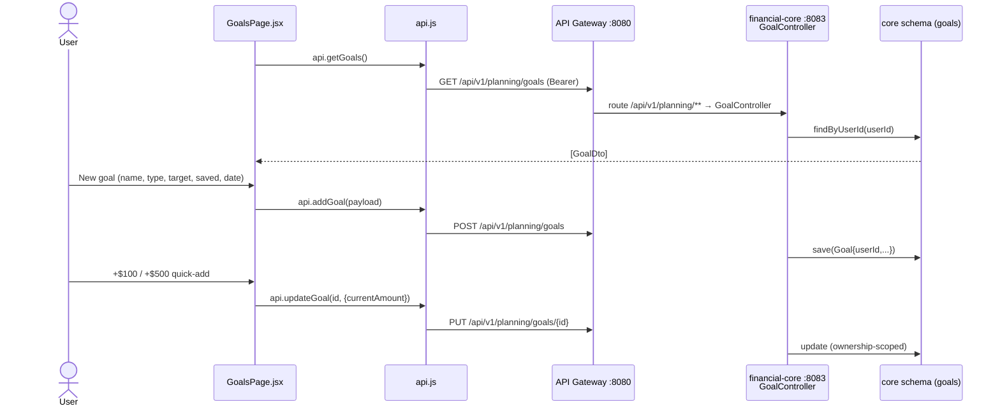

# Goals Flow (set a target → track progress)

How the Goals screen creates and tracks savings/debt/net-worth goals via **financial-core-service**
(`/api/v1/planning/goals`). Goals are fully persisted; the required monthly contribution shown on each
card is computed client-side from target / current / target-date.

## Sequence



## Request trace

1. **`pages/GoalsPage.jsx`** — KPI grid (Goals / Saved / Total target), new-goal form, goal cards with
   progress bars and "+$100 / +$500" quick-add; delete per card.
2. **`api.js`** — `getGoals`, `addGoal`, `updateGoal(id, payload)`, `deleteGoal(id)` →
   `/api/v1/planning/goals[/{id}]`.
3. **API Gateway** — routes `/api/v1/planning/**` to financial-core-service :8083.
4. **`financial-core` → `GoalController`** — CRUD scoped to the authenticated `userId`; delegates to
   `GoalService` / `GoalRepository`.

## Data

`GoalDto` ↔ `Goal`:
```json
{ "id": 7, "name": "House down payment", "goalType": "SAVINGS",
  "targetAmount": 60000, "currentAmount": 12000, "targetDate": "2027-12-31",
  "monthlyContribution": 2400 }
```
`goalType ∈ SAVINGS | DEBT_PAYOFF | NET_WORTH | CUSTOM`.

## Storage

- Table `goals` in schema `core`: `id, user_id, name, goal_type, target_amount, current_amount,
  target_date, monthly_contribution, created_at, updated_at`.

## Notes

- Progress is **user-updated** today (quick-add buttons). Auto-progress from linked accounts /
  net-worth would make goals fully live — see [04 · Feature status & gaps](../../workflows/04-feature-status-and-gaps.md).
- All reads/writes are ownership-scoped; no cross-user access.
