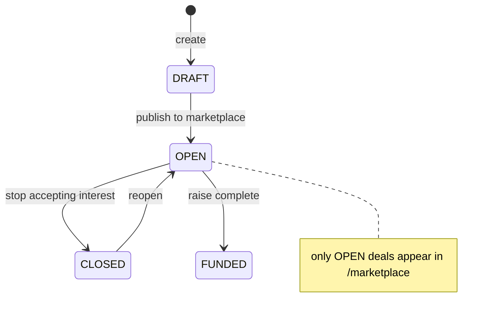

# Deal Room Flow (register → marketplace → interest → leads)

How sponsors register investment deals and how investors browse, save, and express interest — served
by **real-estate-service** under `/api/v1/deals/**` and `/api/v1/sponsor/**`. Everything is persisted;
no external provider is involved. (Granular component view:
[docs/workflows/components/12-deals-and-sponsor-service.md](../../workflows/components/12-deals-and-sponsor-service.md).)

## Sequence

```mermaid
sequenceDiagram
    actor Owner as Owner (sponsor)
    actor Investor
    participant DR as DealRoomPage.jsx
    participant Api as api.js
    participant GW as API Gateway :8080
    participant Svc as real-estate :8084<br/>DealController / SponsorProjectController
    participant DB as real_estate schema

    Owner->>Api: createDeal(...) (status DRAFT)
    Api->>GW: POST /api/v1/deals
    GW->>Svc: route /api/v1/deals/** → DealController
    Svc->>DB: save Deal{userId(owner), ...}
    Owner->>Api: addDealDocument / createSponsorProject
    Owner->>Api: updateDeal(id, {status: OPEN})
    Investor->>Api: getMarketplace(filters)
    Api->>GW: GET /api/v1/deals/marketplace?category=&sort=
    Svc->>DB: query OPEN deals (filter+sort)
    Investor->>Api: watchDeal(id) / getDeal(id)
    Investor->>Api: expressDealInterest(id, {name,email,amount,accredited})
    Api->>GW: POST /api/v1/deals/{id}/interests
    Svc->>DB: save DealInterest (lead; consent to share contact)
    Owner->>Api: getDealInterests(id) → updateLeadStatus(...,COMMITTED)
    Api->>GW: PUT /api/v1/deals/{id}/interests/{iid}/status
    Svc->>DB: update lead status; roll up committed amount
```

## Deal status state machine



## Request trace

1. **`pages/DealRoomPage.jsx`** — tabs My Deals / Marketplace / Saved / My Interests / Track Record,
   plus deal detail, owner leads, and owner documents sub-views.
2. **`api.js`** — `getDeals`, `getDealTaxonomy`, `getMarketplace`, `getDeal`, `createDeal`,
   `updateDeal`, `deleteDeal`, `watchDeal`/`unwatchDeal`, `getWatchlist`, `expressDealInterest`,
   `getDealInterests`, `updateLeadStatus`, `getMyInterests`, `*DealDocument*`, `*SponsorProject*`.
3. **API Gateway** — `/api/v1/deals/**` and `/api/v1/sponsor/**` both route to real-estate-service :8084.
4. **`real-estate` → `DealController` / `SponsorProjectController`** — all writes ownership-scoped in
   `DealService` (a user edits only their own deals/leads/documents).

## Data (entities)

- `deals` — title, category, subcategory, return_type, annual_return_min/max, distribution_frequency,
  target_irr, target_raise, min_investment, hold_period_months, status, amount_committed, location,
  website_url, description.
- `deal_interests` — deal_id, owner_user_id, interested_user_id?, name, email, phone,
  commitment_amount, accredited, status (NEW/CONTACTED/COMMITTED/PASSED), message.
- `deal_documents` — deal_id, owner_user_id, label, url, doc_type (link-based; no object storage).
- `deal_watches` — unique (user_id, deal_id).
- `sponsor_projects` — user_id, name, location, project_year, outcome, url, description.

## Storage

All tables in schema `real_estate` alongside `properties`.

## Notes

- **Consent:** expressing interest stores the investor's contact details + an **accredited-investor
  self-attestation** with explicit consent to share with the deal owner.
- The committed-amount progress bar is **indicative, not binding** — no money moves through the platform.
- Customer Care read-only view: `GET /api/v1/deals/support/{userId}` (CARE/ADMIN, audited).
- **Pending:** notify owner on a new lead; document object-storage; real accreditation/KYC.
