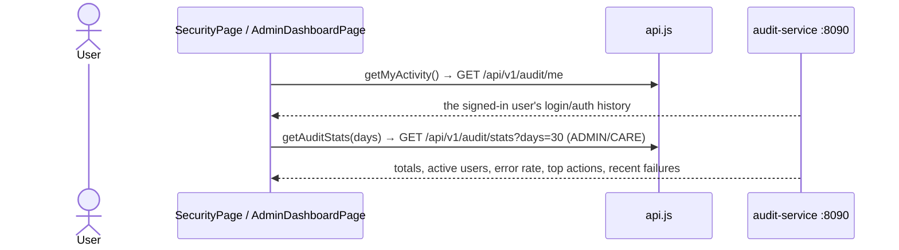
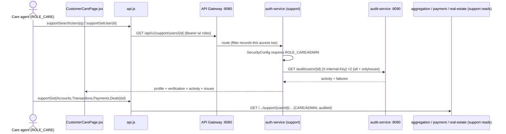

# Audit & Customer Care Flow (activity capture → member 360)

How **every user action is captured** by the audit-service, and how a role-gated **Customer Care**
agent assembles a member "360" view (profile + activity + issues). Two capture paths feed the audit
log: the gateway's global filter (every request) and service domain events (e.g. auth login
success/failure). Granular component docs:
[10-audit-service.md](../../workflows/components/10-audit-service.md) ·
[11-customer-care.md](../../workflows/components/11-customer-care.md).

## Capture: every request is logged

```mermaid
sequenceDiagram
    actor User
    participant GW as API Gateway :8080<br/>AuditLoggingFilter
    participant Svc as any service
    participant Aud as audit-service :8090<br/>(schema audit)

    User->>GW: request + JWT
    GW->>GW: decode sub from JWT, start timer
    GW->>Svc: route
    Svc-->>GW: response
    GW-->>Aud: fire-and-forget POST /api/v1/audit/events (X-Internal-Key)
    Note over GW,Aud: never blocks/fails the user request;<br/>skips preflight, /actuator/**, /api/v1/audit/**
    Svc-->>Aud: (richer) domain events e.g. auth.login.success/failure
```

## Read: the user's own activity & the admin KPI dashboard



## Customer Care 360



## Request trace

1. **Gateway** — `AuditLoggingFilter` runs first: decodes the JWT subject, times the request, derives
   the target service from the path, fire-and-forgets the event. Ingest is guarded by
   `AUDIT_INGEST_KEY` (`X-Internal-Key`) + network isolation.
2. **Domain events** — services post via `AuditClient`. Implemented in auth-service for
   `auth.login.success`, `auth.login.failure` (with attempted email), `auth.register.success`.
3. **Query APIs** (audit-service) — `/audit/me` (self), `/audit/stats` (ADMIN/CARE), `/audit/users/{id}`
   and `/audit/events` (ADMIN / internal key).
4. **Customer Care** (auth-service `/support/**`, role-gated) — search, member 360, activity, and
   ADMIN-only role grants; reads a member's accounts/transactions/payments/deals via each service's
   `/.../support/{userId}` endpoints (all audited, since the agent's own calls pass through the filter).

## Data

`audit_events`: `id, user_id (JWT sub; null=anonymous), actor_type, action, service, method, path,
status, source_ip, user_agent, latency_ms, outcome (SUCCESS|FAILURE|DENIED), metadata, created_at`.
Indexed on `user_id`, `created_at`, `action`, `(user_id, created_at)`.

## Storage

- Table `audit_events` in schema `audit` (append-only).
- Roles live on `users` / `user_roles` (auth schema) and are embedded in the JWT `roles` claim.

## Notes

- **Security:** ingest requires the internal key; query endpoints require a valid JWT; `/me` is always
  self-scoped. ⚠️ **Admin gating TODO:** `/events` and `/users/{id}` currently allow any authenticated
  user with the internal key path — restrict to an admin role before exposing a public admin UI.
- The agent's own lookups are themselves audited by the gateway filter, so support access is traceable.
- **Pending:** broaden domain events to more services; before/after entity diffs; retention/rotation;
  ship to a SIEM.
