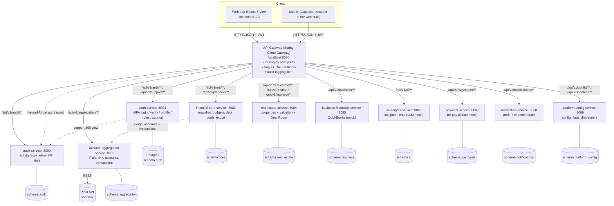

# System Architecture

> _Refreshed 2026-06-07 against the live code._ The platform now runs **11 Spring Boot services**
> behind the gateway (the **audit-service :8090** was added). Three feature areas are **co-hosted**
> inside existing services: **Goals** in financial-core, **Deal Room + Sponsor** in real-estate, and
> **Customer Care (support)** in auth. The JWT carries a **`roles` claim** (USER/CARE/ADMIN).

## Component diagram

## Services & ports

| Service | Port | Path prefix(es) | DB schema | External |
|---|---|---|---|---|
| api-gateway | 8080 | (routes all; runs audit filter) | — | — |
| auth-service | 8081 | `/api/v1/auth`, `/api/v1/support` | `auth` | SMS/email OTP (mock) |
| account-aggregation-service | 8082 | `/api/v1/aggregation` | `aggregation` | Plaid (`plaid-java`) 🟢 sandbox |
| financial-core-service | 8083 | `/api/v1/me`, `/api/v1/planning` | `core` | — (Feign → aggregation) |
| real-estate-service | 8084 | `/api/v1/real-estate`, `/api/v1/deals`, `/api/v1/sponsor` | `real_estate` | valuation (mock) |
| business-financials-service | 8085 | `/api/v1/business` | `business` | QuickBooks (mock) |
| ai-insights-service | 8086 | `/api/v1/ai` | `ai` | LLM Claude/OpenAI (mock) |
| payment-service | 8087 | `/api/v1/payments` | `payments` | Stripe (mock) |
| notification-service | 8088 | `/api/v1/notifications` | `notifications` | email/SMS/push (mock), in-app ✅ |
| platform-config-service | 8089 | `/api/v1/config`, `/api/v1/content` | `platform_config` | — |
| audit-service | 8090 | `/api/v1/audit` | `audit` | — |
| Web (Vite) | 5173 | — | — | — |

> **No legacy Node route in the deployed gateway.** The Node `api` (SQLite) and `integrator-java`
> apps are local placeholders — not routed by the gateway, not deployed. The web client's
> `getAggregatorAccounts`/`*AggregationItems` helpers are legacy and unused by live screens.

> **Mock providers:** external integrations sit behind a provider interface with a working **mock**
> implementation (no real keys needed). Swapping to the real provider is a config + one-class change —
> see each phase doc and `flows/`. Only **Plaid** is a live (sandbox) integration today.

## Tech stack
- **Backend:** Java 17, Spring Boot 3.2.5, Spring Security, Spring Data JPA, Flyway, Spring Cloud
  Gateway (reactive), JJWT 0.11.5, Lombok. H2 (dev) / PostgreSQL (prod).
- **Frontend:** React 18, Vite 5, React Router, single CSS design system (`terravest-theme.css`).
- **Mobile:** Capacitor wrapper of the web build (see [ADR-001](../ARCHITECTURE_DECISION.md)).

## Cross-cutting concerns

### Authentication & authorization (JWT + roles)
- `auth-service` issues an HS256 JWT with `sub = userId` **and a `roles` claim** (USER/CARE/ADMIN).
- **Login is two-step (MFA on by default):** password (step 1) → one-time code via the user's chosen
  channel → token (step 2, `/auth/mfa/verify`). Registration auto-logs-in after verified email+phone.
- The web client stores the token (`localStorage` `terravet_token`) and sends
  `Authorization: Bearer <jwt>` on every call.
- Each service has an identical `JwtAuthFilter` + `JwtService` using the **same shared secret**
  (`jwt.secret`); the principal name **is** the `userId`. Roles map to `ROLE_*` authorities so
  endpoints like `/support/**` and `/audit/stats` are role-gated.
- On `401/403` the web client clears the token and returns to the login screen.

### Audit logging
- The gateway's `AuditLoggingFilter` records **every request** (user, path, status, latency, IP) to
  audit-service, fire-and-forget — it never blocks or fails the user call. Services also emit richer
  domain events (e.g. `auth.login.success/failure`). See [flows/13-audit-and-customer-care-flow.md](flows/13-audit-and-customer-care-flow.md).

### CORS
- Handled **only** at the gateway (`GatewayCorsConfig` reactive `CorsWebFilter`). Downstream
  services do **not** emit CORS headers, so responses carry exactly one `Access-Control-Allow-Origin`.

### Data isolation
- Every domain table has a `user_id`; every query is scoped to the authenticated user. Customer-care
  read endpoints (`/.../support/{userId}`) are the only cross-user reads, and are role-gated + audited.

## Deployment topology
- `docker-compose.yml` provides Postgres locally; `Dockerfile.java-service` is a shared multi-stage
  image template (`--build-arg SERVICE=<name>`); `.github/workflows/ci.yml` builds all services +
  the web app on push/PR. Secrets move to env / a secret manager (`.env.example`). See
  [docs/DEPLOYMENT_PLAN.md](../DEPLOYMENT_PLAN.md).
