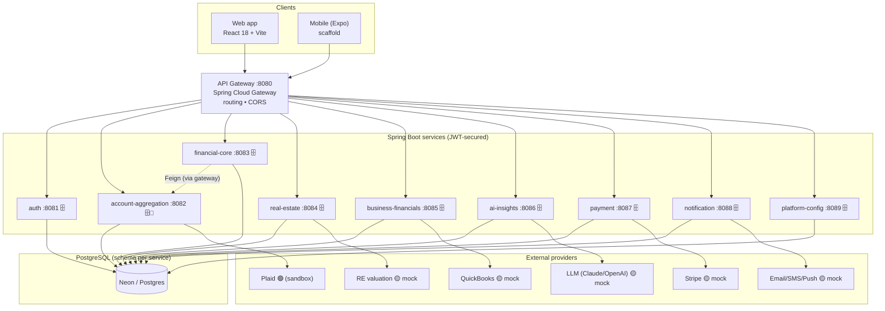
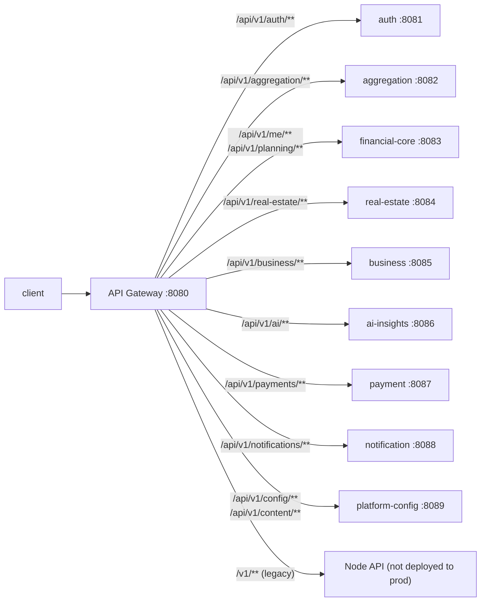
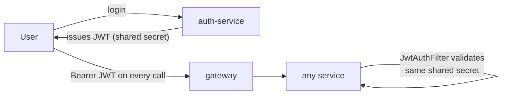

# 01 · High-Level Architecture

The whole platform in one view: clients talk **only** to the API Gateway; the gateway routes to
10 Spring Boot services; each stateful service owns its data in PostgreSQL (schema-per-service);
external providers sit behind provider interfaces (only Plaid is live today).

## System container diagram

## Gateway routing (path → service)

## Authentication model

- A single **shared `JWT_SECRET`** lets a gateway-issued token validate at every service.
- Each service runs its own `JwtAuthFilter`; there is **no central session store**.

## Key facts

- **10 services** + gateway. Only the gateway is public.
- **Schema-per-service** persistence; services do **not** share tables (they call each other via the gateway).
- The only **cross-service call** is financial-core → account-aggregation (Feign) to build the net-worth snapshot.
- **Only Plaid is a live integration** (sandbox). Stripe, QuickBooks, the LLM, real-estate valuation, and email/SMS/push are **mock implementations behind real interfaces** — swappable by config (see each [component file](components/)).

Continue to: [02 · Web app workflows](02-web-app-workflows.md) ·
[03 · Persistence & audit](03-data-persistence-and-audit.md) ·
[04 · Feature status & gaps](04-feature-status-and-gaps.md)
