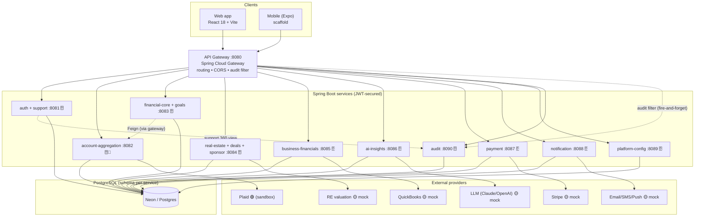
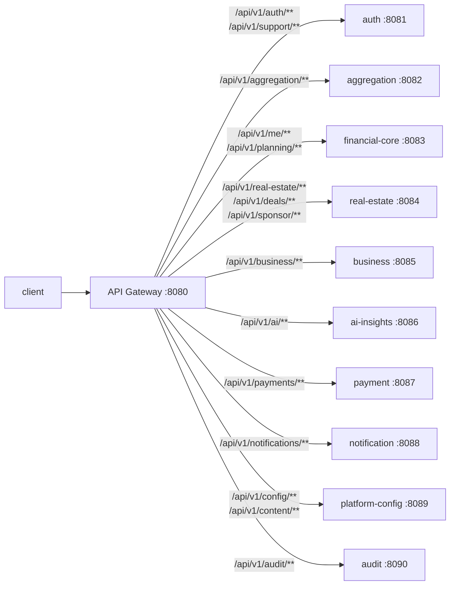
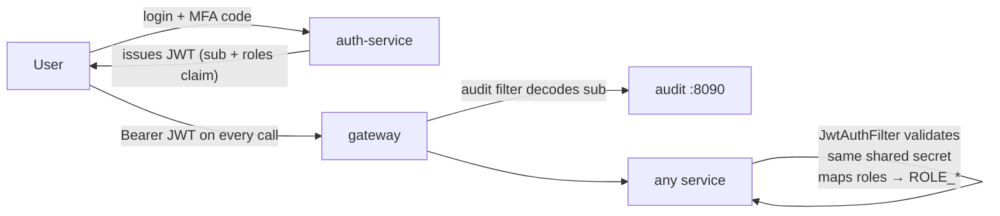

# 01 · High-Level Architecture

The whole platform in one view: clients talk **only** to the API Gateway; the gateway routes to
the Spring Boot services; each stateful service owns its data in PostgreSQL (schema-per-service);
external providers sit behind provider interfaces (only Plaid is live today).

> **What changed since the first draft:** the platform now runs **11 services** behind the gateway
> (the **audit-service :8090** was added), and three feature areas grew real backends that are
> *co-hosted* inside existing services: **Goals** lives in financial-core, and the **Deal Room +
> Sponsor track record** live in real-estate. **Roles** (USER / CARE / ADMIN) are now carried in the
> JWT, enabling the **Customer Care** and **Admin Analytics** consoles.

## System container diagram

## Gateway routing (path → service)

The gateway defines **16 routes** (see
[ApiGatewayApplication.java](../../finance-mvp/apps/api-gateway/src/main/java/com/mywealthmanagement/apigateway/ApiGatewayApplication.java)).
Several feature areas are co-hosted in one service (so multiple path prefixes point at the same port).

| Path prefix | → Service | Feature area |
|---|---|---|
| `/api/v1/auth/**` | auth :8081 | login, MFA, registration, email/SMS verify, profile |
| `/api/v1/support/**` | auth :8081 | Customer Care (role-gated member 360) |
| `/api/v1/aggregation/**` | account-aggregation :8082 | Plaid accounts & transactions |
| `/api/v1/me/**` | financial-core :8083 | net-worth snapshot, data export |
| `/api/v1/planning/**` | financial-core :8083 | budgets, debt, **goals** |
| `/api/v1/real-estate/**` | real-estate :8084 | properties + valuation |
| `/api/v1/deals/**` | real-estate :8084 | **Deal Room** (deals, marketplace, leads, documents) |
| `/api/v1/sponsor/**` | real-estate :8084 | **Sponsor track record** |
| `/api/v1/business/**` | business-financials :8085 | QuickBooks dashboard |
| `/api/v1/ai/**` | ai-insights :8086 | insights + chat |
| `/api/v1/payments/**` | payment :8087 | bill pay |
| `/api/v1/notifications/**` | notification :8088 | inbox + preferences |
| `/api/v1/config/**`, `/api/v1/content/**` | platform-config :8089 | remote config, flags, disclaimers |
| `/api/v1/audit/**` | audit :8090 | activity log + admin KPI stats |

> **Note:** there is **no `/v1/**` legacy route in the deployed gateway.** The Node API
> (`finance-mvp/apps/api`) and `integrator-java` are local placeholders that are **not wired into the
> gateway or deployed to prod**; the web client's `getAggregatorAccounts`/`*AggregationItems` helpers
> are legacy and unused by the live screens.

## Authentication & authorization model

- A single **shared `JWT_SECRET`** lets a gateway-issued token validate at every service.
- Each service runs its own `JwtAuthFilter`; there is **no central session store**.
- The JWT now carries a **`roles` claim** (`USER` default, `CARE`, `ADMIN`). Services map it to
  `ROLE_*` authorities so endpoints like `/support/**` and `/audit/stats` can be role-gated.
- Login is **two-step (MFA on by default)**: password → one-time code (email/SMS) → token. See
  [02 · Web app workflows](02-web-app-workflows.md) flow A.

## Key facts

- **11 services** + gateway. Only the gateway is public.
- **Schema-per-service** persistence; services do **not** share tables (they call each other via the gateway).
- **Co-hosted feature areas:** Goals → financial-core; Deal Room + Sponsor → real-estate; Customer
  Care (support) → auth. Each still uses its own tables within that service's schema.
- The only **business cross-service call** is financial-core → account-aggregation (Feign) to build
  the net-worth snapshot. Two **infrastructure** cross-service paths exist: the gateway's audit filter
  → audit-service (fire-and-forget), and auth-service → audit-service (to assemble the support 360 view).
- **Only Plaid is a live integration** (sandbox). Stripe, QuickBooks, the LLM, real-estate valuation,
  and email/SMS/push are **mock implementations behind real interfaces** — swappable by config
  (see each [component file](components/)).

Continue to: [02 · Web app workflows](02-web-app-workflows.md) ·
[03 · Persistence & audit](03-data-persistence-and-audit.md) ·
[04 · Feature status & gaps](04-feature-status-and-gaps.md)
