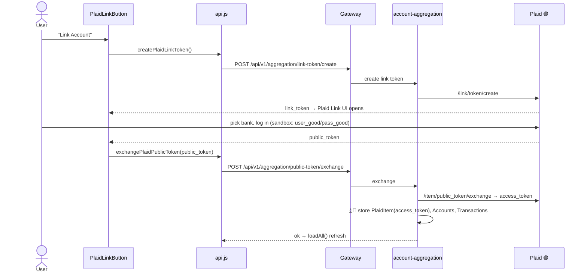
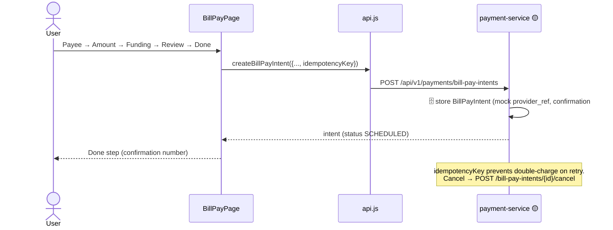
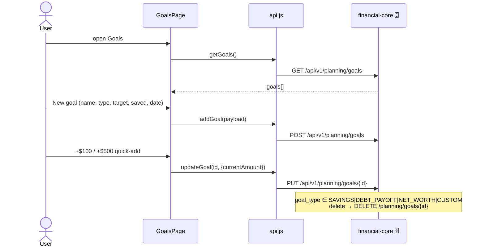
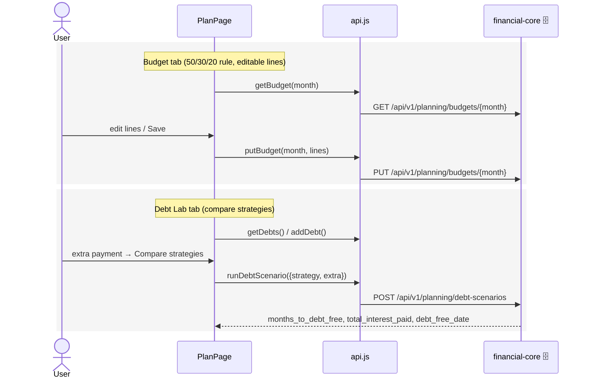
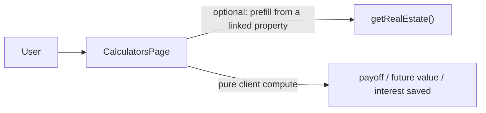
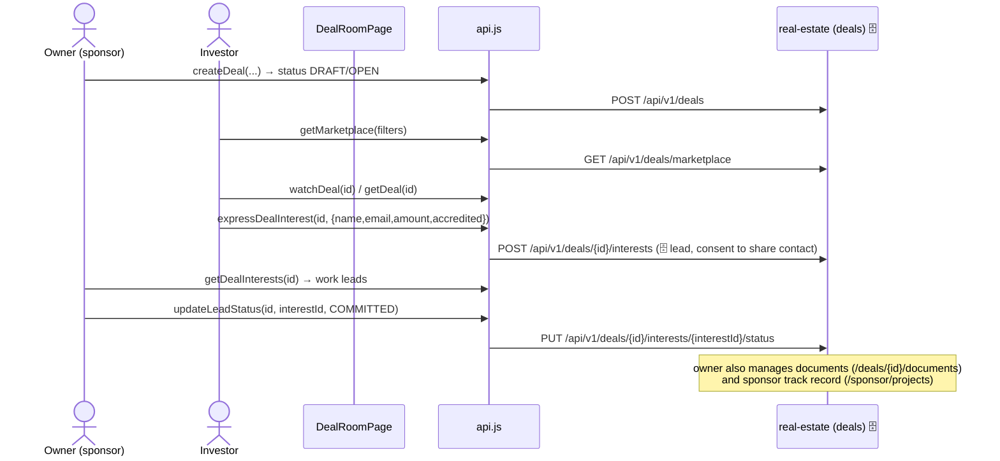
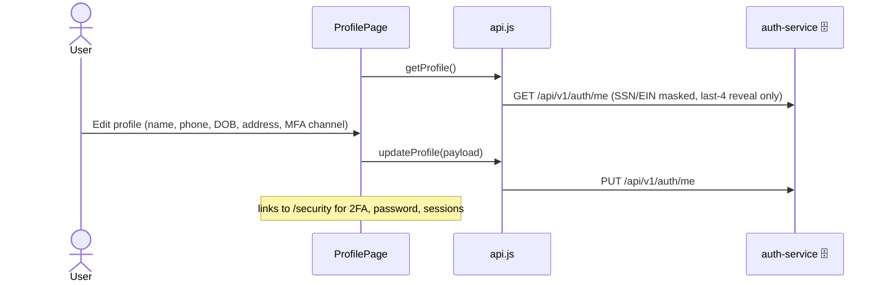
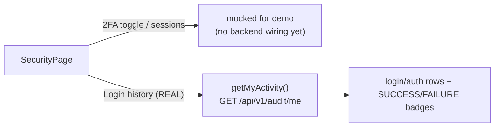
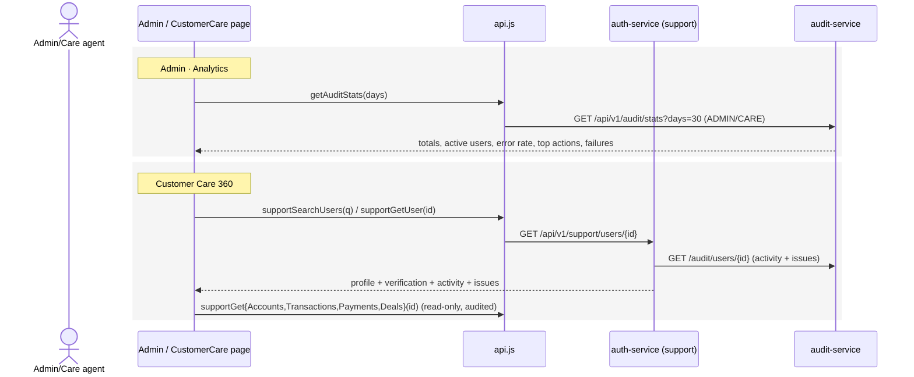

# 02 · Web App Workflows

End-to-end journeys in the React web app ([finance-mvp/apps/web](../../finance-mvp/apps/web)).
The client talks only to the gateway via [src/api.js](../../finance-mvp/apps/web/src/api.js)
(`API_BASE` from `config/apiBase`; the old `USE_MOCK` fixtures were removed so mock data can never
leak into the app).

> This file covers the **whole web product**. Flows A–F are the money core; G–N cover the journeys that
> were added since the first draft (MFA login, Goals, Calculators, Deal Room, Profile/Settings data
> tools, and the role-gated Admin & Customer Care consoles). Per-service detail lives in
> [components/](components/).

---

## A. App boot + login (MFA on every login)

Login is **two-step**: password is step 1; a one-time code (email or SMS, per the user's preferred
channel) is step 2. Registration logs the user straight in (no MFA on the signup itself), but signup
requires **verified email + verified phone** first.

```mermaid
sequenceDiagram
    actor U as User
    participant APP as App.jsx
    participant API as api.js
    participant GW as Gateway
    participant AUTH as auth-service
    participant NOTIF as notification (OTP)

    U->>APP: open app
    APP->>APP: read token from localStorage (terravet_token)
    alt token present
        APP->>API: loadAll() (see flow B)
    else no token → AuthPage
        alt Login
            U->>API: login {email, password}
            API->>GW: POST /api/v1/auth/login
            GW->>AUTH: verify password
            AUTH->>NOTIF: send OTP via chosen channel (mfaRequired=true)
            AUTH-->>API: { mfaRequired, channel, masked destination, devCode? }
            U->>API: verifyMfa {email, code}
            API->>GW: POST /api/v1/auth/mfa/verify
            AUTH-->>API: { token, name, email }
        else Register
            U->>API: sendEmailCode / verifyEmailCode
            U->>API: sendSmsCode / verifySmsCode
            U->>API: register {profile, ssn/ein last4, MFA channel}
            API->>GW: POST /api/v1/auth/register
            AUTH-->>API: { token, name, email } (auto-logged-in)
        end
        API->>APP: setAuthToken(); loadAll()
    end
    Note over API,APP: Any 401/403 → clear token →<br/>dispatch "auth:unauthorized" → back to login
```

- MFA can be disabled by config (`mfaEnabled=false`) — then `/login` returns the token directly.
- In dev the OTP is echoed back as `devCode` (controlled by `exposeDevCode`); never in prod.
- The token's **`roles` claim** drives client-side gating of the Customer Care / Admin nav (the
  backend still enforces the real check).

## B. Dashboard load (`loadAll`) — parallel fan-out

```mermaid
sequenceDiagram
    participant APP as App.jsx
    participant API as api.js
    participant GW as Gateway

    APP->>API: loadAll()
    par Promise.allSettled (6 calls)
        API->>GW: GET /api/v1/me/snapshot
        API->>GW: GET /api/v1/aggregation/accounts
        API->>GW: GET /api/v1/aggregation/transactions
        API->>GW: GET /api/v1/ai/insights
        API->>GW: GET /api/v1/payments/bill-pay-intents
        API->>GW: GET /api/v1/real-estate
    end
    GW-->>API: results (each may fulfil or reject)
    API-->>APP: setSnapshot/Accounts/Transactions/Insights/Intents/Properties
    Note over APP: Failures are per-item warnings;<br/>only all-failed throws. UI degrades gracefully.
```

> `loadAll` is the heartbeat of the dashboard — six independent calls, each tolerant of failure.
> `getSnapshot` also **normalizes camelCase→snake_case** so pages can read either shape. Screens
> beyond the dashboard (Goals, Deal Room, Business, etc.) load their own data on mount.

## C. Remote config + disclaimers (config-driven UI)

```mermaid
sequenceDiagram
    participant AL as AppLayout
    participant RC as config/remoteConfig.js
    participant CC as content/contentClient.js
    participant GW as Gateway
    participant CFG as platform-config-service

    AL->>RC: load app config (nav, sections, flags, theme)
    RC->>GW: GET /api/v1/config/app?platform=web
    RC->>GW: GET /api/v1/config/flags
    GW->>CFG: resolve from DB
    CFG-->>RC: { modules, sections, flags, theme }
    RC->>RC: cache localStorage (tv_remote_config), 4s timeout → DEFAULT_CONFIG fallback
    AL->>AL: build nav, filter by flags + roles

    Note over CC,CFG: On screens needing legal copy:
    CC->>GW: GET /api/v1/content/disclaimers?keys=..&locale=en
    GW->>CFG: fetch current versions
    CFG-->>CC: markdown bodies (cached per locale)
    CC-->>AL: <Disclaimer/> renders; acceptance → POST /content/disclaimers/accept
```

## D. Link a bank (Plaid) — the only live integration



> On the Cash/Transactions screens the user can also **re-categorize** a transaction inline →
> `PATCH /api/v1/aggregation/transactions/{id}/category` (ownership-scoped).

## E. Bill Pay wizard (5 steps)



## F. AI assistant chat

```mermaid
sequenceDiagram
    actor U as User
    participant AIP as AIAssistantPage
    participant API as api.js
    participant AI as ai-insights 🟡

    U->>AIP: type message (+ scope toggles, response style)
    AIP->>API: chatWithAssistant(message, history)
    API->>AI: POST /api/v1/ai/chat
    AI-->>AIP: templated reply (MockAiProvider)
    Note over AI: Insights persisted (🗄️ insights table);<br/>refresh = delete + regenerate per user
```

## G. Goals — set a target, see what to save per month

Goals are **backend-backed** (financial-core, `/planning/goals`). The required monthly contribution
shown on each card is computed client-side from target / current / target-date.



## H. Budget & Debt Lab (PlanPage)



## I. Calculators (client-only math, optional real inputs)

The Calculators screen (mortgage payoff / compound / simple interest) does **all math in the
browser** — no calculator backend. Its only network touch is reusing already-loaded real estate to
pre-fill a mortgage balance.



## J. Deal Room — register, browse, express interest, work leads

The Deal Room is **backend-backed** (real-estate-service, `/deals/**` + `/sponsor/**`). Full detail
and ER in [components/12-deals-and-sponsor-service.md](components/12-deals-and-sponsor-service.md).



## K. Profile & account management



## L. Settings — data export & account deletion (GDPR/CCPA)

```mermaid
sequenceDiagram
    actor U as User
    participant ST as SettingsPage
    participant API as api.js
    participant CORE as financial-core
    participant AUTH as auth-service

    U->>ST: Export my data
    ST->>API: exportMyData()
    API->>CORE: GET /api/v1/me/export
    CORE-->>U: terravest-my-data.json (download)
    U->>ST: Delete account → Confirm
    ST->>API: deleteAccount()
    API->>AUTH: DELETE /api/v1/auth/me
    AUTH-->>ST: 204 → clear session → reload to login
    Note over ST: Appearance/regional prefs are local;<br/>notification toggles persist via /notifications/preferences
```

## M. Security — 2FA, sessions, real login history



## N. Admin Analytics & Customer Care (role-gated)

Both consoles appear in the nav only for `CARE`/`ADMIN` and are enforced server-side.



> See [components/10-audit-service.md](components/10-audit-service.md) and
> [components/11-customer-care.md](components/11-customer-care.md) for the security model.

---

## Web feature → backend wiring (quick map)

| Page | Calls | Source |
|---|---|---|
| Home | `getSnapshot` | **Backend** (upcoming bills hardcoded) |
| Accounts / Cash | `getAccounts` (+categorize) | **Backend** (Plaid 🟢) |
| Transactions | `getTransactions` (+accounts, categorize) | **Backend** (Plaid 🟢) |
| Plan (Budget/Debt) | `getBudget/putBudget/getDebts/runDebtScenario` | **Backend** |
| Goals | `getGoals/addGoal/updateGoal/deleteGoal` | **Backend** |
| Calculators | `getRealEstate` (prefill only) | **Client-only math** |
| Bill Pay | `*BillPayIntent*` | **Backend** 🟡 |
| Real Estate | `getRealEstate/add/update/revalue/lookup` | **Backend** 🟡 |
| Deal Room | `*Deal*/*Sponsor*` | **Backend** |
| AI Assistant | `getInsights/chatWithAssistant` | **Backend** 🟡 |
| My Business | `getBusiness*` | **Backend** 🟡 |
| Messages | `*Notification*` | **Backend** (in-app ✅) |
| Profile | `getProfile/updateProfile` | **Backend** |
| Settings | `exportMyData/deleteAccount/*Preferences*` | **Backend** |
| Security | `getMyActivity` (login history) | **Backend (audit)**; 2FA/sessions mocked |
| Admin · Analytics | `getAuditStats` | **Backend (audit)**, role-gated |
| Customer Care | `support*` | **Backend (auth+audit)**, role-gated |
| Invest, Learn, Guide, Fractional LLC | — | **Hardcoded / localStorage** |

Full breakdown with status: [04 · Feature status & gaps](04-feature-status-and-gaps.md).
Client-only screens: [components/13-client-only-features.md](components/13-client-only-features.md).
