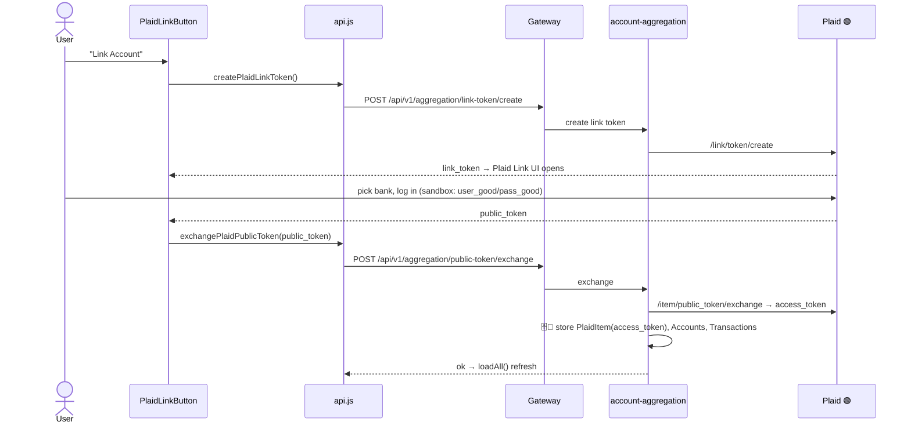
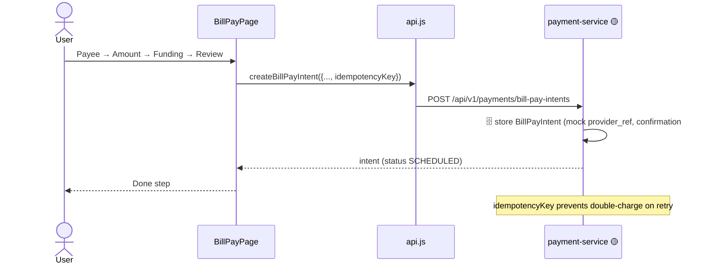

# 02 · Web App Workflows

End-to-end journeys in the React web app ([finance-mvp/apps/web](../../finance-mvp/apps/web)).
The client talks only to the gateway via [src/api.js](../../finance-mvp/apps/web/src/api.js)
(`API_BASE = http://localhost:8080`, `USE_MOCK = false`).

## A. App boot + auth gate

```mermaid
sequenceDiagram
    actor U as User
    participant APP as App.jsx
    participant API as api.js
    participant GW as Gateway
    participant AUTH as auth-service

    U->>APP: open app
    APP->>APP: read token from localStorage (terravet_token)
    alt token present
        APP->>API: loadAll() (see flow B)
    else no token
        APP-->>U: show AuthPage
        U->>API: register / login (+ optional SMS verify)
        API->>GW: POST /api/v1/auth/login
        GW->>AUTH: validate credentials
        AUTH-->>API: { token, name, email }
        API->>APP: setAuthToken(); loadAll()
    end
    Note over API,APP: Any 401/403 → clear token →<br/>dispatch "auth:unauthorized" → back to login
```

## B. Dashboard load (`loadAll`) — parallel fan-out

```mermaid
sequenceDiagram
    participant APP as App.jsx
    participant API as api.js
    participant GW as Gateway

    APP->>API: loadAll()
    par Promise.allSettled (6 calls)
        API->>GW: GET /api/v1/me/snapshot
        API->>GW: GET /api/v1/aggregation/accounts
        API->>GW: GET /api/v1/aggregation/transactions
        API->>GW: GET /api/v1/ai/insights
        API->>GW: GET /api/v1/payments/bill-pay-intents
        API->>GW: GET /api/v1/real-estate
    end
    GW-->>API: results (each may fulfil or reject)
    API-->>APP: setSnapshot/Accounts/Transactions/Insights/Intents/Properties
    Note over APP: Failures are per-item warnings;<br/>only all-failed throws. UI degrades gracefully.
```

> `loadAll` is the heartbeat of the dashboard — six independent calls, each tolerant of failure.
> `getSnapshot` also **normalizes camelCase→snake_case** so pages can read either shape.

## C. Remote config + disclaimers (config-driven UI)

```mermaid
sequenceDiagram
    participant AL as AppLayout
    participant RC as config/remoteConfig.js
    participant CC as content/contentClient.js
    participant GW as Gateway
    participant CFG as platform-config-service

    AL->>RC: load app config (nav, sections, flags, theme)
    RC->>GW: GET /api/v1/config/app?platform=web
    RC->>GW: GET /api/v1/config/flags
    GW->>CFG: resolve from DB
    CFG-->>RC: { modules, sections, flags, theme }
    RC->>RC: cache localStorage (tv_remote_config), 4s timeout → DEFAULT_CONFIG fallback
    AL->>AL: build nav, filter by flags

    Note over CC,CFG: On screens needing legal copy:
    CC->>GW: GET /api/v1/content/disclaimers?keys=..&locale=en
    GW->>CFG: fetch current versions
    CFG-->>CC: markdown bodies (cached per locale)
    CC-->>AL: <Disclaimer/> renders; acceptance → POST /content/disclaimers/accept
```

## D. Link a bank (Plaid) — the only live integration



## E. Bill Pay wizard (5 steps)



## F. AI assistant chat

```mermaid
sequenceDiagram
    actor U as User
    participant AIP as AIAssistantPage
    participant API as api.js
    participant AI as ai-insights 🟡

    U->>AIP: type message (+ scope toggles)
    AIP->>API: chatWithAssistant(message, history)
    API->>AI: POST /api/v1/ai/chat
    AI-->>AIP: templated reply (MockAiProvider)
    Note over AI: Insights persisted (🗄️ insights table);<br/>refresh deletes+regenerates per user
```

## Web feature → backend wiring (quick map)

| Page | Calls | Source |
|---|---|---|
| Home | `getSnapshot` | **Backend** (upcoming bills hardcoded) |
| Accounts | `getAccounts` | **Backend** (Plaid) |
| Transactions | `getTransactions` (+accounts) | **Backend** (Plaid) |
| Plan (Budget/Debt) | `getBudget/putBudget/getDebts/runDebtScenario` | **Backend** |
| Bill Pay | `*BillPayIntent*` | **Backend** 🟡 |
| Real Estate | `getRealEstate/add/update/revalue/lookup` | **Backend** 🟡 |
| AI Assistant | `getInsights/chatWithAssistant` | **Backend** 🟡 |
| My Business | `getBusiness*` | **Backend** 🟡 |
| Messages/Profile/Settings | `*Notification*` | **Backend** 🟡 |
| Invest, Learn, Guide, Deal Room, Fractional LLC | — | **Hardcoded / localStorage** |

Full breakdown with line references: [04 · Feature status & gaps](04-feature-status-and-gaps.md).
