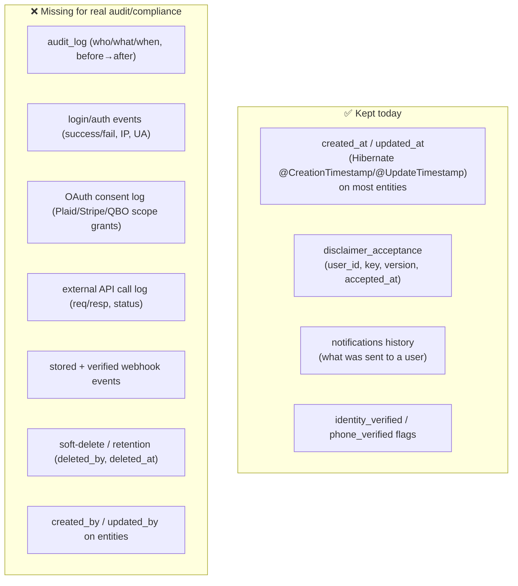
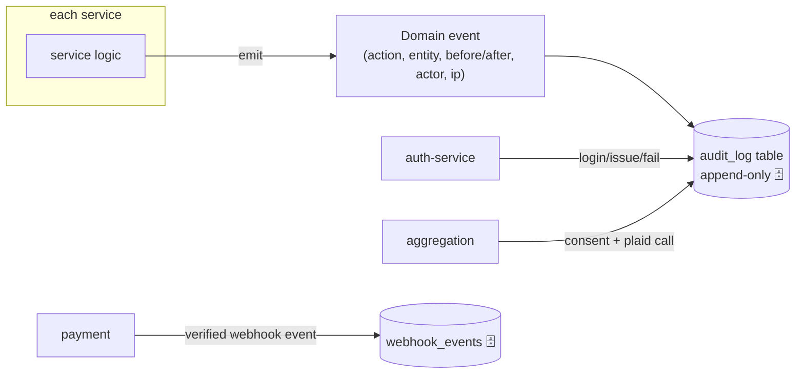

# 03 · Data Persistence & Audit

**Your question:** *"We're pulling all of the member data — are we saving any of it in our database
for reference/audit, and what else are we keeping?"*

**Short answer:** Yes. We **cache external (Plaid) account & transaction data in our own Postgres**,
and we **store a Plaid access token per linked item**. Everything else external is currently **mock**,
but those mock results are also persisted. We keep **basic `created_at`/`updated_at` timestamps**
everywhere — but there is **no real audit trail** (no who/what/when change log, no access log, no
stored webhook events). Details and the gap list below.

---

## 1. What we store from external APIs

```mermaid
flowchart LR
    PLAID["Plaid 🟢"] -->|accounts, transactions, access_token| AGG[("aggregation schema 🗄️🔑")]
    QBO["QuickBooks 🟡 mock"] -->|connection metadata (realm_id, mock)| BIZ[("business schema 🗄️")]
    LLM["LLM 🟡 mock"] -->|generated insights (mock)| AI[("ai schema 🗄️")]
    REVAL["RE valuation 🟡 mock"] -->|current_value, last_valued_at (mock)| RE[("real_estate schema 🗄️")]
    STRIPE["Stripe 🟡 mock"] -->|provider_ref, confirmation# (mock)| PAY[("payments schema 🗄️")]
    COMMS["Email/SMS/Push 🟡 mock"] -.->|no inbound data stored| NOTIF[("notifications schema 🗄️")]
```

### What is persisted (per service)

| Service / schema | External data we keep | Token / secret stored? |
|---|---|---|
| **account-aggregation** | 🟢 **Real Plaid data**: `accounts` (balances, type, names), `transactions` (name, amount, date, category, `plaid_transaction_id`), `plaid_items` | 🔑 **YES** — `plaid_items.access_token` (see risk below) |
| **business-financials** | 🟡 QBO **connection metadata** only: `qbo_connections` (realm_id, company_name, last_sync_at) — mock | No OAuth token stored in entity |
| **ai-insights** | 🟡 Generated `insights` (title, reason, suggested_action) — mock LLM output, not raw responses | No |
| **real-estate** | 🟡 `properties` incl. `current_value`, `last_valued_at` (mock valuation); **Deal Room** tables (`deals`, `deal_interests`, `deal_documents`, `deal_watches`, `sponsor_projects`) — all user-entered | No |
| **payment** | 🟡 `bill_pay_intents` incl. `provider_ref`, `confirmation_number`, `idempotency_key` — mock | No |
| **notification** | `notifications`, `notification_preferences`, `message_template` (app-generated) | No |
| **auth** | `users` — only **`ssn_last4` / `ein_last4`** (never full), password **hash**, verification flags, `mfa_channel`, `user_roles` | Password is hashed (not a token) |
| **financial-core** | `budgets`, `budget_lines`, `debts`, `debt_scenarios`, **`goals`** (user-entered/derived) | No |
| **platform-config** | `app_module/section/setting`, `feature_flag`, `disclaimer`, **`disclaimer_acceptance`** | No |
| **audit** | `audit_events` (every request + auth domain events) — see [10-audit-service](components/10-audit-service.md) | No |

> **We do NOT store raw external API response payloads** — services normalize to their own
> entities. So today there is no "raw response cache" for replay/forensics.

### Member-data tooling (reference/export)
- **Data export (GDPR/CCPA):** `GET /api/v1/me/export` (financial-core) returns the signed-in user's
  full data bundle as a downloadable `terravest-my-data.json` (Settings → "Export my data").
- **Account deletion:** `DELETE /api/v1/auth/me` permanently removes the identity/credentials
  (Settings → "Delete account"). This is a **hard delete** today — see the soft-delete gap below.
- **Deal-interest consent:** when an investor clicks "I'm interested" they **consent to share their
  contact details** with the deal owner; that consent + contact data is stored in `deal_interests`
  (a genuine, if feature-specific, consent record).

---

## 2. 🔴 Security risks in what we store

1. **Plaid access token stored in plaintext.** `plaid_items.access_token` is a `TEXT` column with a
   code comment *"Encrypted in production"* — but **no encryption is implemented**. A Plaid access
   token grants ongoing access to the member's bank data. **Must be encrypted at rest** (column-level
   encryption / KMS envelope) before production, and ideally moved behind a secrets boundary.
2. **No field-level encryption** for any PII (names, balances). Rely on DB-at-rest encryption (Neon
   provides this) — acceptable for MVP, revisit for compliance.
3. **`ssn_last4` / `ein_last4` only** — good; full SSN/EIN are never stored.

---

> ✅ **Update (audit layer now implemented):** a dedicated **audit-service** (:8090) now records
> **every user action**. The API gateway has a global filter that logs every request (user, action,
> path, status, IP, latency), and auth-service emits domain events (login success/failure,
> registration). See [components/10-audit-service.md](components/10-audit-service.md). The gaps below
> that remain open are noted inline (token encryption, webhook storage, soft-delete, admin gating,
> before/after diffs).

## 3. What audit/reference data we keep today



### Kept
- **Timestamps**: `created_at`/`updated_at` via Hibernate on `User`, `Account`, `Transaction`,
  `PlaidItem`, `Budget*`, `Debt*`, `BillPayIntent`, `QboConnection`, etc. (Hibernate-managed —
  *not* application-aware; no actor recorded).
- **Disclaimer acceptance**: the one genuine consent trail (`disclaimer_acceptance`).
- **Notification history**: a record of messages sent (not a security audit).
- **Verification flags**: booleans only — no record of *when/how* verification happened.

### Missing (gap list)
- ❌ **No audit log** — cannot answer "who changed this budget / when / from what to what."
- ❌ **No authentication/access log** — no record of logins, failures, token issuance, IP/user-agent.
  (`auth-service` does not log login events.)
- ❌ **No external-call log** — Plaid/Stripe/QBO/LLM calls are not recorded (req/resp/status). Plaid
  errors surface only as exceptions.
- ❌ **No OAuth consent audit** — no record of the member granting Plaid/QBO access (scope, time).
- ❌ **Webhooks not stored or verified** — `POST /aggregation/webhook` and `POST /payments/webhook`
  exist but **do not verify signatures** and **discard the payload** (log-to-stdout only).
- ❌ **No soft-delete / retention** — deletes are hard (e.g. AI refresh `deleteByUserId`), so deleted
  data is unrecoverable and unauditable. No GDPR/erasure or legal-hold support.
- ❌ **No `created_by`/`updated_by`** on entities; no `@EnableJpaAuditing`.

---

## 4. Recommended audit/reference layer (proposed)



Concrete steps (smallest → biggest value):
1. **Encrypt `plaid_items.access_token`** at rest (highest priority — security).
2. **Auth event log** — table `auth_events(user_id, type, ip, user_agent, success, reason, at)`; write
   on login/register/refresh/failure.
3. **Generic `audit_log`** — append-only `(at, actor_user_id, action, entity_type, entity_id, before_json, after_json, source_ip)`; populate via `@EnableJpaAuditing` + an interceptor or explicit calls on writes.
4. **OAuth/consent log** — `consent(user_id, provider, scope, granted_at, item_id)` written when a
   Plaid item / QBO connection is created.
5. **Webhook hardening** — verify Stripe (`Stripe-Signature`) + Plaid signatures; store every event in
   `webhook_events(provider, type, payload, signature_ok, received_at, processed_at)`.
6. **Soft-delete + retention** — `deleted_at`/`deleted_by` and a retention policy; replace hard deletes.
7. **`created_by`/`updated_by`** via `AuditorAware` (actor from JWT).

> See [04 · Feature status & gaps](04-feature-status-and-gaps.md) for how this folds into the
> production-readiness plan, and [docs/DEPLOYMENT_PLAN.md](../DEPLOYMENT_PLAN.md) Day 4 (hardening).
