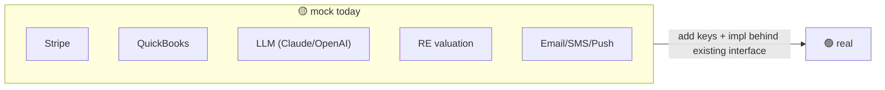

# 04 · Feature Status & Gaps

**Your question:** *"Check all my features with backend API + data — what's pending?"*

This is the consolidated reality check: every feature, whether it's wired to the backend, whether the
backend uses a **real** integration or a **mock**, and **what's pending** to make it production-real.

## Legend
- ✅ **Done & real** — backend-wired, real integration (or no integration needed).
- 🟡 **Done on mock** — fully wired, but the external provider is a mock behind a real interface.
- 🟠 **Partial** — mostly backend, but some sections are hardcoded/placeholder.
- ⬜ **Static** — no backend; hardcoded or localStorage only.

---

## Feature matrix

| Feature (web page) | Backend service | Endpoints | Provider | Status | Pending to be prod-real |
|---|---|---|---|---|---|
| Auth (login + **MFA**, register, email/SMS verify) | auth | `/auth/login`, `/auth/mfa/verify`, `/auth/register`, `/auth/{email,sms}/{send,verify}` | none | ✅ | Real SMS/email OTP provider (dev returns code); MFA on by default |
| Profile (view/edit, masked SSN/EIN) | auth | `/auth/me` GET/PUT | none | ✅ | — |
| Accounts / Cash | account-aggregation | `/aggregation/*` | **Plaid 🟢 sandbox** | ✅ (sandbox) | Plaid **production** keys; encrypt access token; webhook handling |
| Transactions (+inline categorize) | account-aggregation | `/aggregation/transactions` (+`/{id}/category`) | Plaid 🟢 | ✅ (sandbox) | Same as Accounts; transaction sync/refresh job |
| Home dashboard | financial-core (+others) | `/me/snapshot` | none | 🟠 | "Upcoming bills" is **hardcoded**; wire to payment/calendar data |
| Budgets | financial-core | `/planning/budgets/*` | none | ✅ | — (category bucketing is client-side by design) |
| Debt Lab | financial-core | `/planning/debt-scenarios*` | none | ✅ | Strategy copy hardcoded (cosmetic) |
| **Goals** | financial-core | `/planning/goals` (CRUD) | none | ✅ | Auto-progress from linked accounts/net-worth (today user-updated) |
| Calculators | — (client math) | `getRealEstate` (prefill only) | none | ✅ | None — pure client compute by design |
| Net-worth snapshot | financial-core → aggregation (Feign) | `/me/snapshot` | none | 🟠 | Some 30d-change deltas are placeholders; confirm real-estate equity feeds in |
| Data export / Delete account | financial-core / auth | `/me/export`, `/auth/me` DELETE | none | ✅ | Delete is **hard** (no soft-delete/retention yet) |
| Bill Pay | payment | `/payments/*` | **Stripe 🟡 mock** | 🟡 | Real Stripe (or ACH) keys; **webhook signature verify**; persist webhook events |
| Real Estate / Properties | real-estate | `/real-estate/*` (7) | **Valuation 🟡 mock** | 🟡 | Real valuation API (RentCast/ATTOM); 30d deltas are placeholders |
| **Deal Room** (deals/marketplace/leads/docs) | real-estate (deals) | `/deals/*`, `/sponsor/*` | none | ✅ | Optional doc object-storage (links today); notify owner on new lead |
| AI Assistant | ai-insights | `/ai/*` (3) | **LLM 🟡 mock** | 🟡 | Real Claude/OpenAI wiring (`AI_PROVIDER`); prompt library hardcoded |
| My Business | business-financials | `/business/*` (7) | **QuickBooks 🟡 mock** | 🟡 | Real QBO OAuth + token storage; entity-type list hardcoded |
| Messages (inbox) | notification | `/notifications/*` | in-app ✅ / email,push,sms 🟡 | 🟡 | Real SendGrid/FCM/Twilio adapters (config-driven router ready) |
| Settings (notif prefs) | notification | `/notifications/preferences` | none | ✅ | — |
| Security | auth + audit | `/audit/me` (login history) | none | 🟠 | Login history **real (audit)**; 2FA/sessions UI still mocked; biometric (mobile) |
| Remote config / nav / flags | platform-config | `/config/*` | DB ✅ | ✅ | Optional managed flag provider (LaunchDarkly/Unleash) |
| Disclaimers / legal copy | platform-config | `/content/*` | DB ✅ | ✅ | Broaden coverage (only RE valuation wired today) |
| **Admin · Analytics** | audit | `/audit/stats` | none | ✅ | Already role-gated; richer ops widgets |
| **Customer Care** (member 360) | auth (support) + audit | `/support/*`, `/audit/users/*` | none | ✅ | Support actions (reset pw, resend verify) future |
| Audit / activity log | audit | `/audit/*` | none | ✅ | Admin-role gating on search; broaden domain events; before/after diffs |
| **Invest** (stocks/brokers/alts/market) | — | none | — | ⬜ | No backend at all; holdings/allocation/marketplace **hardcoded** + localStorage |
| Learn | — | none | — | ⬜ | Static content; no learning service |
| How-to Guide | — | none | — | ⬜ | Static walkthrough |
| Fractional LLC | — | none | — | ⬜ | "Example offerings — not live"; no backend wiring |

---

## What's pending — grouped

### 1. Flip mocks → real providers (config + one class each)

- **Payment** → real Stripe (keys + `PaymentProvider` impl) **and webhook signature verification**.
- **AI** → set `AI_PROVIDER=anthropic`, implement `AiProvider` with Claude.
- **Business** → real QBO OAuth, store + refresh tokens (currently only realm_id mock).
- **Real estate** → real valuation provider (`PropertyValuationProvider` impl + key).
- **Notification** → real SendGrid/FCM/Twilio adapters (the `ChannelRouter` already selects by config).

### 2. Build out the unbacked features (⬜)
- **Invest** is the biggest gap — entirely hardcoded/localStorage (holdings, allocation, brokers,
  alternatives, marketplace). Needs an investments service (or brokerage aggregation) to be real.
- **Fractional LLC** — currently "example offerings, not live"; needs a fractional-investing provider.
- **Learn / Guide** — decide: keep static (CMS-driven via platform-config) or build services.
- ✅ **Deal Room is now backed** (real-estate-service `/deals` + `/sponsor`) — deals, marketplace,
  watchlist, investor leads, documents, and sponsor track record all persist. See
  [components/12-deals-and-sponsor-service.md](components/12-deals-and-sponsor-service.md).

### 3. Replace remaining hardcoded UI blocks (🟠)
- Home "upcoming bills"; Invest allocation & day-change; Real-estate 30d deltas; Cash categories;
  AI prompt library; debt-strategy copy. (Mostly cosmetic except upcoming bills.)

### 4. Cross-cutting production-readiness (see [03](03-data-persistence-and-audit.md) + [DEPLOYMENT_PLAN](../DEPLOYMENT_PLAN.md))
- 🔴 **Encrypt Plaid access token at rest.**
- **Audit layer**: auth events, generic audit_log, OAuth consent log, webhook event storage.
- **Webhooks**: verify signatures (Stripe + Plaid); persist events.
- **Soft-delete + retention.**
- **Postgres cutover + secrets manager + tests/CI + deploy** (Day 1–7 plan already underway).

---

## One-line summary

> **Core money features (auth+MFA, accounts, transactions, budgets, debt, goals, bill pay, real
> estate, Deal Room, AI, business, notifications, profile/export) are fully wired to the backend**, and
> **Customer Care + Admin Analytics + a real audit trail are live.** Only **Plaid is a live
> integration (sandbox)**; the other five integrations are **mocks behind real interfaces** (flip via
> config). **Invest, Learn, Guide, and Fractional LLC are the only features not backed by any API
> yet.** The biggest remaining hardening gaps are **encrypting the stored Plaid token**, **webhook
> signature verification + storage**, and **soft-delete/retention**.
