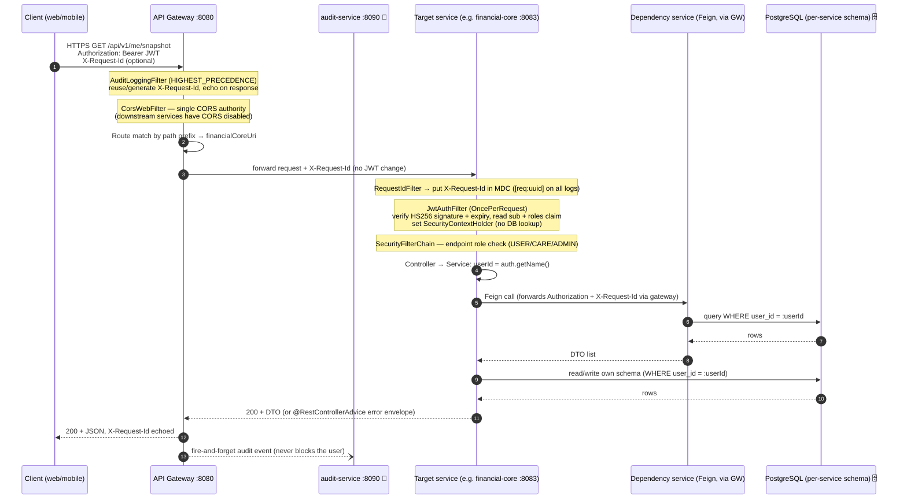
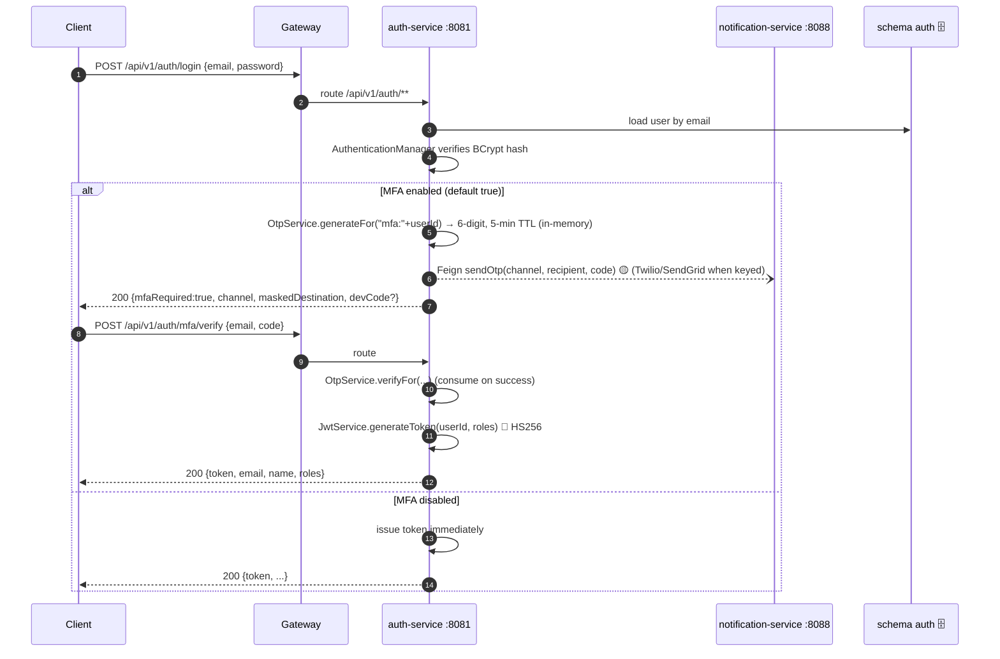
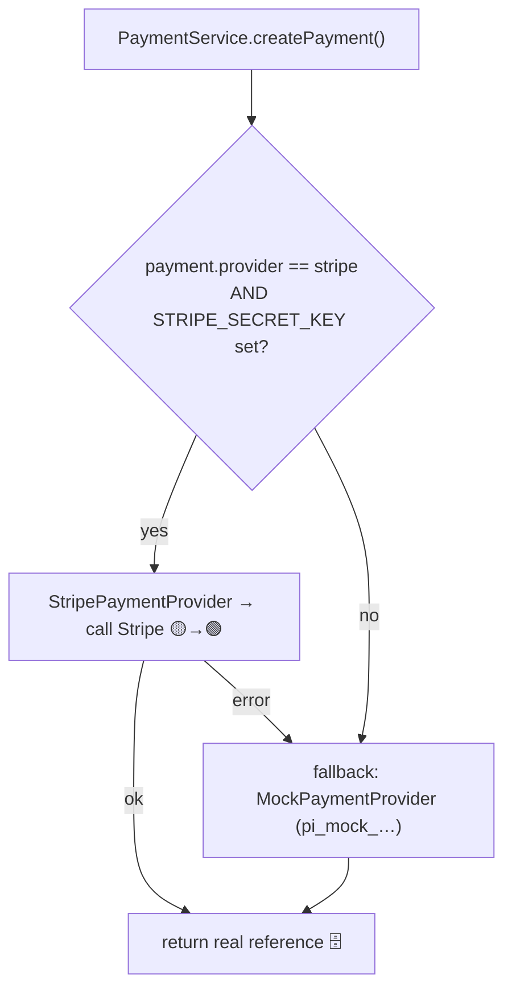
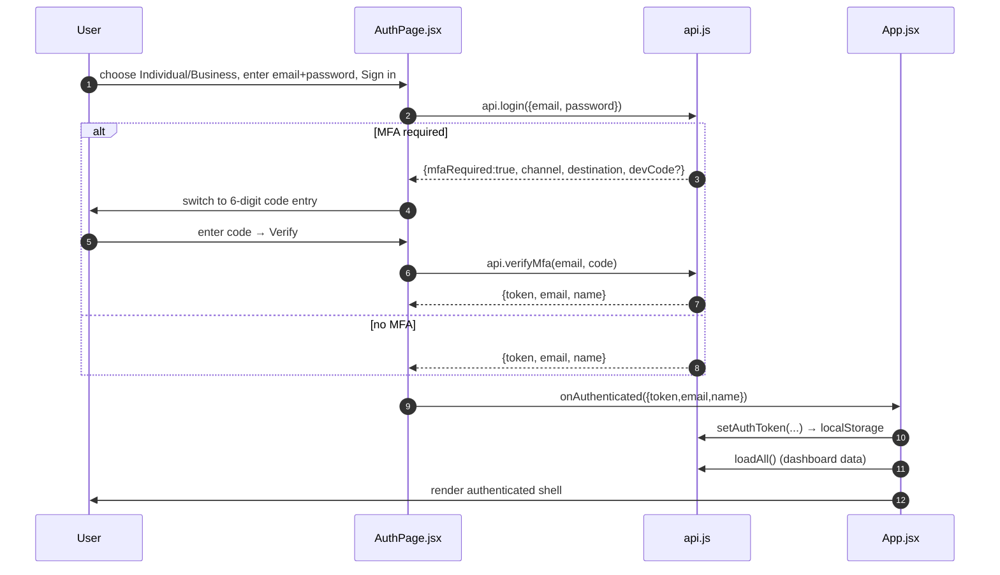
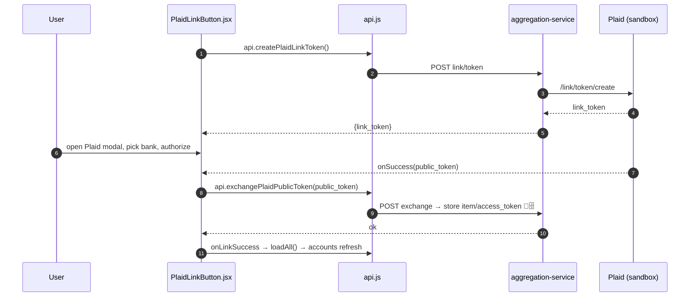

# End-to-End Process Flows — API & UI, Step by Step

_Last updated: 2026-06-11 (traced against the live code: gateway, auth-service, secrets-service,
platform-config, financial-core, audit, and the React web app)._

This is the **granular, step-by-step map** of how a request travels through the whole system and how
the UI drives, sends, and renders it. It complements the higher-level docs:

- [01-high-level-architecture.md](01-high-level-architecture.md) — one picture of the platform.
- [02-web-app-workflows.md](02-web-app-workflows.md) — user journeys (flows A–N).
- [components/](components/) — per-service deep dives.

Two halves:
- **[Part A — API process flows](#part-a--api-process-flows)**: request → auth → gateway → secrets → DB → response.
- **[Part B — UI workflows](#part-b--ui-workflows)**: interaction → trigger → response → component data flow.
- **[Part C — One full vertical slice](#part-c--one-full-vertical-slice-bill-pay-end-to-end)**: UI tap → backend → DB → UI render.

> **Legend:** 🟢 real integration (Plaid sandbox) · 🟡 mock behind a real interface (config-swap) ·
> 🗄️ persisted to PostgreSQL (per-service schema) · 🔑 secret/token · 🧾 audited.

---

# Part A — API process flows

## A.0 The request pipeline at a glance

Every authenticated call follows the **same ordered pipeline**. The gateway never validates the JWT —
it routes, sets CORS, stamps a correlation id, and audits. **Each service validates the JWT itself**
(stateless), then enforces per-user isolation at the repository layer.



**Pipeline order, in words:**

1. **Client** sends `HTTPS/JSON` with `Authorization: Bearer <JWT>` (optional inbound `X-Request-Id`).
2. **Gateway `AuditLoggingFilter`** (`@Order(HIGHEST_PRECEDENCE)`) reuses or mints an `X-Request-Id`, echoes it on the response, and starts a latency timer.
3. **Gateway `CorsWebFilter`** enforces CORS against the allow-list (`gateway.cors.allowed-origins`, default `http://localhost:5173`). The gateway is the **only** CORS authority.
4. **Gateway route match** by path prefix (16 routes) → rewrites to the target service URI. The gateway **does not** verify the JWT; it only parses the subject for the audit event.
5. **Service `RequestIdFilter`** reads `X-Request-Id` into the SLF4J MDC so every log line is tagged `[req:<uuid>]`.
6. **Service `JwtAuthFilter`** (`OncePerRequestFilter`) reads the bearer token, verifies the **HS256** signature with the shared `JWT_SECRET` and the expiry, extracts `sub` (userId) and the `roles` claim, and builds a `UsernamePasswordAuthenticationToken` with `ROLE_USER/ROLE_CARE/ROLE_ADMIN` authorities. **Stateless — no DB lookup.**
7. **`SecurityFilterChain`** applies endpoint matchers (e.g. `/api/v1/support/**` → `hasAnyRole(CARE,ADMIN)`; role-grant → `hasRole(ADMIN)`).
8. **Controller** handler runs; the **Service** reads `userId = SecurityContextHolder…​getName()`.
9. **Feign** inter-service calls (when needed) go **back through the gateway** with the original `Authorization` + `X-Request-Id` forwarded by a `RequestInterceptor`.
10. **Repository (Spring Data JPA)** queries always filter `WHERE user_id = :userId` (per-user isolation; ownership-miss returns **404**, not 403, to avoid leaking existence).
11. **Service** assembles a **DTO**; **Controller** returns `ResponseEntity`.
12. On any exception, the service's **`@RestControllerAdvice`** maps it to the standard error envelope.
13. **Gateway** returns the response to the client and, **after** the response is ready, **fire-and-forgets** an audit event to audit-service (`subscribe()` with a swallowed error — it never blocks or fails the user request).

| Pipeline stage | Where | Source of truth |
|---|---|---|
| Correlation id + audit | `api-gateway/AuditLoggingFilter.java` | gateway only |
| CORS | `api-gateway/GatewayCorsConfig.java` | gateway only |
| Routing (16 routes) | `api-gateway/ApiGatewayApplication.java` (RouteLocator) | gateway |
| JWT verify + roles | each service `config/JwtAuthFilter.java` | per service |
| Role gating | each service `config/SecurityConfig.java` | per service |
| Per-user isolation | repositories (`findByUserId…`) | per service |
| Error shape | each service `config/GlobalExceptionHandler.java` | per service |

## A.1 Authentication & MFA (the two-step login)



- **Endpoints** (`auth-service/auth/AuthController.java`): `register` (auto-logs-in), `login` (step 1, credentials only), `mfa/verify` (step 2, code → token), plus `email/send` + `email/verify` for sign-up email verification.
- **JWT** (`auth/JwtService.java`): library `jjwt 0.11.5`, **HS256**, signing key from `JWT_SECRET` env var. Claims: `sub` = userId, `roles` = `["USER"|"CARE"|"ADMIN"]`, `iat`, `exp` (default 24h). 🔑
- **Passwords**: `BCryptPasswordEncoder` (strength 10), hashed at registration; stored as `password_hash` (never nullable).
- **OTP** (`auth/OtpService.java`): 🟡 mock — 6-digit code in an in-memory map with 5-min TTL; same mechanism for login MFA (`mfa:<userId>`) and email verify (`email:<email>`). In dev the code is echoed back as `devCode` when `otp.expose-dev-code=true`.
- **Account type (Individual/Business)**: registration carries `accountType` and, for business, `businessName` + `ein`. PII is stored **encrypted** (`ssnEncrypted` / `einEncrypted`, AES-256-GCM via `EncryptedStringConverter`); only `ssnLast4` / `einLast4` are ever returned for display.
- **Role-gating**: `/api/v1/support/**` requires `CARE`/`ADMIN`; role grant/revoke requires `ADMIN` and is 🧾 audited as `support.role.grant`.

## A.2 API Gateway responsibilities

`apps/api-gateway` (Spring Cloud Gateway, reactive):

- **Routing** — `RouteLocator` bean maps path prefixes to service URIs (externalized as `service.*.uri`, overridden by `SERVICE_*_URI` in Docker/prod):

  | Path prefix(es) | → Service |
  |---|---|
  | `/api/v1/auth/**`, `/api/v1/support/**` | auth :8081 |
  | `/api/v1/aggregation/**` | account-aggregation :8082 🟢 |
  | `/api/v1/me/**`, `/api/v1/planning/**`, `/api/v1/invest/**` | financial-core :8083 |
  | `/api/v1/real-estate/**`, `/api/v1/deals/**`, `/api/v1/sponsor/**` | real-estate :8084 |
  | `/api/v1/business/**` | business-financials :8085 |
  | `/api/v1/ai/**` | ai-insights :8086 |
  | `/api/v1/payments/**` | payment :8087 |
  | `/api/v1/notifications/**` | notification :8088 |
  | `/api/v1/config/**`, `/api/v1/content/**` | platform-config :8089 |
  | `/api/v1/audit/**` | audit :8090 |

- **CORS** — single `CorsWebFilter`; `allowCredentials=true`, `maxAge=3600`, methods `GET/POST/PUT/DELETE/PATCH/OPTIONS`. Downstream services keep CORS **off**.
- **Audit filter** — `GlobalFilter`, highest precedence; emits `{userId, actorType, action, service, method, path, status, sourceIp, userAgent, latencyMs, outcome, metadata:{requestId}}` to audit-service with an `X-Internal-Key`. Skips `OPTIONS`, `/actuator/*`, and `/api/v1/audit/*` (no self-audit). Fire-and-forget.
- **Correlation** — `X-Request-Id` read or generated, propagated downstream and echoed on the response.

## A.3 Secrets management 🔑

`apps/secrets-service` — internal-only (not exposed via the public gateway):

1. A service needs a provider key (e.g. payment-service wants `STRIPE_SECRET_KEY`).
2. **At startup** it calls `GET /internal/secrets?scope=<scope>` with `X-Internal-Key` (shared mesh secret) + `X-Service-Id` (caller name).
3. secrets-service verifies the internal key (`SECRETS_INTERNAL_KEY`), checks the caller holds a **READ `SecretGrant`** for that scope, decrypts the value, and returns it. The read is 🧾 audited (`secret.read` / `secret.denied`).
4. The caller **caches** the value in memory (no per-request fetches).

- **Key hierarchy**: envelope crypto — data keys (DEK) wrapped by a master key (KEK). `secrets.provider=local` derives the KEK from `SECRETS_MASTER_KEY` (dev only); `secrets.provider=kms` keeps the KEK in **GCP KMS** (`SECRETS_KMS_KEY_NAME`), accessed via the service-account identity. (`MasterKeyProvider` → `LocalMasterKeyProvider` / `GcpKmsMasterKeyProvider`.)
- **In practice today**: most services also accept plain env vars (`PLAID_SECRET`, `STRIPE_SECRET_KEY`, `JWT_SECRET`, `app.encryption.key`) for local/dev; the secrets-service is the production-grade path.

## A.4 Config toggles & mock fallback 🟡

`apps/platform-config-service` plus a per-provider seam in each integrating service:

- **Flags**: `GET /api/v1/config/flags` → `{flagKey: boolean}` from a Flyway-seeded `feature_flags` table behind a `ConfigProvider` interface (`DbConfigProvider`; swappable for LaunchDarkly/Unleash). Clients fetch on login and cache.
- **Provider selection pattern** (example: payment-service):
  - `MockPaymentProvider` — always registered; returns `pi_mock_<nanoTime>`, no network.
  - `StripePaymentProvider` — `@ConditionalOnProperty(name="payment.provider", havingValue="stripe")` + `@Primary`; if the secret is blank **or** the Stripe call throws, it **falls back to the mock** and logs a warning.



- **Account aggregation (Plaid)** follows the same shape but is 🟢 **real against the Plaid sandbox** when `plaid.client-id`/`plaid.secret` are set (`account-aggregation-service`); otherwise mock data.

## A.5 Database layer 🗄️

- **One PostgreSQL instance (Neon in prod, H2 in-memory in dev), schema-per-service**: `auth`, `aggregation`, `core`, `real_estate`, `business`, `ai`, `payments`, `notifications`, `platform_config`, `audit`. No shared schema → loose coupling.
- **JPA/Hibernate** entities; **Flyway** migrations (`classpath:db/migration`, `V<N>__<desc>.sql`) run on service startup before the app accepts traffic; add-column DDL is idempotent (`IF NOT EXISTS`).
- **Per-user isolation** is enforced in code, not by the DB: repositories use `findByUserId(...)`, and single-entity reads add an ownership filter (`.filter(t -> t.getUserId().equals(userId))`) returning **404** on mismatch.

## A.6 Inter-service communication (Feign via the gateway)

- Services call each other through the **gateway** (not directly): e.g. `@FeignClient(url="${api-gateway.url}/api/v1/aggregation")`.
- A `RequestInterceptor` (`FeignConfig`) forwards the inbound `Authorization` header and the `X-Request-Id` (from MDC) on every Feign call, so the downstream service can validate the JWT and continue the trace.
- Cross-service reads that aren't critical are **best-effort** (e.g. financial-core's snapshot still returns if the real-estate fetch fails).

## A.7 Audit & tamper-evidence 🧾

`apps/audit-service` (schema `audit`):

- **Ingest**: `POST /api/v1/audit/events` guarded by `X-Internal-Key`, returns **202 Accepted**.
- **Append-only hash chain**: each row stores `prev_hash` and `entry_hash = SHA-256(prev_hash | canonical(fields))`; `GET /api/v1/audit/verify` recomputes the chain to detect tampering.
- **Admin KPI stats**: `GET /api/v1/audit/stats?days=N` (CARE/ADMIN) → totals, success/failure rate, top actions, top users, latency P50/P95/P99, events by service. This powers the **Admin · Analytics** screens.
- Indexed on `user_id`, `created_at`, `action`, and `(user_id, created_at)` for the member-360 activity views.

## A.8 Error handling & response shapes

Standard envelope from each service's `@RestControllerAdvice` (`GlobalExceptionHandler`):

```json
{ "timestamp": "2026-06-11T14:30:00", "status": 400, "error": "Bad Request",
  "message": "Validation failed", "fields": { "amount": "Amount must be greater than zero" } }
```

| Status | Meaning in this system |
|---|---|
| 200 / 201 / 202 / 204 | OK / created / accepted (audit ingest) / no content |
| 400 | validation or malformed input (`fields` map for field errors) |
| 401 | missing/invalid/expired JWT (client clears token, returns to login) |
| 403 | valid JWT, insufficient role |
| 404 | not found **or** ownership check failed (no existence leak) |
| 409 | idempotency conflict (e.g. payment already exists) |
| 500 | unhandled exception |

---

# Part B — UI workflows

React + Vite + TypeScript/JSX SPA (`apps/web`), also wrapped by **Capacitor** for iOS/Android. State is
plain React hooks with a **single source of truth in `App.jsx`** (no Redux/Zustand); data is passed down
by props. No React Query/SWR — fetching is manual on mount/action.

## B.0 App boot & auth gating

```mermaid
sequenceDiagram
    autonumber
    participant U as User
    participant M as main.jsx
    participant APP as App.jsx
    participant API as api.js
    participant GW as Gateway

    U->>M: open app
    M->>M: apply saved theme (data-theme) + init i18n + register SW (web)
    M->>APP: render <App/>
    APP->>API: api.getToken() (reads localStorage terravet_token)
    alt token present
        APP->>API: loadAll() → Promise.allSettled([...])
        API->>GW: GET snapshot, accounts, transactions, insights, payment-intents, real-estate (parallel, JWT attached)
        GW-->>API: results (some may fail → logged, not fatal)
        API-->>APP: setSnapshot/setAccounts/... ; render <AppLayout/>
    else no token
        APP->>U: render <AuthPage/>
    end
```

- **Entry** `src/main.jsx`: applies theme before first paint, initializes `i18next` (localStorage `tv_lang` → `<html lang>` → browser), registers the PWA service worker (web only).
- **Root** `src/App.jsx`: on mount reads the JWT; if present calls `loadAll()`, else renders `AuthPage`. Holds the central state buckets (`snapshot`, `accounts`, `transactions`, `insights`, `paymentIntents`, `properties`, `user`, `billPayForm`, …) and passes them + handlers into `AppLayout`.
- **Routing** `src/components/AppLayout.jsx`: React Router v6; pages are `React.lazy()` (code-split) from a **module registry**; nav sections are **config-driven** (`resolveNav(config, registry, flags)`) with a bundled `DEFAULT` fallback. Authenticated shell only renders when `api.getToken()` is truthy.

## B.1 API client layer

`src/api.js` + `src/config/apiBase.js`:

- **Base URL**: `VITE_API_BASE` → Android-emulator `10.0.2.2:8080` → `http://localhost:8080`.
- **`request()`**: adds `Content-Type: application/json`; if a token exists, adds `Authorization: Bearer <token>`. Handles `204` → `null`; otherwise parses JSON.
- **401/403**: clears the token and dispatches a `window` event `auth:unauthorized`, then throws. `App.jsx` listens and drops to the login screen with "Your session expired." **No refresh token** — expiry is detected on the next call.
- **Token storage**: `localStorage.terravet_token` (+ `terravet_email`, `terravet_name`), mirrored in an in-memory `authToken`.
- **Client-side role read**: `getUserRoles()/isCareAgent()/isAdmin()/getCurrentUserId()` base64-decode the JWT payload (already trusted over HTTPS) **only to gate UI** — the server re-checks every call.
- **Response normalization**: some endpoints reshape camelCase → snake_case the UI expects (e.g. `getSnapshot()` maps `netWorth.total → net_worth.total`, `creditCards → credit_cards`).

## B.2 Login + MFA (UI)



- **Register** branch collects first/last name, email (+OTP verify), phone (+SMS OTP verify), DOB, address, SSN/EIN, and **account type** (INDIVIDUAL/BUSINESS); gated on password strength + verified flags, then `api.register(form)` → `onAuthenticated()`.

## B.3 Dashboard load (read flow)

1. Route `/` renders `HomePage` with props from `App.jsx` (`snapshot`, `accounts`, `paymentIntents`, `insights`, …).
2. Local state: `range` ("3M"), `chartType` ("area"/"line"/"bar") — both persisted in localStorage.
3. Render: greeting + KPI grid (Net Worth with >15% **downfall** alert via `computeDownfall()`, credit utilization, upcoming bills via `deriveUpcomingBills(paymentIntents)`, liquid/investments/real-estate), `NetWorthChart` (SVG), account cards, top-2 AI insights, scheduled payments.
4. Components are **read-only** (props in, no mutation). Changing the range calls `api.getSnapshot(range)` and updates local chart state; "Refresh" calls the parent's `loadAll()`.
5. `loadAll()` (`App.jsx`): sets `loading`, runs `Promise.allSettled([...])` in parallel, updates each state bucket as it resolves, tolerates partial failures, clears `loading`.

## B.4 Write/action flow — Bill Pay wizard (4 steps)

- **Trigger**: "Pay a bill" → `openBillPay()` resets `billPayForm` + `billPayStep=0`, navigates to `/billpay`.
- **Step 0** select payee (credit card vs biller) → `update('card_account_id', …)`.
- **Step 1** enter amount (quick chips: Minimum/Statement) → validate `amount > 0`.
- **Step 2** choose funding account → validate `available ≥ amount` (insufficient-funds warning disables Next).
- **Step 3** review + schedule toggle + memo + **authorization checkbox** → "Confirm & Pay".
- **Submit** `submitBillPay()`: builds payload with an **idempotency key** `bp-${Date.now()}-${rand}` (prevents double-charge on retry/double-click), `POST /api/v1/payments/bill-pay-intents`; on success stores `lastBillPayIntent`, calls `loadAll()`, advances to **Step 4** success; on error shows a banner and stays.
- **History/cancel**: PENDING/SCHEDULED intents can be cancelled (`api.cancelBillPayIntent(id)` → re-fetch).

> No optimistic updates anywhere — forms show a pending/disabled state until the server confirms, then re-fetch.

## B.5 Plaid account linking 🟢



## B.6 AI chat

1. User picks **scope** checkboxes (net worth, cash, investments, …) + **response style** (Concise/Balanced/Detailed).
2. Send → handler prepends a directive `[Focus: …][Style: …]` to the message, `POST /api/v1/ai/chat` with history, sets `sending=true`.
3. Response `{reply}` appended to the messages array; thread persisted to `localStorage tv_ai_chat`; regenerate / new-chat supported. (LLM is 🟡 mock until keyed.)

## B.7 Cross-cutting UI concerns

- **Theme** (`src/theme.js`): `light`/`dark`/`glass` via `document.documentElement[data-theme]` + CSS variables in `terravest-theme.css`; persisted in `localStorage tv_theme`; cycled from the topbar.
- **i18n**: `i18next`+`react-i18next`; bundled `en, es, fr, de, pt, zh, hi, ja, ar`; optional on-the-fly auto-translate of async content; **RTL** for Arabic.
- **Role-gated UI**: Ops Portal / Customer Care entry points render only when the decoded JWT has `CARE`/`ADMIN` — but the **server enforces** it on every `/api/v1/support/**` call.
- **Patterns**: loading = disabled control + `ti ti-loader spin`; empty = centered icon + heading + CTA (`.empty-state`); error = red `.badge badge-red` banner, cleared on next success/input.

---

# Part C — One full vertical slice (Bill Pay, end to end)

Tying the UI and API halves together for a single user action:

```mermaid
sequenceDiagram
    autonumber
    participant U as User
    participant UI as BillPayPage / App.jsx
    participant API as api.js
    participant GW as Gateway :8080
    participant AUD as audit-service 🧾
    participant PAY as payment-service :8087
    participant CFG as platform-config / secrets 🔑
    participant STR as Stripe 🟡/🟢
    participant DB as schema payments 🗄️

    U->>UI: Step 0-3, check authorize, Confirm & Pay
    UI->>API: createBillPayIntent(payload + idempotencyKey)
    API->>GW: POST /api/v1/payments/bill-pay-intents (Bearer JWT, X-Request-Id)
    Note over GW: audit filter stamps X-Request-Id; CORS ok; route → payment
    GW->>PAY: forward
    Note over PAY: JwtAuthFilter verifies JWT → userId; SecurityFilterChain ok
    PAY->>CFG: provider flag + Stripe secret (cached) 🔑
    alt provider=stripe AND key set
        PAY->>STR: create payment intent
        STR-->>PAY: reference (or error → mock fallback)
    else mock
        PAY->>PAY: pi_mock_<nanoTime>
    end
    PAY->>DB: persist intent (idempotency-keyed) WHERE user_id 🗄️
    PAY-->>GW: 201 {id, status, confirmation}
    GW-->>API: 201 (X-Request-Id echoed)
    GW--)AUD: fire-and-forget audit event (action=POST .../bill-pay-intents, status=201)
    API-->>UI: intent
    UI->>API: loadAll() → getPaymentIntents() refresh
    UI->>U: Step 4 success screen + updated history
```

**One line per layer:** UI validates and authorizes → `api.js` attaches the JWT and posts → gateway stamps the
correlation id, applies CORS, routes, and (after) audits → payment-service verifies the JWT, resolves the
provider via config/secrets (real-or-mock fallback), persists the idempotent intent scoped to the user, and
returns `201` → the UI stores the result, re-fetches, and shows confirmation.

---

## Where to go next

- Per-service endpoint lists, ER diagrams, and sequence diagrams: [components/](components/).
- What's real vs mock vs hardcoded and what's pending: [04-feature-status-and-gaps.md](04-feature-status-and-gaps.md).
- What member data is stored and the audit/compliance posture: [03-data-persistence-and-audit.md](03-data-persistence-and-audit.md).
