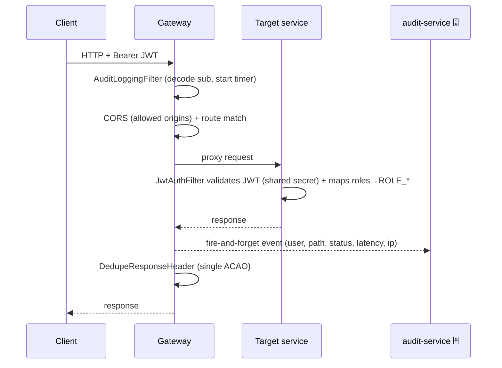

# Component · API Gateway (:8080)

**Responsibility:** single public entry point. Routes every `/api/v1/**` path to the right service,
applies CORS, dedupes response headers, and runs the **audit logging filter** (fire-and-forget log of
every request to the audit-service). **Stateless** (no DB).
**Source:** [finance-mvp/apps/api-gateway](../../../finance-mvp/apps/api-gateway)

## Routing table (16 routes)

| Path prefix | → Service |
|---|---|
| `/api/v1/auth/**` | auth :8081 |
| `/api/v1/support/**` | auth :8081 (Customer Care) |
| `/api/v1/aggregation/**` | account-aggregation :8082 |
| `/api/v1/me/**`, `/api/v1/planning/**` | financial-core :8083 (snapshot, export, budgets, debt, goals) |
| `/api/v1/real-estate/**` | real-estate :8084 |
| `/api/v1/deals/**`, `/api/v1/sponsor/**` | real-estate :8084 (Deal Room) |
| `/api/v1/business/**` | business-financials :8085 |
| `/api/v1/ai/**` | ai-insights :8086 |
| `/api/v1/payments/**` | payment :8087 |
| `/api/v1/notifications/**` | notification :8088 |
| `/api/v1/config/**`, `/api/v1/content/**` | platform-config :8089 |
| `/api/v1/audit/**` | audit :8090 |

> Routes are defined in code
> ([ApiGatewayApplication.java](../../../finance-mvp/apps/api-gateway/src/main/java/com/mywealthmanagement/apigateway/ApiGatewayApplication.java)).
> There is **no `/v1/**` legacy route** in the deployed gateway — the Node `api` and `integrator-java`
> apps are local placeholders, not wired in or deployed.

## Request flow

The audit filter never blocks or fails the user request; it skips CORS preflight, `/actuator/**`,
and `/api/v1/audit/**` (no self-logging). See [10-audit-service.md](10-audit-service.md).

## Config (externalized)
- Downstream URIs: `SERVICE_*_URI` env (default `localhost:808x`; compose → `http://<svc>:8080`).
- CORS: `GATEWAY_CORS_ALLOWED_ORIGINS` (default localhost; prod = web origin only).
- Audit: `AUDIT_ENABLED`, `AUDIT_URI`, `AUDIT_INGEST_KEY`, `JWT_SECRET` (to decode the subject only).

## Status / pending
- ✅ Routing + CORS working; env-configurable; per-request audit logging live.
- ⬜ No rate limiting, request-size limits, or central auth at the edge (each service validates JWT itself).
