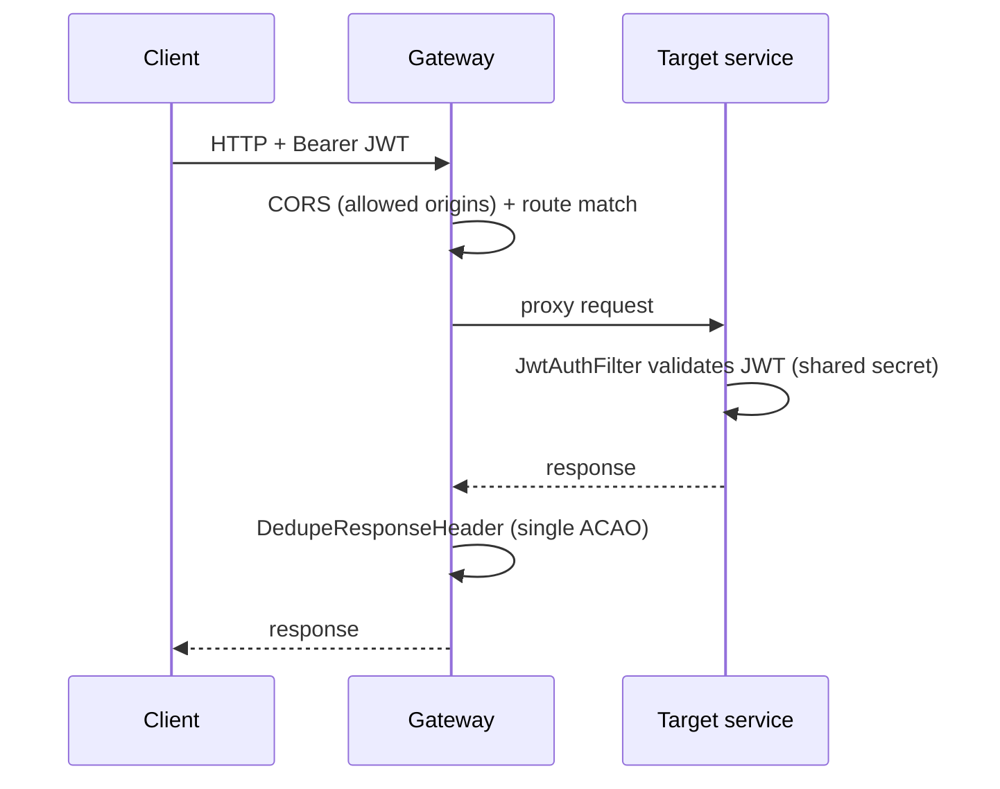

# Component · API Gateway (:8080)

**Responsibility:** single public entry point. Routes every `/api/v1/**` path to the right service,
applies CORS, dedupes response headers. **Stateless** (no DB).
**Source:** [finance-mvp/apps/api-gateway](../../../finance-mvp/apps/api-gateway)

## Routing table

| Path prefix | → Service |
|---|---|
| `/api/v1/auth/**` | auth :8081 |
| `/api/v1/aggregation/**` | account-aggregation :8082 |
| `/api/v1/me/**`, `/api/v1/planning/**` | financial-core :8083 |
| `/api/v1/real-estate/**` | real-estate :8084 |
| `/api/v1/business/**` | business-financials :8085 |
| `/api/v1/ai/**` | ai-insights :8086 |
| `/api/v1/payments/**` | payment :8087 |
| `/api/v1/notifications/**` | notification :8088 |
| `/api/v1/config/**`, `/api/v1/content/**` | platform-config :8089 |
| `/v1/**` | legacy Node API (not deployed to prod) |

## Request flow

## Config (externalized — see Day 1 work)
- Downstream URIs: `SERVICE_*_URI` env (default `localhost:808x`; compose → `http://<svc>:8080`).
- CORS: `GATEWAY_CORS_ALLOWED_ORIGINS` (default localhost; prod = web origin only).

## Status / pending
- ✅ Routing + CORS working; now env-configurable.
- ⬜ No rate limiting, request-size limits, or central auth at the edge (each service validates JWT itself).
