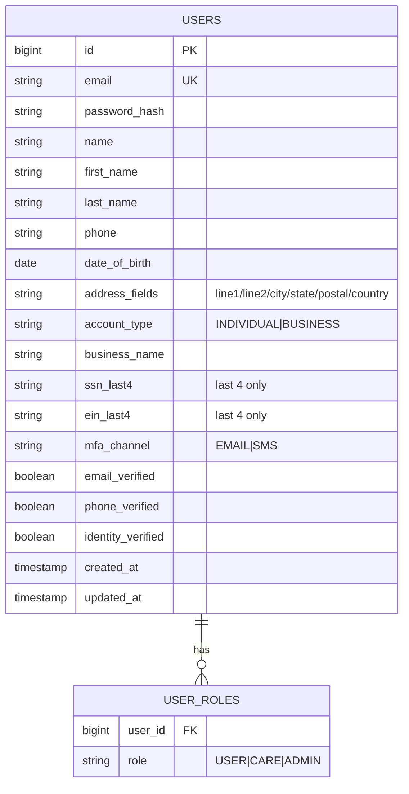
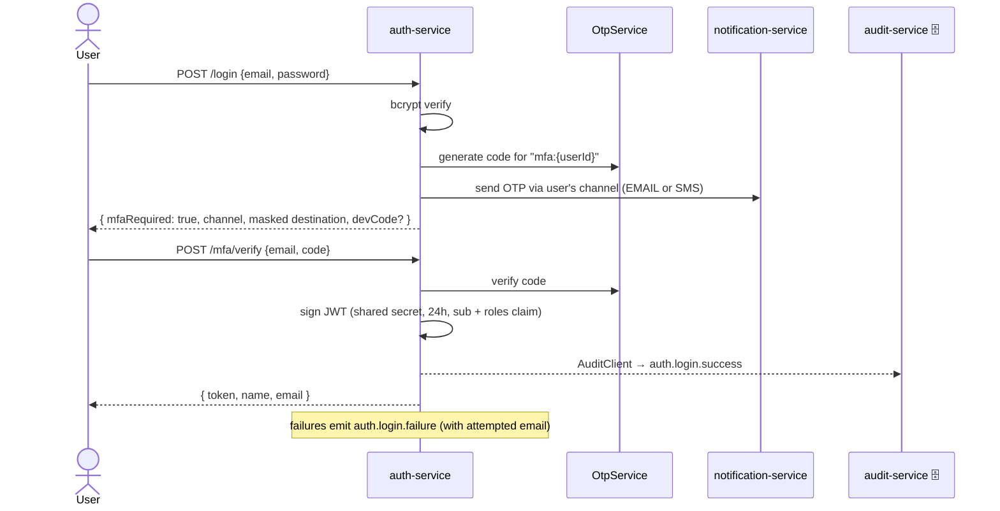

# Component · Auth Service (:8081)

**Responsibility:** registration, two-step login (password + **MFA code on every login**), JWT
issuance with a **roles claim**, email + SMS verification, full profile (view/edit/delete, masked
SSN/EIN), and the role-gated **Customer Care `/support` API** (see
[11-customer-care.md](11-customer-care.md)).
**Source:** [finance-mvp/apps/auth-service](../../../finance-mvp/apps/auth-service) · 🗄️ schema `auth`

## Endpoints

| Method | Path | Purpose |
|---|---|---|
| POST | `/api/v1/auth/register` | create account (verified email+phone required by the web), auto-login, return JWT |
| POST | `/api/v1/auth/login` | **step 1**: verify password → sends OTP via the user's MFA channel (`mfaRequired=true`); returns token directly only if MFA is disabled |
| POST | `/api/v1/auth/mfa/verify` | **step 2**: exchange `{email, code}` for a JWT |
| POST | `/api/v1/auth/email/send` / `email/verify` | email verification code (signup/profile; dev returns `devCode`) |
| POST | `/api/v1/auth/sms/send` / `sms/verify` | phone verification code (dev returns `devCode`) |
| GET | `/api/v1/auth/validate` | validate a token |
| GET | `/api/v1/auth/me` | full profile (SSN/EIN **masked**, last-4 reveal only) |
| PUT | `/api/v1/auth/me` | update editable fields (name, phone, DOB, address, MFA channel) |
| DELETE | `/api/v1/auth/me` | permanently delete the signed-in user (hard delete) |
| — | `/api/v1/support/**` | Customer Care: search, member 360, activity, role grants ([details](11-customer-care.md)) |

## Data model

## Login sequence (MFA on by default)

- `mfaEnabled` config flag (on by default) — when off, `/login` returns the token directly.
- `exposeDevCode` echoes the OTP back in dev only; OTP delivery goes through notification-service
  (mock adapters today, Twilio/SendGrid when keyed).
- The JWT carries **`roles`** so every service can map them to `ROLE_*` authorities.

## Status / pending
- ✅ Two-step MFA login, register with email+phone verification, profile GET/PUT/DELETE (masked
  SSN/EIN), roles in JWT, auth domain events to audit-service, `/support` Customer Care API.
- ⬜ **Real SMS/email OTP providers** (dev returns the code; router is config-ready).
- ⬜ Password reset ("Forgot password?" link is UI-only today); session management / token revocation.
- ⬜ Account deletion is a **hard delete** — no soft-delete/retention (see [03](../03-data-persistence-and-audit.md)).
