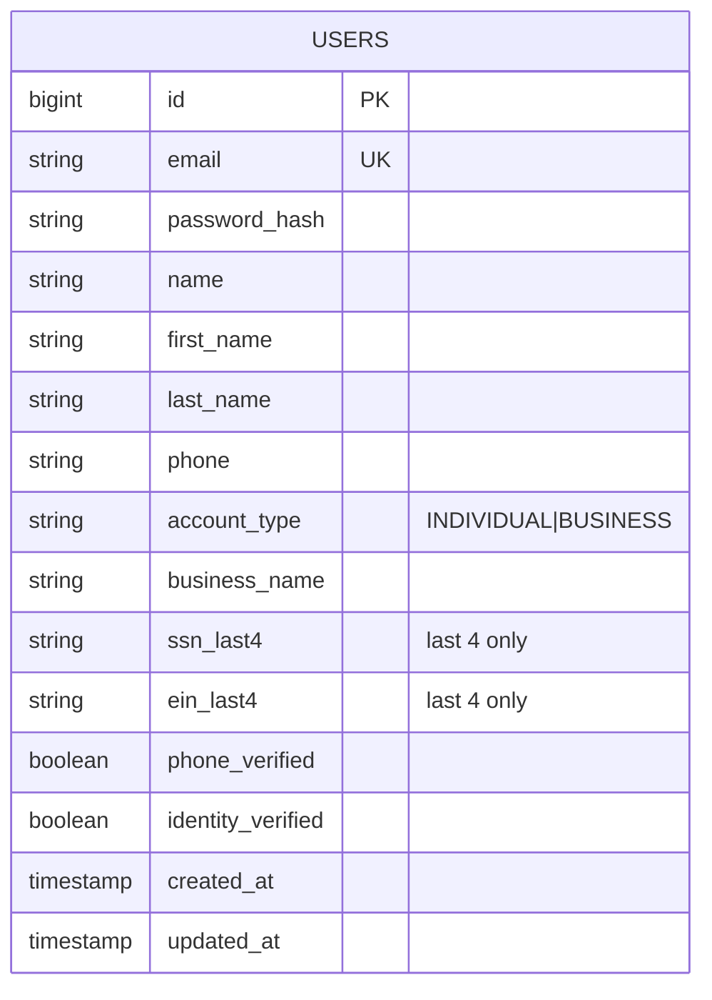

# Component · Auth Service (:8081)

**Responsibility:** registration, login, JWT issuance, SMS phone verification, profile/identity fields.
**Source:** [finance-mvp/apps/auth-service](../../../finance-mvp/apps/auth-service) · 🗄️ schema `auth`

## Endpoints
| Method | Path | Purpose |
|---|---|---|
| POST | `/api/v1/auth/register` | create account, return JWT |
| POST | `/api/v1/auth/login` | authenticate, return JWT |
| GET | `/api/v1/auth/validate` | validate a token |
| POST | `/api/v1/auth/sms/send` | send phone code (dev returns `devCode`) |
| POST | `/api/v1/auth/sms/verify` | verify phone code |

## Data model

Migrations: `V1__create_user_table`, `V2__add_name_to_users`, `V3__add_profile_and_verification`.

## Login sequence
```mermaid
sequenceDiagram
    actor U as User
    participant AUTH as auth-service
    participant DB as auth schema 🗄️
    U->>AUTH: POST /login {email,password}
    AUTH->>DB: find user by email
    AUTH->>AUTH: bcrypt verify; sign JWT (shared secret, 24h)
    AUTH-->>U: { token, name, email }
```

## Status / pending
- ✅ Register/login/JWT, SMS verify flow, profile fields. Stores only `ssn_last4`/`ein_last4`, password **hashed**.
- ⬜ **Real SMS provider** (dev returns the code). **No auth event/audit log** (logins, failures, token issuance) — see [03 · Persistence & Audit](../03-data-persistence-and-audit.md).
