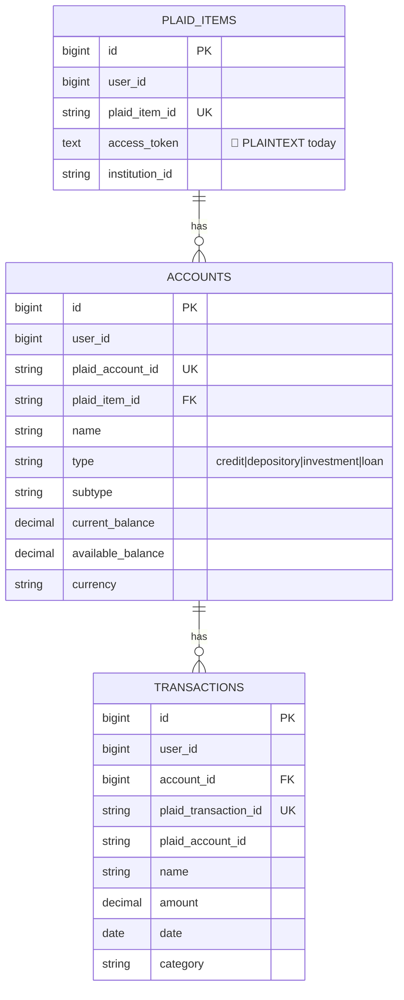
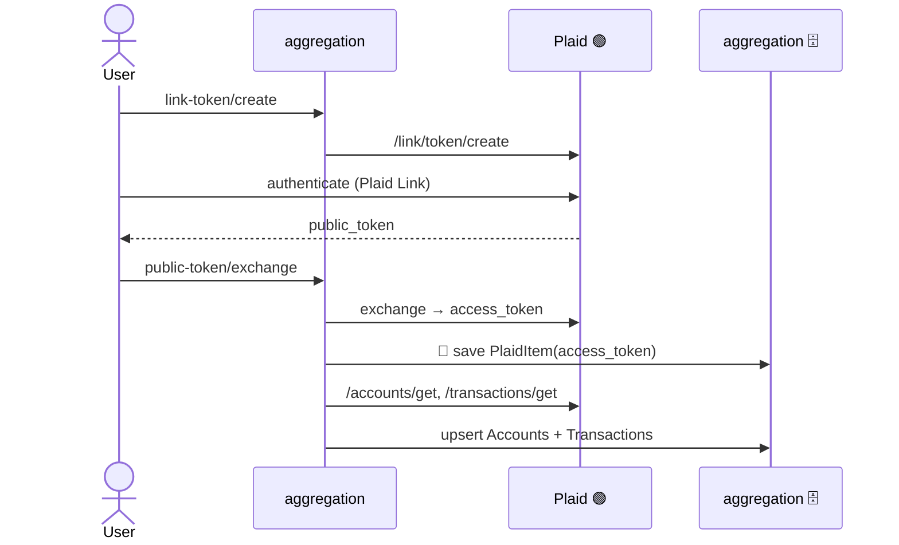

# Component · Account Aggregation Service (:8082) — Plaid 🟢

**Responsibility:** the **only live external integration**. Links bank accounts via Plaid, exchanges
tokens, fetches and **persists** accounts & transactions. **Stores the Plaid access token.**
**Source:** [finance-mvp/apps/account-aggregation-service](../../../finance-mvp/apps/account-aggregation-service) · 🗄️🔑 schema `aggregation`

## Endpoints
| Method | Path | Purpose |
|---|---|---|
| POST | `/api/v1/aggregation/link-token/create` | create Plaid Link token |
| POST | `/api/v1/aggregation/public-token/exchange` | exchange public→access token, sync data |
| GET | `/api/v1/aggregation/accounts` | list persisted accounts |
| GET | `/api/v1/aggregation/transactions` | list persisted transactions |
| POST | `/api/v1/aggregation/webhook` | Plaid webhook (⚠️ **no signature verify**, payload discarded) |

## Data model

## Link + sync sequence

## Status / pending
- ✅ Real Plaid (sandbox): link, exchange, accounts, transactions persisted with `created_at/updated_at`.
- 🔴 **Encrypt `access_token` at rest** (currently plaintext, comment says "encrypted in production").
- ⬜ **Webhook**: implement Plaid signature verification + handle `TRANSACTIONS_UPDATES`/`ITEM_ERROR`; store events.
- ⬜ Plaid **production** credentials; scheduled/refresh sync; consent log when an item is linked.
