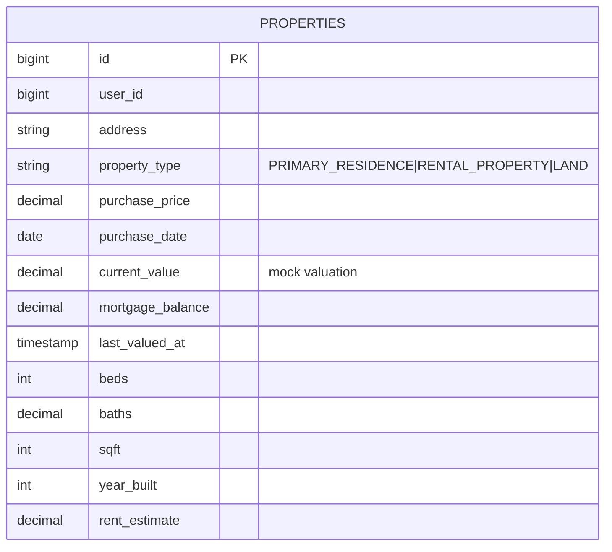
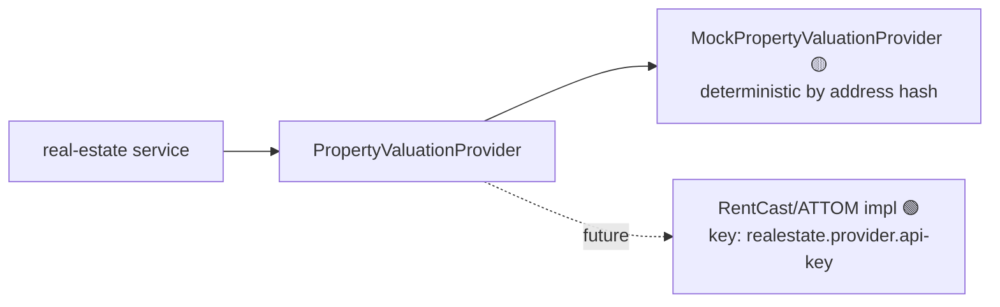

# Component · Real Estate Service (:8084) — Valuation 🟡 mock

**Responsibility:** property CRUD + valuation. Valuation is a **mock provider** behind a real interface.
**Source:** [finance-mvp/apps/real-estate-service](../../../finance-mvp/apps/real-estate-service) · 🗄️ schema `real_estate`

> This service also hosts the **Deal Room** (`/api/v1/deals/**`, `/api/v1/sponsor/**`) — documented
> separately in [12-deals-and-sponsor-service.md](12-deals-and-sponsor-service.md).

## Endpoints
| Method | Path | Purpose |
|---|---|---|
| GET / POST | `/api/v1/real-estate` | list / add property |
| GET/PUT/DELETE | `/api/v1/real-estate/{id}` | read / update / delete |
| POST | `/api/v1/real-estate/{id}/revalue` | re-run valuation (mock) |
| POST | `/api/v1/real-estate/lookup` | estimate value from address (mock) |

## Data model

## Provider selection

## Status / pending
- 🟡 Full CRUD persisted; valuation/lookup are deterministic mock.
- ⬜ Real valuation provider + API key; 30d-change deltas in UI are placeholders.
- ✅ Uses the content service for the **valuation disclaimer** (`<Disclaimer/>`).
