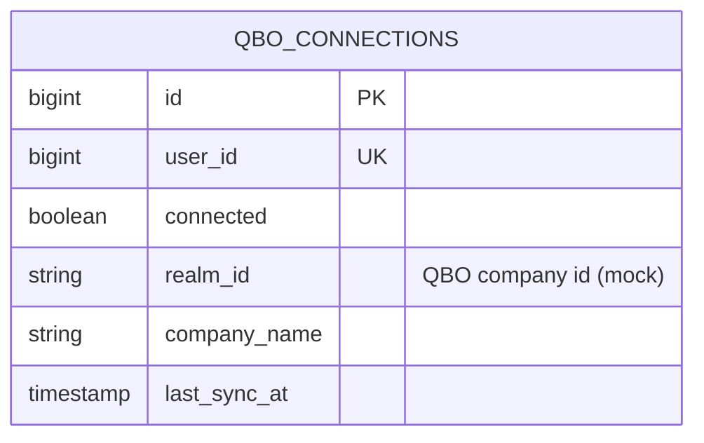
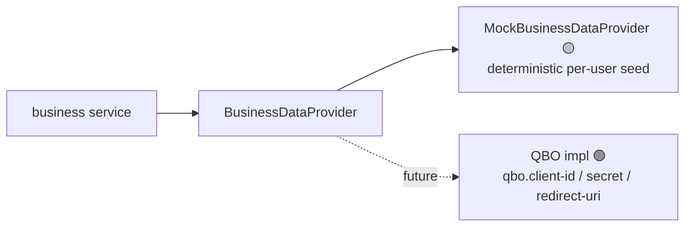

# Component · Business Financials Service (:8085) — QuickBooks 🟡 mock

**Responsibility:** business dashboard, P&L, invoices, expenses via a **QuickBooks Online (QBO)**
provider — currently a **mock**. Persists only the connection metadata.
**Source:** [finance-mvp/apps/business-financials-service](../../../finance-mvp/apps/business-financials-service) · 🗄️ schema `business`

## Endpoints
| Method | Path | Purpose |
|---|---|---|
| GET | `/api/v1/business/connection` | connection status |
| POST | `/api/v1/business/connect` | connect (mock) |
| POST | `/api/v1/business/sync` | sync (mock) |
| GET | `/api/v1/business/dashboard` | KPIs (mock) |
| GET | `/api/v1/business/pnl?period=` | P&L (mock) |
| GET | `/api/v1/business/invoices` / `/expenses` | lists (mock) |

## Data model

> Only connection metadata is stored. Dashboard/P&L/invoices/expenses are generated per-user by the
> mock — **not persisted**. No QBO OAuth token is stored.

## Provider selection

## Status / pending
- 🟡 Fully wired UI on mock data.
- ⬜ Real QBO OAuth flow; **store + refresh access/refresh tokens** (none stored today); persist synced P&L/invoices/expenses if needed for history.
