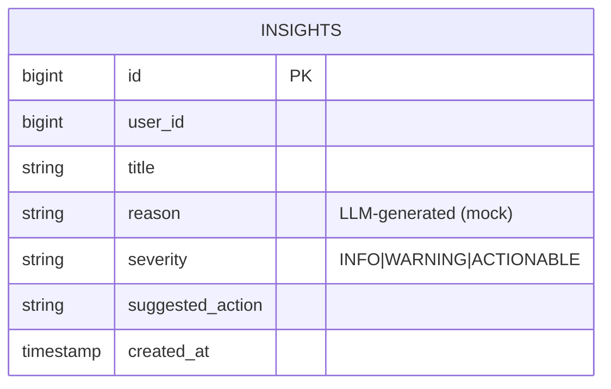
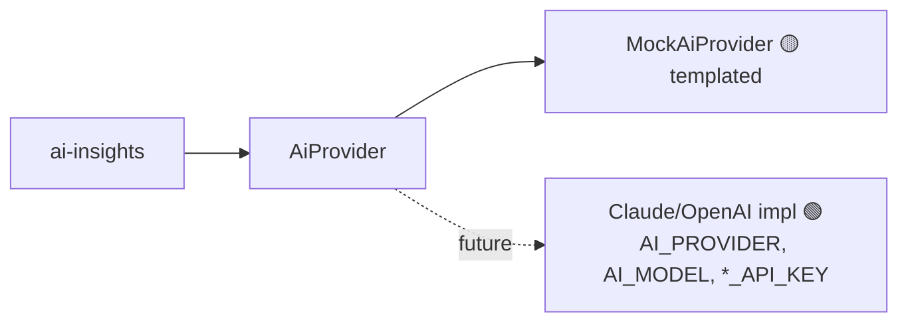
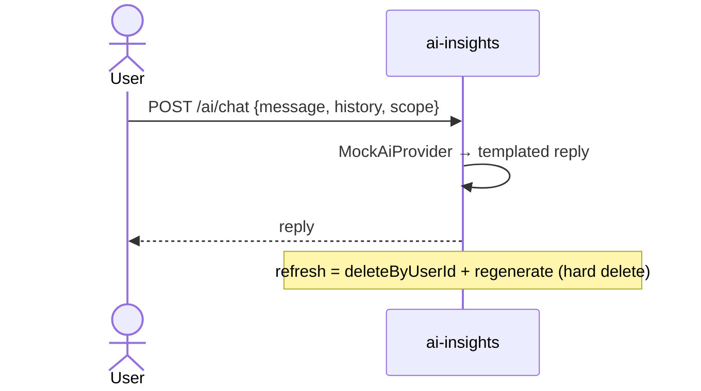

# Component · AI Insights Service (:8086) — LLM 🟡 mock

**Responsibility:** generate financial insights + power the AI chat assistant via an LLM provider —
currently a **mock** (templated). Persists generated insights.
**Source:** [finance-mvp/apps/ai-insights-service](../../../finance-mvp/apps/ai-insights-service) · 🗄️ schema `ai`

## Endpoints
| Method | Path | Purpose |
|---|---|---|
| GET | `/api/v1/ai/insights` | list insights |
| POST | `/api/v1/ai/insights/refresh` | regenerate (delete + recreate per user) |
| POST | `/api/v1/ai/chat` | chat with assistant |

## Data model

> Only processed insights are stored — **no raw LLM request/response** is persisted.

## Provider selection

## Chat sequence

## Status / pending
- 🟡 Insights + chat wired on mock.
- ⬜ Real LLM (`AI_PROVIDER=anthropic`, default model `claude-opus-4-8`); feed real account/budget context;
  consider storing chat history; prompt library is hardcoded client-side.
