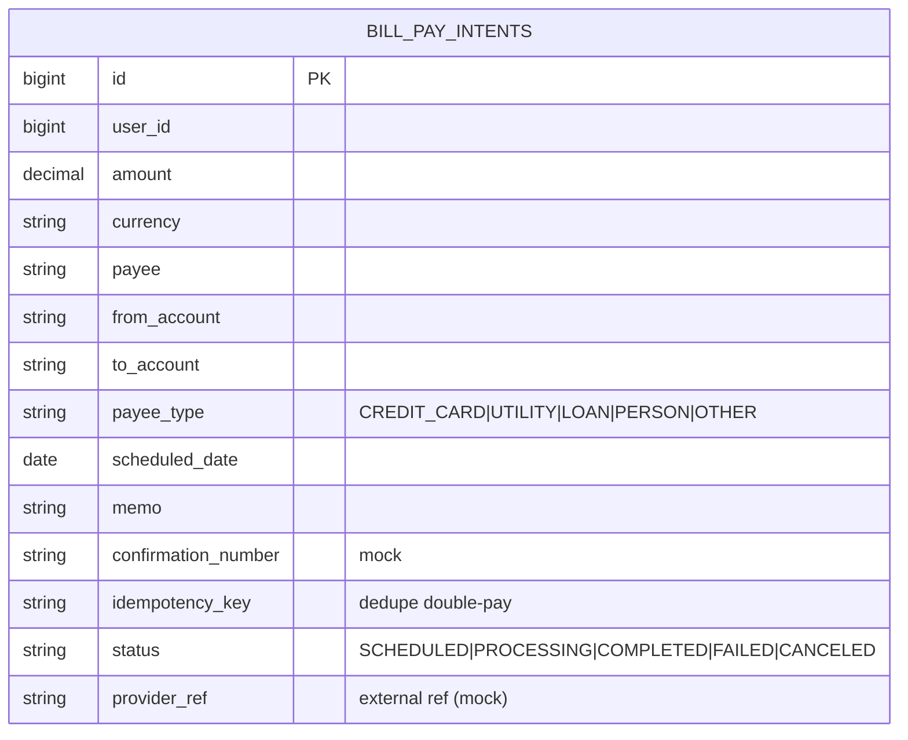
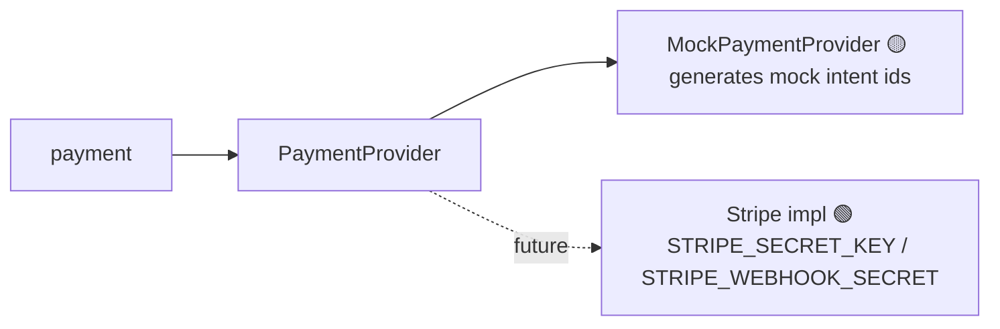

# Component · Payment Service (:8087) — Stripe 🟡 mock

**Responsibility:** bill-pay intents (schedule/cancel) via a **Stripe** provider — currently a **mock**.
**Source:** [finance-mvp/apps/payment-service](../../../finance-mvp/apps/payment-service) · 🗄️ schema `payments`

## Endpoints
| Method | Path | Purpose |
|---|---|---|
| GET | `/api/v1/payments/bill-pay-intents` | list intents |
| POST | `/api/v1/payments/bill-pay-intents` | create intent (idempotent) |
| GET | `/api/v1/payments/bill-pay-intents/{id}` | read |
| POST | `/api/v1/payments/bill-pay-intents/{id}/cancel` | cancel |
| GET | `/api/v1/payments/support/{userId}/bill-pay-intents` | Customer Care read-only view of a member's payments (CARE/ADMIN, audited) |
| POST | `/api/v1/payments/webhook` | Stripe webhook (⚠️ **no signature verify**, payload discarded; `permitAll`) |

## Data model

## Provider selection

## Status / pending
- 🟡 Intents persisted with idempotency keys; full bill-pay wizard works on mock.
- ⬜ Real Stripe (or ACH) integration.
- 🔴 **Webhook signature verification** (`Stripe-Signature` + secret) and **persist webhook events** — see [03 · Persistence & Audit](../03-data-persistence-and-audit.md).
