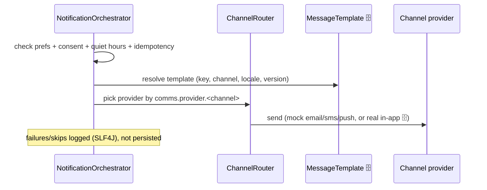
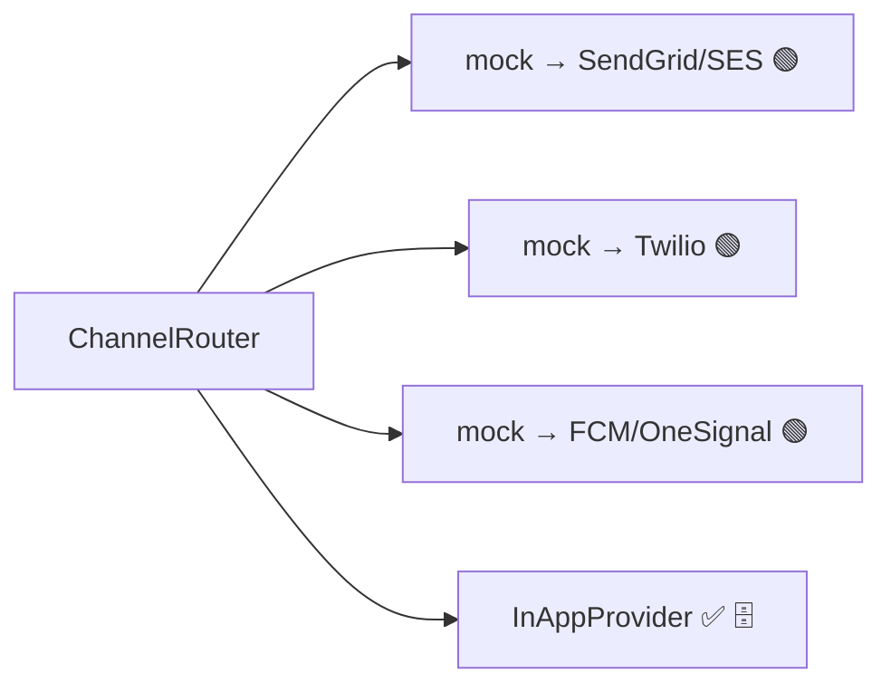

# Component · Notification Service (:8088) — multi-channel 🟡 (in-app ✅)

**Responsibility:** notifications inbox + preferences + templated multi-channel delivery
(SMS/email/push/in-app) via a **config-driven channel router**. In-app is real (DB-backed);
email/SMS/push are mock adapters.
**Source:** [finance-mvp/apps/notification-service](../../../finance-mvp/apps/notification-service) · 🗄️ schema `notifications`

## Endpoints
| Method | Path | Purpose |
|---|---|---|
| GET | `/api/v1/notifications` | inbox |
| GET/PUT | `/api/v1/notifications/preferences` | get/set prefs |
| POST | `/api/v1/notifications/{id}/read` | mark read |
| POST | `/api/v1/notifications/test` | send a test notification |
| GET | `/api/v1/notifications/templates` | list templates |
| POST | `/api/v1/notifications/send` | orchestrated send |

## Data model
```mermaid
erDiagram
    NOTIFICATIONS { bigint id PK; bigint user_id; string type "BUDGET|PAYMENT|ACCOUNT|SYSTEM"; string title; text body; string channel "EMAIL|PUSH|INAPP"; boolean is_read; timestamp created_at }
    NOTIFICATION_PREFERENCES { bigint id PK; bigint user_id UK; boolean email_enabled; boolean push_enabled; boolean weekly_summary; boolean budget_alerts; boolean payment_alerts }
    MESSAGE_TEMPLATE { bigint id PK; string template_key; string channel "SMS|EMAIL|PUSH|IN_APP"; string locale; string subject; string body; string variables; int version; boolean enabled }
```

## Orchestrated send


## Provider selection (config-driven — swap without code)
`comms.provider.sms|email|push = mock` (default), `comms.provider.inapp = inapp` (real).


## Status / pending
- ✅ In-app inbox + preferences + templates fully working; router architecture done.
- 🟡 Email/SMS/push are mock — add real adapters (config already selects by name).
- ⬜ Delivery logs/receipts not persisted; orchestration events only in app logs.
