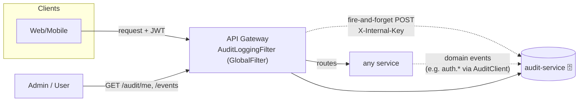
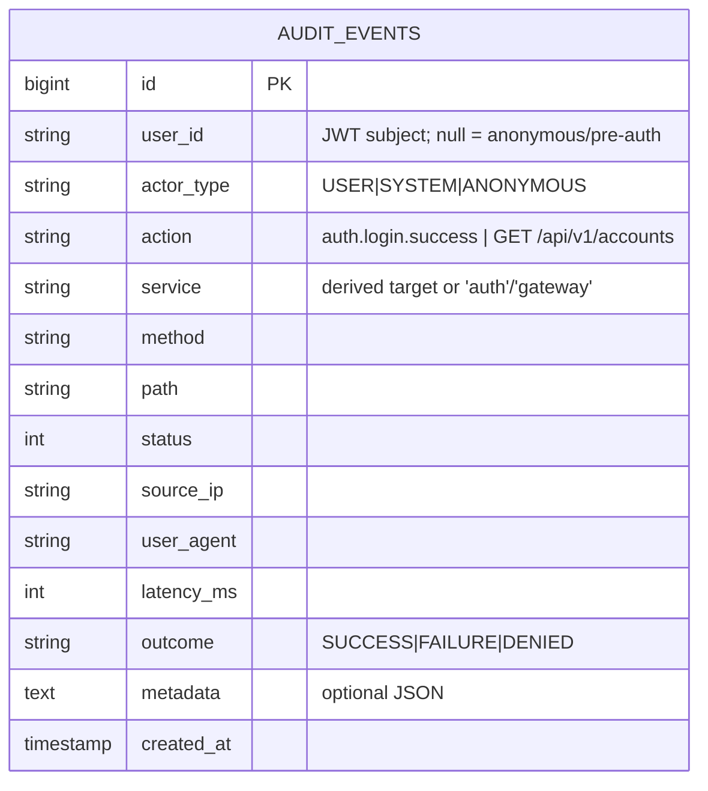
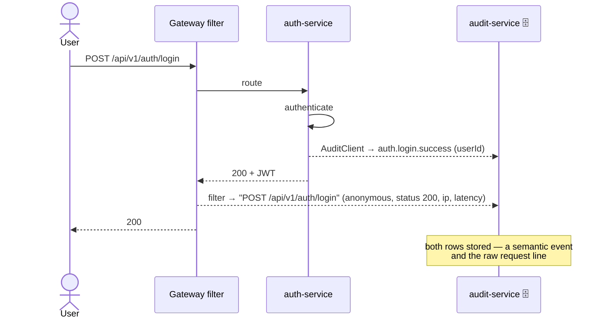

# Component · Audit Service (:8090) — user-activity logging ✅

**Responsibility:** an **append-only log of every user action** across the platform, plus query APIs.
Two capture paths feed it: (1) the **gateway global filter** records *every request* automatically;
(2) services emit **richer domain events** (e.g. auth login success/failure) with the resolved user.
**Source:** [finance-mvp/apps/audit-service](../../../finance-mvp/apps/audit-service) · 🗄️ schema `audit`

## How "every action" is captured

- **Gateway filter** ([AuditLoggingFilter.java](../../../finance-mvp/apps/api-gateway/src/main/java/com/mywealthmanagement/apigateway/AuditLoggingFilter.java)):
  runs first in the chain, measures latency around the whole request, decodes the **userId from the
  JWT subject**, derives the target service from the path, and **fire-and-forgets** the event to
  audit-service via WebClient. It **never blocks or fails** the user request. Skips CORS preflight,
  `/actuator/**`, and `/api/v1/audit/**` (no self-logging).
- **Domain events**: services post via a tiny `AuditClient`. Implemented today in **auth-service**
  ([AuditClient.java](../../../finance-mvp/apps/auth-service/src/main/java/com/mywealthmanagement/authservice/audit/AuditClient.java))
  for `auth.login.success`, `auth.login.failure` (with attempted email), `auth.register.success`.

## Data model

Indexes on `user_id`, `created_at`, `action`, `(user_id, created_at)` (Flyway `V1__create_audit_table.sql`).

## Endpoints
| Method | Path | Auth | Purpose |
|---|---|---|---|
| POST | `/api/v1/audit/events` | **internal key** (`X-Internal-Key`) | ingest one event (gateway/services) |
| GET | `/api/v1/audit/me?page=&size=` | user JWT | the signed-in user's own activity |
| GET | `/api/v1/audit/users/{userId}` | JWT (admin → see note) | a specific user's activity |
| GET | `/api/v1/audit/events?userId=&action=&from=&to=&page=&size=` | JWT (admin → see note) | filtered search (paged) |

## Ingest sequence

## Security model
- Ingest is guarded by a **shared `AUDIT_INGEST_KEY`** (header) + network isolation (only reachable
  inside the compose network; not exposed by Caddy beyond the gateway routes).
- Query endpoints require a valid **user JWT**. `/me` is always self-scoped.
- ⚠️ **Admin gating TODO:** `/events` and `/users/{id}` currently allow any authenticated user.
  Roles aren't modeled yet (JWT carries no authorities) — restrict to an admin role before exposing
  these in a real admin UI.

## Config
| Var | Default | Where |
|---|---|---|
| `AUDIT_ENABLED` | `true` | gateway filter on/off |
| `AUDIT_URI` | `http://localhost:8090` (compose: `http://audit-service:8080`) | gateway + emitting services |
| `AUDIT_INGEST_KEY` | `dev-internal-audit-key` (set real in prod) | gateway + services + audit-service |
| `DATABASE_*` | — | audit-service prod datasource (schema `audit`) |

## Status / pending
- ✅ Captures **every gateway request** + auth domain events; query APIs (`/me`, search) live; H2 dev / Postgres prod; in CI matrix + compose + gateway route.
- ⬜ **Admin role gating** on search endpoints.
- ⬜ Broaden domain events to other services (payments, aggregation consent, data exports) via the same `AuditClient` pattern.
- ⬜ Optional: before/after diffs for entity changes (`@EnableJpaAuditing` + interceptor); retention/rotation policy for the append-only log; ship to SIEM.

> Related cross-cutting gaps (token encryption, webhook storage, soft-delete) remain in
> [03 · Persistence & Audit](../03-data-persistence-and-audit.md).
