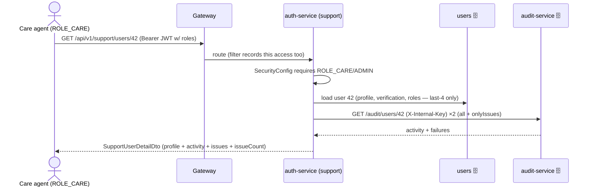

# Component · Customer Care / Support (role-gated) ✅

**Responsibility:** lets a **support agent** look up any member and see their full profile, verification
status, and complete **activity + issues encountered** — to help when something goes wrong.
Built into **auth-service** (it owns users) with a **role system** + the **audit-service** for activity.
**Sources:** auth-service `support/*` + `audit/AuditClient`, web `pages/CustomerCarePage.jsx`.

## Roles
`Role` enum: `USER` (default), `CARE` (support agent), `ADMIN`. Roles are stored on the user
(`user_roles` table) and now **embedded in the JWT** as a `roles` claim. Each service's JWT filter
maps them to `ROLE_*` authorities, so endpoints can be role-gated.

- **Bootstrap the first agent:** set `SUPPORT_BOOTSTRAP_EMAIL` to an existing user's email; on startup
  auth-service grants them `ADMIN+CARE` ([SupportBootstrap](../../../finance-mvp/apps/auth-service/src/main/java/com/mywealthmanagement/authservice/support/SupportBootstrap.java)).
- **Thereafter:** an ADMIN grants `CARE` to others via `POST /api/v1/support/users/{id}/roles`.

## Endpoints (auth-service, gated `CARE`/`ADMIN`)
| Method | Path | Role | Purpose |
|---|---|---|---|
| GET | `/api/v1/support/users?query=` | CARE/ADMIN | search members by email/name (paged) |
| GET | `/api/v1/support/users/{id}` | CARE/ADMIN | **360 view**: profile + verification + recent activity + issues |
| GET | `/api/v1/support/users/{id}/activity?onlyIssues=` | CARE/ADMIN | activity timeline (or just problems) |
| POST | `/api/v1/support/users/{id}/roles` | **ADMIN only** | grant/revoke CARE/ADMIN |

## How a 360 view is assembled

> The agent's own lookups are themselves audited by the gateway filter — so support access is traceable.

## Web UI
[CustomerCarePage.jsx](../../../finance-mvp/apps/web/src/pages/CustomerCarePage.jsx): search panel + a
member 360 (profile KPIs, verification badges, roles) with two tabs — **Issues encountered**
(failed/denied actions) and **Recent activity**. Nav item + `/customer-care` route appear **only**
for care/admin (`isCareAgent()` decodes the JWT `roles`); the route redirects others home, and the
backend enforces the real check regardless.

## Security
- Endpoints gated by role; **role changes are ADMIN-only** (separate path matcher).
- No secrets exposed — only `ssn_last4`/`ein_last4`, never full identifiers.
- auth→audit calls use the internal key; audit's `/users/**` + `/events` accept that key
  server-to-side (see [10-audit-service.md](10-audit-service.md)).

## Status / pending
- ✅ Role system + JWT roles claim; support search / 360 / activity / role-grant; web console gated by role; first-admin bootstrap.
- ⬜ Richer 360: pull **accounts/transactions/payments by userId** (needs admin "by-user" endpoints in those services — today the view shows profile + full audit activity).
- ⬜ Support actions like "resend verification", "reset password", impersonation (with heavy audit) — future.
- ⬜ Admin UI to list/manage CARE agents.
