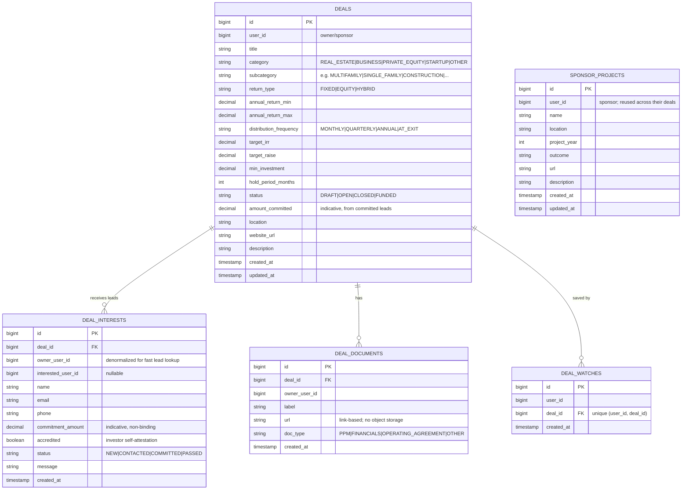
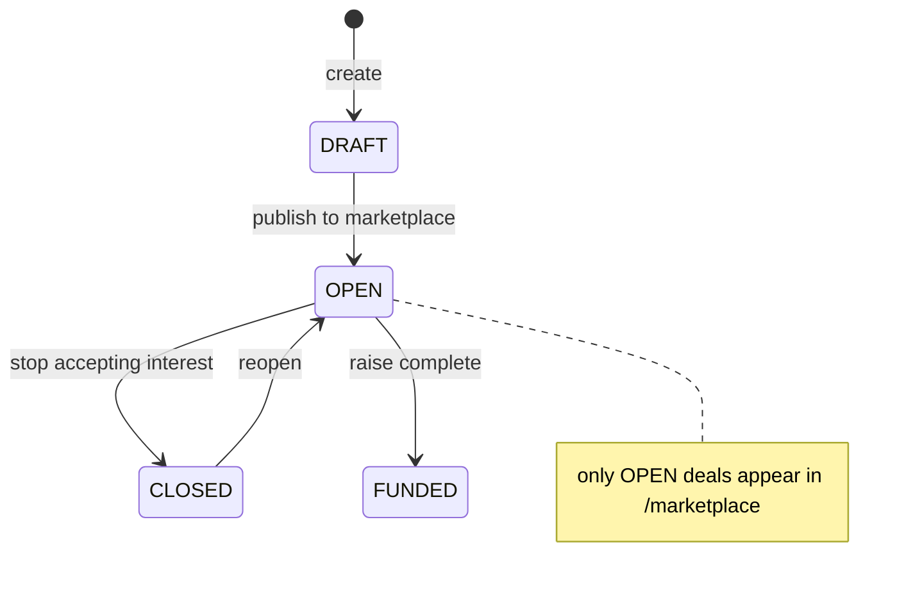

# Component · Deals & Sponsor (Deal Room) — hosted in real-estate-service (:8084) ✅

**Responsibility:** the **Deal Room**: users (sponsors) register investment deals, list them on a
marketplace, attach link-based documents and a track record; investors browse/filter, save deals to a
watchlist, and **express interest** (becoming leads the sponsor works through statuses). All
**backend-backed and persisted** — no external provider involved.
**Source:** [finance-mvp/apps/real-estate-service](../../../finance-mvp/apps/real-estate-service)
(`deal/` + `sponsor/` packages) · 🗄️ schema `real_estate` ·
Web UI: [DealRoomPage.jsx](../../../finance-mvp/apps/web/src/pages/DealRoomPage.jsx)

> Why here? The Deal Room launched as a real-estate-adjacent feature, so its tables live in the
> real-estate service behind the `/api/v1/deals/**` and `/api/v1/sponsor/**` gateway routes. If it
> keeps growing (payments, escrow, KYC) it's a natural candidate to split into its own service.

## Endpoints

### Deals (owner = the user who created the deal)
| Method | Path | Purpose |
|---|---|---|
| GET / POST | `/api/v1/deals` | my deals / register a deal |
| GET | `/api/v1/deals/taxonomy` | category → subcategory taxonomy for the form |
| GET | `/api/v1/deals/marketplace?category=&subcategory=&returnType=&sort=` | browse **OPEN** deals (filter + sort) |
| GET / PUT / DELETE | `/api/v1/deals/{id}` | detail / edit / remove (writes owner-scoped) |
| GET | `/api/v1/deals/support/{userId}` | Customer Care read-only view (CARE/ADMIN, audited) |

### Investor actions
| Method | Path | Purpose |
|---|---|---|
| GET | `/api/v1/deals/watchlist` | my saved deals |
| POST / DELETE | `/api/v1/deals/{id}/watch` | save / unsave (unique per user+deal) |
| POST | `/api/v1/deals/{id}/interests` | **express interest** — share contact details + indicative amount with the owner (accredited self-attestation) |
| GET | `/api/v1/deals/my-interests` | deals I expressed interest in (+ my lead status) |

### Owner lead + document management
| Method | Path | Purpose |
|---|---|---|
| GET | `/api/v1/deals/{id}/interests` | leads for my deal |
| PUT | `/api/v1/deals/{id}/interests/{interestId}/status` | work a lead: `NEW → CONTACTED → COMMITTED / PASSED` |
| GET / POST | `/api/v1/deals/{id}/documents` | list / attach a document **link** (PPM, financials, operating agreement — no object storage) |
| DELETE | `/api/v1/deals/{id}/documents/{docId}` | remove a document link |

### Sponsor track record
| Method | Path | Purpose |
|---|---|---|
| GET / POST | `/api/v1/sponsor/projects` | my past projects / add one |
| PUT / DELETE | `/api/v1/sponsor/projects/{id}` | edit / remove |
| GET | `/api/v1/deals/{id}/sponsor-projects` | a deal's sponsor track record (shown to investors on the detail page) |

## Data model



## Lifecycle: from registration to a committed lead

```mermaid
sequenceDiagram
    actor O as Owner (sponsor)
    actor I as Investor
    participant RE as real-estate (deals) 🗄️

    O->>RE: POST /deals {title, category, returns, raise…} (status DRAFT)
    O->>RE: POST /deals/{id}/documents (PPM link)
    O->>RE: POST /sponsor/projects (track record)
    O->>RE: PUT /deals/{id} {status: OPEN}  → listed on marketplace
    I->>RE: GET /deals/marketplace?category=REAL_ESTATE&sort=highestReturn
    I->>RE: POST /deals/{id}/watch (save)
    I->>RE: GET /deals/{id} (+documents +sponsor-projects)
    I->>RE: POST /deals/{id}/interests {name, email, amount, accredited ✓}
    Note over RE: 🗄️ lead stored; investor consents to share contact with owner
    O->>RE: GET /deals/{id}/interests → work leads
    O->>RE: PUT /deals/{id}/interests/{iid}/status → COMMITTED
    Note over RE: committed amounts roll up into the deal's<br/>"interest committed" progress bar (indicative, not binding)
```

## Deal status state machine



## Security / privacy
- All deal writes are **owner-scoped** in `DealService` (a user can only edit/delete their own deals,
  documents, and leads).
- Lead capture stores investor **contact details with explicit consent** ("share with the deal
  owner") + an **accredited-investor self-attestation** — a feature-level consent record (see
  [03 · Persistence & Audit](../03-data-persistence-and-audit.md)).
- The progress bar is **indicative interest, not binding** — no money moves through the platform.
- Customer Care visibility via `/deals/support/{userId}` (role-gated, gateway-audited).

## Status / pending
- ✅ Full CRUD for deals, taxonomy-driven form, marketplace with filters/sort, watchlist, investor
  interests, owner lead pipeline, link-based documents, sponsor track record. All persisted.
- ⬜ Notify the owner on a new lead (notification-service integration).
- ⬜ Document **object storage** + access control (links only today).
- ⬜ Real accreditation/KYC verification (self-attestation only); legal review of marketplace copy.
- ⬜ Consider splitting into a dedicated deals-service if scope grows (escrow, subscriptions, payments).
