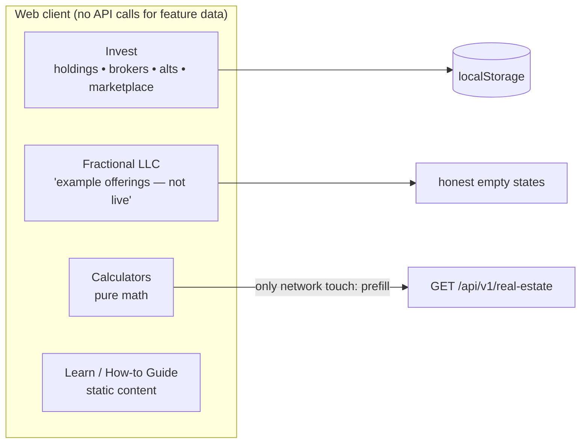

# Component · Client-Only Features (no backend) ⬜

**Responsibility (of this doc):** make the **unbacked features explicit** so nobody mistakes them for
wired functionality. These screens render real UI but keep their data **in the browser**
(hardcoded constants and/or `localStorage`) — except where noted. They are the remaining ⬜ rows in
[04 · Feature status & gaps](../04-feature-status-and-gaps.md).

## Invest ([InvestPage.jsx](../../../finance-mvp/apps/web/src/pages/InvestPage.jsx)) — biggest gap

Four tabs, all client-side:

| Tab | What it shows | Where the data lives |
|---|---|---|
| Stocks & ETFs | KPIs, allocation card (static 58/22/12/8 model), holdings table + sparklines | hardcoded + localStorage |
| Brokers | config-driven broker tiles; **simulated** OAuth ("Demo mode — no real redirect") / credentials connect (credentials never stored); connected list + Sync | localStorage |
| Alternatives | add/edit alt holdings (LLC, land, crypto, collectibles…), breakdown by type | localStorage |
| Marketplace | honest empty state: "No live offerings yet" | — |

**To make real:** an investments service (or brokerage aggregation via Plaid Investments / SnapTrade)
with persisted holdings, real broker OAuth + token storage, and a marketplace provider.

## Fractional LLC ([FractionalLLCPage.jsx](../../../finance-mvp/apps/web/src/pages/FractionalLLCPage.jsx))

Marked **"Example offerings — not live"**: holdings & offerings are empty arrays until a
fractional-investing provider is connected. The "Invest" button only simulates a request submission.
**To make real:** a fractional-ownership provider + offering/holding persistence (could share the
Deal Room rails — see [12-deals-and-sponsor-service.md](12-deals-and-sponsor-service.md)).

## Calculators ([CalculatorsPage.jsx](../../../finance-mvp/apps/web/src/pages/CalculatorsPage.jsx)) — ✅ by design

Mortgage payoff / compound interest / simple interest. **All math runs in the browser** — the only
network touch is reusing already-loaded properties (`getRealEstate`) to prefill a mortgage balance.
This is intentional; no backend is pending.

## Learn & How-to Guide ([LearnPage](../../../finance-mvp/apps/web/src/pages/LearnPage.jsx) / [GuidePage](../../../finance-mvp/apps/web/src/pages/GuidePage.jsx))

Static educational content and the product walkthrough. **Decision pending:** keep static, or serve
via platform-config/content (CMS-style) so non-engineers can edit — the disclaimers pipeline in
[09-platform-config-service.md](09-platform-config-service.md) already shows the pattern.

## Dev/internal screens (not user features)

`StyleGuidePage` (design tokens reference) and `UIFlowMapPage` (screen-flow map) are internal tools;
no backend is ever intended.

## Status / pending
- ⬜ **Invest** — needs a real investments backend (largest unbacked feature).
- ⬜ **Fractional LLC** — needs a provider; honest empty states shipped meanwhile.
- ✅ **Calculators** — client-only by design; nothing pending.
- ⬜ **Learn / Guide** — decide static vs CMS-driven via platform-config.
