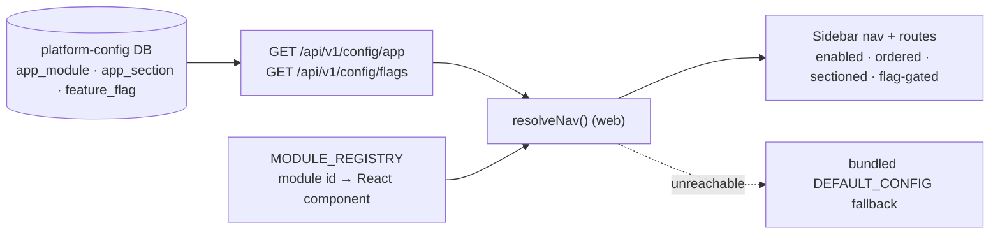

# TerraVest — Migration: web screens → module registry

The existing web screens (routes in `apps/web/src/components/AppLayout.jsx`) map
1:1 to **module ids** in the new registry. Going forward, **which** modules
appear, their **order**, and whether they're **enabled** is controlled by
`platform-config-service` (from the database) — not hard-coded in the web app.
Disclaimers come from the content API; user comms come from DB-backed templates.

## How config-driven nav resolves at runtime

> Enable/disable, reorder, or re-section a feature by changing the DB — no code change.

---

## 1. Screen / route → module id

| Screen | Web route | Module id | Nav group |
| --- | --- | --- | --- |
| Home / Dashboard | `/` | `home` | Finance |
| Accounts | `/accounts` | `accounts` | Finance |
| Transactions | `/transactions` | `transactions` | Finance |
| Budgets | `/budget` | `budget` | Finance |
| Pay Bills | `/billpay` | `billpay` | Finance |
| Debt Lab | `/debt` | `debt` | Finance |
| Investments | `/invest` | `invest` | Finance |
| My Business | `/mybusiness` | `mybusiness` | Finance |
| AI Assistant | `/ai-assistant` | `ai-assistant` | Finance |
| Properties | `/realestate` | `realestate` | Real Estate |
| Deal Room | `/dealroom` | `dealroom` | Real Estate |
| Fractional LLC | `/fractional` | `fractional` | Real Estate |
| Security | `/security` | `security` | Settings |
| Messages | `/messages` | `messages` | Settings |
| Settings | `/settings` | `settings` | Settings |
| Profile | `/profile` | `profile` | (account menu) |
| Learn | `/learn` | `learn` | (resources) |
| Guide / How-to | `/guide` | `guide` | (resources) |
| Style Guide | `/styleguide` | `styleguide` | (internal/dev) |
| UI Flow Map | `/flowmap` | `flowmap` | (internal/dev) |

> The module id is the stable key. The route stays as-is for the web app; the
> registry references modules by id so nav can be reordered/toggled without
> touching route definitions.

---

## 2. What moved to the backend (no code change to adjust)

| Concern | Source of truth | What ops/legal can change |
| --- | --- | --- |
| Nav: which modules show, order, enable/disable, badges | `platform-config-service` DB | enable a module, reorder groups, hide a screen per tier |
| Disclaimers / legal copy | content API (CMS DB or `CMS_API_URL`) | edit disclaimer text, effective dates |
| Comms (email/SMS/push) wording | notification-service DB templates | edit subject/body, add locales |

The client fetches this configuration at startup, so changes go live on next
load — no app rebuild or store release for content/config-only edits (see
`DEPLOYMENT.md` §5).

---

## 3. How legal/ops edit without code

All three areas follow the same **version-bump pattern**: rows are versioned;
editors insert/activate a new version rather than mutating the live one, so
changes are auditable and instantly reversible.

### Navigation & module enablement (platform-config-service)
- Tables (conceptual): `modules` (id, default label, icon, route),
  `nav_items` (module_id, group, sort_order, enabled, badge),
  `config_version` (version, published_at).
- To change nav: update `nav_items` (e.g. set `enabled=false`, change
  `sort_order`), then bump `config_version.version`. Clients compare the version
  and refetch when it changes.

### Disclaimers (content API)
- Tables (conceptual): `content_documents` (key, locale, body, version,
  effective_at, active).
- To change a disclaimer: insert a new row with the same `key`, incremented
  `version`, set `active=true` (deactivating the prior). The app requests the
  active version for the key/locale.

### Comms templates (notification-service)
- Tables (conceptual): `message_templates` (key, channel, locale, subject, body,
  version, active).
- To change a template: insert a new version for the `key`+`channel`+`locale`,
  set `active=true`. The service renders the active version at send time.

In every case: **insert a new version, activate it, bump/version the record** —
never edit code, never edit the live row in place.

> Note: `platform-config-service` currently has only its `pom.xml` scaffolded.
> The table names above are the conceptual contract for the registry/version
> pattern and should be created when the service is implemented.
